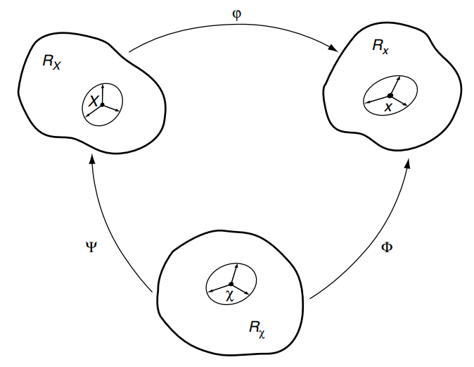
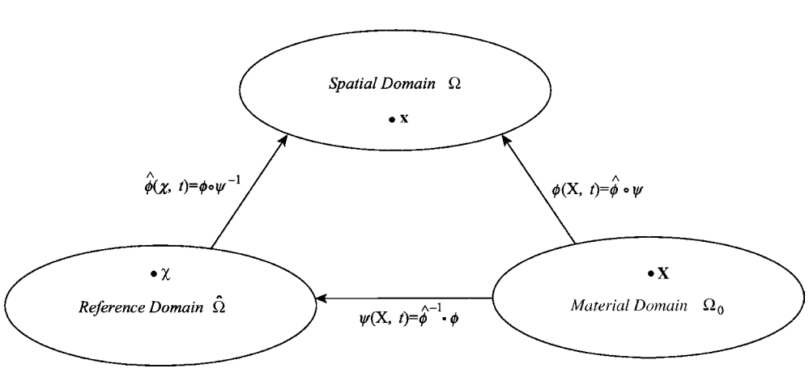

Arbitrary Lagrangian-Eulerian
==================================
 
Arbitrary Lagrangian-Eulerian (ALE)
---------------------------------------------------------------------------
#. `Arbitrary Lagrangian-Eulerian (ALE) and Computational Fluid Dynamics (CFD) <https://2021.help.altair.com/2021/hwsolvers/rad/topics/solvers/rad/arbitrary_lagrangian_eulerian_computational_fluid_dynamics_c.htm>`_
#. `ALE formula <https://max.book118.com/html/2016/1212/71106288.shtm>`_
#. `Arbitrary Lagrangian-Eulerian Methods <https://ww2.lacan.upc.edu/scientificPublications/files/pdfs/2017-ECM-DHPR-blanc.pdf>`_
#. `Arbitrary Lagrangian-Eulerian Methods(Wiley Online Library) <https://onlinelibrary.wiley.com/doi/full/10.1002/0470091355.ecm009>`_

Lagrangian and Eulerian viewpoints
---------------------------------------------------------------------------

Two domains are commonly used in continuum mechanics: the material domain :math:`R_{X} \subset \mathbb{R}^{n_{\text {sd }}}`,
with :math:`n_{\text {sd }}` spatial dimensions, made up of material particles :math:`X`, and the spatial domain :math:`R_{\boldsymbol{x}}`,
consisting of spatial points :math:`\boldsymbol{x}`.

.. image:: images/ale1.png
   :width: 600

.. math::
  \begin{aligned}
    \boldsymbol{\varphi}: R_{\boldsymbol{X}} \times\left[t_{0}, t_{\text {final }}]\right. & \longrightarrow R_{\boldsymbol{x}} \times\left[t_{0}, t_{\text {final }}]\right. \\
    (\boldsymbol{X}, t) & \longmapsto \boldsymbol{\varphi}(\boldsymbol{X}, t)=(\boldsymbol{x}, t)
  \end{aligned}
  
which allows us to link :math:`X` and :math:`\boldsymbol{x}` in time by the law of motion, namely

.. math::
  \boldsymbol{x}=\boldsymbol{x}(\boldsymbol{X}, t), \quad t=t
  
which explicitly states the particular nature of :math:`\boldsymbol{\varphi}` : first, the spatial coordinates :math:`\boldsymbol{x}` depend both
on the material particle, :math:`\boldsymbol{X}` , and time :math:`t` , and, second, physical time is measured by the same
variable :math:`t` in both material and spatial domains. For every fixed instant :math:`t`, the mapping :math:`\boldsymbol{\varphi}` defines
a configuration in the spatial domain. It is convenient to employ a matrix representation for
the gradient of :math:`\boldsymbol{\varphi}`,

.. math::
  \frac{\partial \boldsymbol{\varphi}}{\partial(\boldsymbol{X}, t)}=\left(\begin{array}{cc}
  \frac{\partial \boldsymbol{x}}{\partial \boldsymbol{X}} & \boldsymbol{v} \\
  \mathbf{0}^{\mathrm{T}} & 1
  \end{array}\right)  
  
where :math:`\mathbf{0}^{\mathrm{T}}` is a null row-vector and the material velocity :math:`\boldsymbol{v}` is

.. math::
  \boldsymbol{v}(\boldsymbol{X}, t)=\left.\frac{\partial \boldsymbol{x}}{\partial t}\right|_{\boldsymbol{x}}  
  
ALE kinematical description
---------------------------------------------------------------------------

   
In the ALE description of motion, neither the material configuration :math:`R_{\boldsymbol{X}}` nor the spatial
configuration :math:`R_{\boldsymbol{x}}` is taken as the reference. Thus, a third domain is needed: the referential
configuration :math:`R_{\boldsymbol{\chi}}` where reference coordinates :math:`\boldsymbol{\chi}` are introduced to identify the grid points.
Figure above shows these domains and the one-to-one transformations relating the configurations.
The referential domain :math:`R_{\boldsymbol{\chi}}` is mapped into the material and spatial domains by :math:`\boldsymbol{\Psi}` and :math:`\boldsymbol{\varphi}`
respectively. The particle motion :math:`\boldsymbol{\varphi}`  may then be expressed as :math:`\boldsymbol{\varphi}=\boldsymbol{\Phi} \circ \boldsymbol{\Psi}^{-1}` , clearly showing
that, of course, the three mappings :math:`\boldsymbol{\Psi}`, :math:`\boldsymbol{\Phi}` , and :math:`\boldsymbol{\varphi}` are not independent. 
  
.. math::
  \begin{aligned}
  \boldsymbol{\Phi}: R_{\boldsymbol{\chi}} \times\left[t_0, t_{\text {final }}]\right. & \longrightarrow R_{\boldsymbol{x}} \times\left[t_0, t_{\text {final }}]\right. \\
  (\boldsymbol{\chi}, t) & \longmapsto \boldsymbol{\Phi}(\boldsymbol{\chi}, t)=(\boldsymbol{x}, t)
  \end{aligned}
  
and its gradient is

.. math::
  \frac{\partial \boldsymbol{\Phi}}{\partial(\boldsymbol{\chi}, t)}=\left(\begin{array}{ll}
  \frac{\partial \boldsymbol{x}}{\partial \boldsymbol{\chi}} & \hat{\boldsymbol{v}} \\
  \mathbf{0}^{\mathrm{T}} & 1
  \end{array}\right)
  
where now, the mesh velocity

.. math::
  \hat{\boldsymbol{v}}(\boldsymbol{\chi}, t)=\left.\frac{\partial \boldsymbol{x}}{\partial t}\right|_{\boldsymbol{\chi}}
  
is involved. Note that both the material and the mesh move with respect to the laboratory.
Thus, the corresponding material and mesh velocities have been defined by deriving the
equations of material motion and mesh motion respectively with respect to time.

Finally, regarding :math:`\boldsymbol{\Psi}`, it is convenient to represent directly its inverse :math:`\boldsymbol{\Psi}^{-1}`,

.. math::
  \begin{aligned}
  \boldsymbol{\Psi}^{-1}: R_{\boldsymbol{X}} \times\left[t_0, t_{\text {final }}]\right. & \longrightarrow R_{\boldsymbol{\chi}} \times\left[t_0, t_{\text {final }}]\right. \\
  (\boldsymbol{X}, t) & \longmapsto \boldsymbol{\Psi}^{-1}(\boldsymbol{X}, t)=(\boldsymbol{\chi}, t)
  \end{aligned}
  
and its gradient is

.. math::
  \frac{\partial \boldsymbol{\Psi}^{-1}}{\partial(\boldsymbol{X}, t)}=\left(\begin{array}{cc}
  \frac{\partial \boldsymbol{\chi}}{\partial \boldsymbol{X}} & \boldsymbol{w} \\
  \mathbf{0}^{\mathrm{T}} & 1
  \end{array}\right)
  
where the velocity :math:`\boldsymbol{w}` is defined as  

.. math::
  \boldsymbol{w}=\left.\frac{\partial \boldsymbol{\chi}}{\partial t}\right|_{\boldsymbol{X}}
  
and can be interpreted as the particle velocity in the referential domain, since it measures
the time variation of the referential coordinate :math:`\boldsymbol{\chi}` holding the material particle :math:`\boldsymbol{X}` fixed. The
relation between velocities :math:`\boldsymbol{v}`, :math:`\hat{\boldsymbol{v}}`, and :math:`\boldsymbol{w}` can be obtained by differentiating :math:`\boldsymbol{\varphi}=\boldsymbol{\Phi} \circ \boldsymbol{\Psi}^{-1}`,

.. math::
  \begin{aligned}
  \frac{\partial \boldsymbol{\varphi}}{\partial(\boldsymbol{X}, t)}(\boldsymbol{X}, t) & =\frac{\partial \boldsymbol{\Phi}}{\partial(\boldsymbol{\chi}, t)}\left(\boldsymbol{\Psi}^{-1}(\boldsymbol{X}, t)\right) \frac{\partial \boldsymbol{\Psi}^{-1}}{\partial(\boldsymbol{X}, t)}(\boldsymbol{X}, t) \\
  & =\frac{\partial \boldsymbol{\Phi}}{\partial(\boldsymbol{\chi}, t)}(\boldsymbol{\chi}, t) \quad \frac{\partial \boldsymbol{\Psi}^{-1}}{\partial(\boldsymbol{X}, t)}(\boldsymbol{X}, t)
  \end{aligned}
  
or, in matrix format:

.. math::
  \left(\begin{array}{cc}
  \frac{\partial \boldsymbol{x}}{\partial \boldsymbol{X}} & \boldsymbol{v} \\
  \mathbf{0}^T & 1
  \end{array}\right)=\left(\begin{array}{ll}
  \frac{\partial \boldsymbol{x}}{\partial \boldsymbol{\chi}} & \hat{\boldsymbol{v}} \\
  \mathbf{0}^T & 1
  \end{array}\right)\left(\begin{array}{cc}
  \frac{\partial \boldsymbol{\chi}}{\partial \boldsymbol{X}} & \boldsymbol{w} \\
  \mathbf{0}^T & 1
  \end{array}\right)
  
which yields, after block multiplication,

.. math::
  \boldsymbol{v}=\hat{\boldsymbol{v}}+\frac{\partial \boldsymbol{x}}{\partial \chi} \cdot \boldsymbol{w}

This equation may be rewritten as

.. math::
  \boldsymbol{c}:=\boldsymbol{v}-\hat{\boldsymbol{v}}=\frac{\partial \boldsymbol{x}}{\partial \chi} \cdot \boldsymbol{w}
  
Material, spatial, and referential time derivatives
---------------------------------------------------------------------------

In order to relate the time derivative in the material, spatial, and referential domains, let
a scalar physical quantity be described by :math:`f(\boldsymbol{x}, t)`, :math:`f^{*}(\boldsymbol{\chi}, t)`, and :math:`f^{* *}(\boldsymbol{X}, t)` in the spatial,
referential, and material domains respectively. Stars are employed to emphasize that the
functional forms are, in general, different.

Since the particle motion :math:`\boldsymbol{\varphi}` is a mapping, the spatial description :math:`f(\boldsymbol{x}, t)`, and the material
description :math:`f^{* *}(\boldsymbol{X}, t)` of the physical quantity can be related as

.. math::
  f^{* *}(\boldsymbol{X}, t)=f(\boldsymbol{\varphi}(\boldsymbol{X}, t)) \quad or \quad f^{* *}=f \circ \boldsymbol{\varphi}
  
The gradient of this expression can be easily computed as

.. math::
  \frac{\partial f^{* *}}{\partial(\boldsymbol{X}, t)}(\boldsymbol{X}, t)=\frac{\partial f}{\partial(\boldsymbol{x}, t)}(\boldsymbol{x}, t) \quad \frac{\partial \boldsymbol{\varphi}}{\partial(\boldsymbol{X}, t)}(\boldsymbol{X}, t)
  
.. math::
  \frac{f^{**}(\boldsymbol{X+\bigtriangleup\boldsymbol{X} },t)-f^{**}(\boldsymbol{X},t)}{\bigtriangleup\boldsymbol{X}} 
  
.. math::
  \frac{f^{**}(\boldsymbol{X+\bigtriangleup\boldsymbol{X} },t)-f^{**}(\boldsymbol{X},t)}{\bigtriangleup\boldsymbol{X}} 
  
  
Material Motion, Mesh Displacement, Mesh Velocity,and Mesh Acceleration
---------------------------------------------------------------------------

In an ALE method, both the motion of the mesh and the material must be described. The
motion of the material is described as before by:

.. math::
  \mathbf{x}=\boldsymbol{\phi}(\mathbf{X}, t)
  
where :math:`\mathbf{X}` are the material coordinates. The function :math:`\boldsymbol{\phi}(\mathbf{X}, t)` maps the body from the initial configuration :math:`\Omega_{0}` to the current or spatial configuration :math:`\Omega`. Although it is called the motion
throughout this book, in this chapter we will often call it the *material motion* to distinguish it
from the *mesh motion*. It is identical to the map used to describe the motion of Lagrangian elements.

In the ALE formulation, we consider another reference domain :math:`\hat{\Omega}` as shown in Figure 7.1.
This domain is called the *referential domain* or the *ALE domain*. The initial values of the
position of particles are denoted by :math:`\boldsymbol{\chi}`, so:

.. math::
  \boldsymbol{\chi}=\boldsymbol{\phi}(\mathbf{X}, 0)
  
The coordinates :math:`\boldsymbol{\chi}` are called the *referential* or *ALE coordinates*. In most cases :math:`\boldsymbol{\phi}(\boldsymbol{X}, 0)=\boldsymbol{X}`, so
:math:`\boldsymbol{\chi}(\boldsymbol{X}, 0)=\boldsymbol{X}` . The referential domain :math:`\hat{\Omega}` is used to describe the motion of the mesh independent
of the motion of the material. In the implementation, the domain :math:`\hat{\Omega}` is used to construct the
initial mesh. It remains coincident with the mesh throughout the computation, so it can also be
considered the computational domain.
The motion of the mesh is described by  

.. math::
  \boldsymbol{x}=\hat{\boldsymbol{\phi}}(\boldsymbol{\chi}, t)
  

   
   Maps between Lagrangian, Eulerian and ALE domains
      
