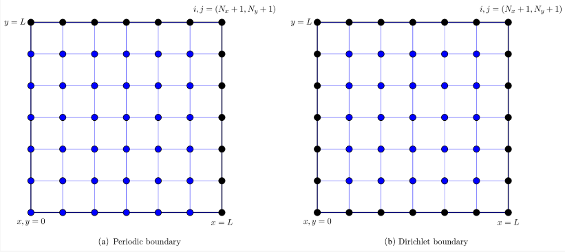

Poisson Equation
==================================

#. `CFD Julia: A Learning Module Structuring an Introductory Course on Computational Fluid Dynamics <https://www.mdpi.com/2311-5521/4/3/159/>`_
#. `The Fast Fourier Transform (FFT) <https://www.youtube.com/watch?v=E8HeD-MUrjY/>`_
#. `The Fast Fourier Transform (FFT): Most Ingenious Algorithm Ever? <https://www.youtube.com/watch?v=h7apO7q16V0/>`_

Two-Dimensional Poisson Equation
-----------------------------------------------------
In this section, we explain different methods to solve the Poisson equation which is encountered in solution to the incompressible flows. The Poisson equation is solved at every iteration step in the solution to the incompressible Navier-Stokes equation due to the continuity constraint.
Therefore, many studies have been done to accelerate the solution to the Poisson equation using higher-order numerical methods, and developing fast parallel algorithms. The Poisson equation is a second-order elliptic equation and can be represented as

.. math::
  \cfrac{\partial ^{2}u}{\partial x^{2}}+ \cfrac{\partial ^{2}u}{\partial y^{2}}=f
  
Using the second-order central difference formula for discretization of the Poisson equation, we get

.. math::
  \cfrac{u_{i-1,j}-2u_{i,j}+u_{i+1,j}}{\Delta x^{2}} +\cfrac{u_{i,j-1}-2u_{i,j}+u_{i,j+1}}{\Delta y^{2}} =f_{i,j}
  
where :math:`\Delta x` and :math:`\Delta y` is the grid spacing in the :math:`x` and :math:`y` directions, and :math:`f_{i,j}` is the source term at discrete grid
locations. If we write the above Equation at each grid point, we get a system of linear equations. For the Dirichlet boundary condition, we assume that the values of
:math:`u_{i,j}` are available when :math:`(x_{i},y_{j})` is a boundary point. These eauations can be written in the standard matrix notation as

.. math::
  \mathbf{A}\mathbf{u}=\mathbf{f}
  
where
  
.. math::
  \mathbf{A}=\begin{bmatrix}
  D_{xy}& D_{y} & 0&\cdots& D_{x}&\cdots&\cdots&0\\
  D_{y}&D_{xy}& D_{y} & \ddots & &\ddots&&\vdots \\
  0&D_{y}&D_{xy}& D_{y} & \ddots & &\ddots&\vdots \\
  \vdots&\ddots&\ddots & \ddots & &\ddots&&D_{x} \\
  D_{x}&&\ddots & \ddots & &\ddots&&\vdots \\
  \vdots&\ddots& &\ddots & D_{y}&D_{xy}& D_{y}&0 \\
  \vdots&& \ddots&&\ddots & D_{y}&D_{xy}& D_{y} \\
   0&\cdots& &D_{x}&\cdots &0 & D_{y}&D_{xy} \\
  \end{bmatrix}
  
-  
  
.. math::  
  \mathbf{u}=\begin{bmatrix}
  u_{1,1}\\
  u_{1,2}\\
  \vdots\\
  \vdots\\
  u_{2,1}\\
  \vdots\\
  \vdots\\
  u_{N_{x},N_{y}}
  \end{bmatrix}
  \quad
  \mathbf{f}=
  \begin{bmatrix}
  f_{1,1}\\
  f_{1,2}\\
  \vdots\\
  \vdots\\
  f_{2,1}\\
  \vdots\\
  \vdots\\
  f_{N_{x},N_{y}}
  \end{bmatrix}  
  
-  
  
.. math:: 
  \begin{array}{l}
  D_{xy}=\cfrac{-2}{\Delta x^{2}}+\cfrac{-2}{\Delta y^{2}}\\
  D_{x}=\cfrac{1}{\Delta x^{2}}\\
  D_{y}=\cfrac{1}{\Delta y^{2}}\\
  \end{array}
  
The boundary points of the domain are incorporated in the source term vector :math:`\mathbf{b}` in the above equation.
We can solve the equation by standard methods for systems of linear equations, such as Gaussian elimination.
However, the matrix :math:`\mathbf{A}` is very sparse and the standard methods are computationally expensive for large size of :math:`\mathbf{A}`.
In this paper, we discuss direct methods based on fast Fourier transform (FFT) and fast sine transform (FST) for periodic and Dirichlet boundary condition. We also explain iterative methods to solve Equation.
We will further present a multigrid framework which scales linearly with a number of discrete grid points in the domain.

Direct Solver
-----------------------
We use two different boundary conditions for direct Poisson solver: periodic and Dirichlet boundary condition.
For the Dirichlet boundary condition, the nodal values of a solution are already known and do not change, and hence, we do not do any calculation for the boundary points.
In case of periodic boundary condition, we do calculation for grid points :math:`(i,j)` between :math:`[1,N_{x}]\times[1,N_{y}]`.
The solution at right :math:`(i=N_{x}+1)` and top :math:`(j=N_{y}+1)` boundary is obtained from left :math:`(i=1)` and bottom :math:`(j=1)` boundary, respectively.

   
   Finite difference grid for two-dimensional problems. The calculation is done only for points shown by blue color. The solution at black points is extended from left and bottom boundary for periodic boundary condition. The solution is already available at all four boundaries for Dirichlet boundary condition.  

We perform the assessment of direct solver using the method of manufactured solution. We assume certain field :math:`\mathbf{u}` and compute the source term :math:`\mathbf{f}` at each grid location.
We then solve the Poisson equation for this source term :math:`\mathbf{f}` and compare the numerically calculated field :math:`\mathbf{u}` with the exact solution field :math:`\mathbf{u}`. The exact field :math:`\mathbf{u}` and the corresponding source term :math:`\mathbf{f}` used for direct Poisson solver are given below

.. math:: 
  \begin{array}{l}
  u(x,y)=\text{sin}(2\pi x)\text{sin}(2\pi y)+\cfrac{1}{16^2}\text{sin}(32\pi x)\text{sin}(32\pi y)\\
  f(x,y)=-8\pi^{2}\text{sin}(2\pi x)\text{sin}(2\pi y)-8\pi^{2}\text{sin}(32\pi x)\text{sin}(32\pi y)
  \end{array}

-
  
.. math:: 
  \begin{array}{l}
  \displaystyle \cfrac{\partial u(x,y)}{\partial x}=2\pi\text{cos}(2\pi x)\text{sin}(2\pi y)+\cfrac{32\pi}{16^2}\text{cos}(32\pi x)\text{sin}(32\pi y)\\
  \displaystyle \cfrac{\partial^{2} u(x,y)}{\partial x^{2}}=-(2\pi)^{2}\text{sin}(2\pi x)\text{sin}(2\pi y)-\cfrac{(32\pi)^2}{16^2}\text{sin}(32\pi x)\text{sin}(32\pi y)\\
  \displaystyle \cfrac{\partial^{2} u(x,y)}{\partial x^{2}}=-(2\pi)^{2}\left\{\text{sin}(2\pi x)\text{sin}(2\pi y)+\text{sin}(32\pi x)\text{sin}(32\pi y)\right\}
  \end{array} 
  
-  

.. math:: 
  \begin{array}{l}
  \displaystyle \cfrac{\partial u(x,y)}{\partial y}=2\pi\text{sin}(2\pi x)\text{cos}(2\pi y)+\cfrac{32\pi}{16^2}\text{sin}(32\pi x)\text{cos}(32\pi y)\\
  \displaystyle \cfrac{\partial^{2} u(x,y)}{\partial y^{2}}=-(2\pi)^{2}\text{sin}(2\pi x)\text{sin}(2\pi y)-\cfrac{(32\pi)^2}{16^2}\text{sin}(32\pi x)\text{sin}(32\pi y)\\
  \displaystyle \cfrac{\partial^{2} u(x,y)}{\partial y^{2}}=-(2\pi)^{2}\left\{\text{sin}(2\pi x)\text{sin}(2\pi y)+\text{sin}(32\pi x)\text{sin}(32\pi y)\right\}
  \end{array}  
  
-  

.. math:: 
  \begin{array}{l}
  \displaystyle \cfrac{\partial^{2} u(x,y)}{\partial x^{2}}+\cfrac{\partial^{2} u(x,y)}{\partial y^{2}}=-2(2\pi)^{2}\left\{\text{sin}(2\pi x)\text{sin}(2\pi y)+\text{sin}(32\pi x)\text{sin}(32\pi y)\right\}=f(x,y)\\
  \displaystyle \cfrac{\partial^{2} u}{\partial x^{2}}+\cfrac{\partial^{2} u}{\partial y^{2}}=-8\pi^{2}\left\{\text{sin}(2\pi x)\text{sin}(2\pi y)+\text{sin}(32\pi x)\text{sin}(32\pi y)\right\}=f(x,y)
  \end{array} 
  
This problem can have both periodic and Dirichlet boundary conditions. The computational domain is square in shape and is divided into :math:`512\times 512` grid in :math:`x` and :math:`y` directions.  

Fast Fourier Transform
-------------------------------
There are two different ways to implement fast Poisson solver for the periodic domain.
One way is to perform FFTs directly on the Poisson equation, which will give us the spectral accuracy.
The second method is to discretize the Poisson equation first and then apply FFTs on the discretized equation.
The second approach will give us the same spatial order of accuracy as the numerical scheme used for discretization.
We use the second-order central difference scheme for developing a direct Poisson solver.

The Fourier transform decomposes a spatial function into its sine and cosine components. The output of the Fourier transform is the function in its frequency domain. We can recover the function from its frequency domain using the inverse Fourier transform. We use both the function and its Fourier transform in the discretized domain which is called the discrete Fourier transform (DFT). Cooley-Tukey proposed an FFT algorithm that reduces the complexity of computing DFT from 
:math:`O(N^{2})` to :math:`O(N\text{log}N)`, where :math:`N` is the data size. In two-dimensions, the DFT for a square domain discretized equally in both directions is defined as

.. math:: 
  \widetilde{u}_{m,n}=\sum_{i=0}^{N_{x}-1} \sum_{j=0}^{N_{y}-1} {u}_{i,j}
  e^{-\mathbf{i}2\pi \left(\cfrac{mi}{N_{x}}+\cfrac{nj}{N_{y}}\right)}

-

.. math:: 
  \widetilde{f}_{m,n}=\sum_{i=0}^{N_{x}-1} \sum_{j=0}^{N_{y}-1} {f}_{i,j}
  e^{-\mathbf{i}2\pi \left(\cfrac{mi}{N_{x}}+\cfrac{nj}{N_{y}}\right)}
  
where :math:`u_{i,j}` is the function in the spatial domain and the exponential term is the basis function corresponding to each point 
:math:`\widetilde{u}_{m,n}` in the Fourier space, :math:`m` and :math:`n` are the wavenumbers in Fourier space in :math:`x` and :math:`y` directions, respectively. This equation can be interpreted as the value in the frequency domain 
:math:`\widetilde{u}_{m,n}` can be obtained by multiplying the spatial function with the corresponding basis function and summing the result. The basis functions are sine and cosine waves with increasing frequencies. 
Here, :math:`\widetilde{u}_{0,0}` represents the component of the function with the lowest wavenumber and :math:`\widetilde{u}_{N_{x}-1,N_{y}-1}` represents the component with the highest wavenumber. Similarly, the function in Fourier space can be transformed to the spatial domain. The inverse discrete Fourier transform (IDFT) is given by

.. math:: 
  {u}_{i,j}=\cfrac{1}{N_{x}} \cfrac{1}{N_{y}}\sum_{m=-N_{x}/2}^{N_{x}/2-1} \sum_{n=-N_{y}/2}^{N_{y}/2-1} \widetilde{u}_{m,n}
  e^{\mathbf{i}2\pi \left(\cfrac{mi}{N_{x}}+\cfrac{nj}{N_{y}}\right)}
  
-
  
.. math::   
  {f}_{i,j}=\cfrac{1}{N_{x}} \cfrac{1}{N_{y}}\sum_{m=-N_{x}/2}^{N_{x}/2-1} \sum_{n=-N_{y}/2}^{N_{y}/2-1} \widetilde{f}_{m,n}
  e^{\mathbf{i}2\pi \left(\cfrac{mi}{N_{x}}+\cfrac{nj}{N_{y}}\right)}\\  
  
where :math:`1/(N_{x}N_{y})` is the normalization term. The normalization can also be applied to forward transform, but it should be used only once.   

.. math:: 
  \widetilde{u}_{m,n}\left(\cfrac{e^{\mathbf{i}\cfrac{2\pi m}{N_{x}}}-2+e^{\mathbf{i}\cfrac{-2\pi m}{N_{x}}}}{\Delta x^{2}}
  +\cfrac{e^{\mathbf{i}\cfrac{2\pi n}{N_{y}}}-2+e^{\mathbf{i}\cfrac{-2\pi n}{N_{y}}}}{\Delta y^{2}}\right)
  =\widetilde{f}_{m,n}
  
in which we use the definition of cosine to yield

.. math::
  \widetilde{u}_{m,n}\left(\cfrac{2\text{cos}\left (\cfrac{2\pi m}{N_{x}}\right)-2}{\Delta x^{2}}
  +\cfrac{2\text{cos}\left (\cfrac{2\pi n}{N_{y}}\right)-2}{\Delta y^{2}}\right)
  =\widetilde{f}_{m,n}

Euler's formula:

.. math::
  \begin{array}{l}
  e^{\mathbf{i}\theta }=\text{cos}\theta +\mathbf{i}\text{sin}\theta\\
  e^{-\mathbf{i}\theta }=\text{cos}\theta -\mathbf{i}\text{sin}\theta\\
  \text{cos}\theta=\cfrac{1}{2}(e^{\mathbf{i}\theta }+e^{-\mathbf{i}\theta }) \\
  \text{sin}\theta=\cfrac{1}{2\mathbf{i}}(e^{\mathbf{i}\theta }-e^{-\mathbf{i}\theta }) 
  \end{array}
  
The three step procedure to develop a Poisson solver using FFT is given below  

- Apply forward FFT to find the Fourier coefficients of the source term in the Poisson equation (:math:`\widetilde{f}_{m,n}`
  from the grid values :math:`{f}_{i,j}`)
- Get the Fourier coefficients for the solution :math:`\widetilde{u}_{m,n}` using below relation

.. math::
  \widetilde{u}_{m,n}
  =\cfrac{ \widetilde{f}_{m,n}}
  {\cfrac{2}{\Delta x^{2}}\text{cos}\left (\cfrac{2\pi m}{N_{x}}\right)+
  \cfrac{2}{\Delta y^{2}}\text{cos}\left (\cfrac{2\pi n}{N_{y}}\right)-
  \cfrac{2}{\Delta x^{2}}-\cfrac{2}{\Delta y^{2}}
  }
  
-  Apply inverse FFT to get the grid values :math:`{u}_{i,j}` from the Fourier coefficients :math:`\widetilde{u}_{m,n}`

version 2

.. math::
  {u}_{i,j}=\cfrac{1}{N_{x}} \cfrac{1}{N_{y}}\sum_{m=0}^{N_{x}-1} \sum_{n=0}^{N_{y}-1} \widetilde{u}_{m,n}
  e^{\mathbf{i}2\pi \left(\cfrac{mi}{N_{x}}+\cfrac{nj}{N_{y}}\right)}
  
detail
-----------------------  

.. math::
  \begin{array}{l}
  \displaystyle {u}_{i,j}=\cfrac{1}{N_{x}} \cfrac{1}{N_{y}}\sum_{m=-N_{x}/2}^{N_{x}/2-1} \sum_{n=-N_{y}/2}^{N_{y}/2-1} \widetilde{u}_{m,n}
  e^{\mathbf{i}2\pi \left(\cfrac{mi}{N_{x}}+\cfrac{nj}{N_{y}}\right)}\\
  \displaystyle   {u}_{i+1,j}=\cfrac{1}{N_{x}} \cfrac{1}{N_{y}}\sum_{m=-N_{x}/2}^{N_{x}/2-1} \sum_{n=-N_{y}/2}^{N_{y}/2-1} \widetilde{u}_{m,n}
  e^{\mathbf{i}2\pi \left(\cfrac{m(i+1)}{N_{x}}+\cfrac{nj}{N_{y}}\right)}\\
  \displaystyle {u}_{i-1,j}=\cfrac{1}{N_{x}} \cfrac{1}{N_{y}}\sum_{m=-N_{x}/2}^{N_{x}/2-1} \sum_{n=-N_{y}/2}^{N_{y}/2-1} \widetilde{u}_{m,n}
  e^{\mathbf{i}2\pi \left(\cfrac{m(i-1)}{N_{x}}+\cfrac{nj}{N_{y}}\right)}\\
  \end{array} 
  
-

.. math::  
  \begin{array}{l}
  \displaystyle {u}_{i,j}=\cfrac{1}{N_{x}} \cfrac{1}{N_{y}}\sum_{m=-N_{x}/2}^{N_{x}/2-1} \sum_{n=-N_{y}/2}^{N_{y}/2-1} \widetilde{u}_{m,n}
  e^{\mathbf{i}2\pi \left(\cfrac{mi}{N_{x}}+\cfrac{nj}{N_{y}}\right)}\\
  \displaystyle   {u}_{i,j+1}=\cfrac{1}{N_{x}} \cfrac{1}{N_{y}}\sum_{m=-N_{x}/2}^{N_{x}/2-1} \sum_{n=-N_{y}/2}^{N_{y}/2-1} \widetilde{u}_{m,n}
  e^{\mathbf{i}2\pi \left(\cfrac{mi}{N_{x}}+\cfrac{n(j+1)}{N_{y}}\right)}\\
  \displaystyle {u}_{i,j-1}=\cfrac{1}{N_{x}} \cfrac{1}{N_{y}}\sum_{m=-N_{x}/2}^{N_{x}/2-1} \sum_{n=-N_{y}/2}^{N_{y}/2-1} \widetilde{u}_{m,n}
  e^{\mathbf{i}2\pi \left(\cfrac{mi}{N_{x}}+\cfrac{n(j-1)}{N_{y}}\right)}\\
  \end{array} 

Equivalent to

.. math::  
  \begin{array}{l}
  \displaystyle {u}_{i,j}=\cfrac{1}{N_{x}} \cfrac{1}{N_{y}}\sum_{m=-N_{x}/2}^{N_{x}/2-1} \sum_{n=-N_{y}/2}^{N_{y}/2-1} \widetilde{u}_{m,n}
  e^{\mathbf{i}2\pi \left(\cfrac{mi}{N_{x}}+\cfrac{nj}{N_{y}}\right)}\\
  \displaystyle   {u}_{i+1,j}=\cfrac{1}{N_{x}} \cfrac{1}{N_{y}}\sum_{m=-N_{x}/2}^{N_{x}/2-1} \sum_{n=-N_{y}/2}^{N_{y}/2-1} \widetilde{u}_{m,n}
  e^{\mathbf{i}2\pi \left(\cfrac{mi}{N_{x}}+\cfrac{nj}{N_{y}}\right)}e^{\mathbf{i}2\pi \left(\cfrac{m}{N_{x}}\right)}\\
  \displaystyle {u}_{i-1,j}=\cfrac{1}{N_{x}} \cfrac{1}{N_{y}}\sum_{m=-N_{x}/2}^{N_{x}/2-1} \sum_{n=-N_{y}/2}^{N_{y}/2-1} \widetilde{u}_{m,n}
  e^{\mathbf{i}2\pi \left(\cfrac{mi}{N_{x}}+\cfrac{nj}{N_{y}}\right)}e^{\mathbf{i}2\pi \left(-\cfrac{m}{N_{x}}\right)}\\
  \end{array}  
  
-

.. math::
  \begin{array}{l}
  \displaystyle {u}_{i,j}=\cfrac{1}{N_{x}} \cfrac{1}{N_{y}}\sum_{m=-N_{x}/2}^{N_{x}/2-1} \sum_{n=-N_{y}/2}^{N_{y}/2-1} \widetilde{u}_{m,n}
  e^{\mathbf{i}2\pi \left(\cfrac{mi}{N_{x}}+\cfrac{nj}{N_{y}}\right)}\\
  \displaystyle   {u}_{i,j+1}=\cfrac{1}{N_{x}} \cfrac{1}{N_{y}}\sum_{m=-N_{x}/2}^{N_{x}/2-1} \sum_{n=-N_{y}/2}^{N_{y}/2-1} \widetilde{u}_{m,n}
  e^{\mathbf{i}2\pi \left(\cfrac{mi}{N_{x}}+\cfrac{nj}{N_{y}}\right)}e^{\mathbf{i}2\pi \left(\cfrac{n}{N_{y}}\right)}\\
  \displaystyle {u}_{i,j-1}=\cfrac{1}{N_{x}} \cfrac{1}{N_{y}}\sum_{m=-N_{x}/2}^{N_{x}/2-1} \sum_{n=-N_{y}/2}^{N_{y}/2-1} \widetilde{u}_{m,n}
  e^{\mathbf{i}2\pi \left(\cfrac{mi}{N_{x}}+\cfrac{nj}{N_{y}}\right)}e^{\mathbf{i}2\pi \left(-\cfrac{n}{N_{y}}\right)}\\
  \end{array}  
  
-

.. math::  
  \cfrac{u_{i-1,j}-2u_{i,j}+u_{i+1,j}}{\Delta x^{2}} +\cfrac{u_{i,j-1}-2u_{i,j}+u_{i,j+1}}{\Delta y^{2}} =f_{i,j}  
  
-
  
.. math::   
  {f}_{i,j}=\cfrac{1}{N_{x}} \cfrac{1}{N_{y}}\sum_{m=-N_{x}/2}^{N_{x}/2-1} \sum_{n=-N_{y}/2}^{N_{y}/2-1} \widetilde{f}_{m,n}
  e^{\mathbf{i}2\pi \left(\cfrac{mi}{N_{x}}+\cfrac{nj}{N_{y}}\right)}\\  
  
-
  
.. math::   
  \begin{array}{l}
  \displaystyle \cfrac{{u}_{i-1,j}-2{u}_{i,j}+{u}_{i+1,j}}{\Delta x^{2}} \\
  \displaystyle  =\cfrac{1}{N_{x}N_{y}} \sum_{m=-N_{x}/2}^{N_{x}/2-1} \sum_{n=-N_{y}/2}^{N_{y}/2-1} \widetilde{u}_{m,n}
  e^{\mathbf{i}2\pi \left(\cfrac{mi}{N_{x}}+\cfrac{nj}{N_{y}}\right)}\left(\cfrac{e^{\mathbf{i}2\pi \left(\cfrac{m}{N_{x}}\right)}-2+e^{\mathbf{i}2\pi \left(-\cfrac{m}{N_{x}}\right)}}{\Delta x^{2}} \right)
  \end{array}
  
-
  
.. math::   
  \begin{array}{l}
  \displaystyle \cfrac{{u}_{i,j-1}-2{u}_{i,j}+{u}_{i,j+1}}{\Delta y^{2}} \\
  \displaystyle  =\cfrac{1}{N_{x}N_{y}} \sum_{m=-N_{x}/2}^{N_{x}/2-1} \sum_{n=-N_{y}/2}^{N_{y}/2-1} \widetilde{u}_{m,n}
  e^{\mathbf{i}2\pi \left(\cfrac{mi}{N_{x}}+\cfrac{nj}{N_{y}}\right)}\left(\cfrac{e^{\mathbf{i}2\pi \left(\cfrac{n}{N_{y}}\right)}-2+e^{\mathbf{i}2\pi \left(-\cfrac{n}{N_{y}}\right)}}{\Delta y^{2}} \right)
  \end{array}
  
-
  
.. math:: 
  \widetilde{u}_{m,n}\cfrac{e^{\mathbf{i}2\pi \left(\cfrac{m}{N_{x}}\right)}-2+e^{\mathbf{i}2\pi \left(-\cfrac{m}{N_{x}}\right)}}{\Delta x^{2}}
  +\widetilde{u}_{m,n}\cfrac{e^{\mathbf{i}2\pi \left(\cfrac{n}{N_{y}}\right)}-2+e^{\mathbf{i}2\pi \left(-\cfrac{n}{N_{y}}\right)}}{\Delta y^{2}}
  =\widetilde{f}_{m,n}  
  
Fast Sine Transform  
---------------------- 
Fourier Sine series of period :math:`2\pi` and is given by

.. math::
  f(x)=\sum_{n=1}^{\infty}b_{n}\text{sin }nx
  
where the Fourier coefficients are  

.. math::
  b_{n}=\cfrac{2}{\pi}\int_{0}^{\pi} f(x)\text{sin }nxdx\quad(n=1,2,3,\dots)
  

the Fourier Sine series of period :math:`2L` and is given by

.. math::
  f(x)=\sum_{n=1}^{\infty}b_{n}\text{sin }\cfrac{n\pi x}{L}
  
where the Fourier coefficients are  

.. math::
  b_{n}=\cfrac{2}{L}\int_{0}^{L} f(x)\text{sin }\cfrac{n\pi x}{L}dx\quad(n=1,2,3,\dots)
  
the Fourier Sine series of period :math:`2T` and is given by

.. math::
  f(x)=\sum_{n=1}^{\infty}b_{n}\text{sin }\cfrac{n\pi x}{T}
  
where the Fourier coefficients are  

.. math::
  b_{n}=\cfrac{2}{T}\int_{0}^{T} f(x)\text{sin }\cfrac{n\pi x}{T}dx\quad(n=1,2,3,\dots)
  
or

the Fourier Sine series of period :math:`2T` and is given by

.. math::
  f(t)=\sum_{n=1}^{\infty}b_{n}\text{sin }\cfrac{\pi nt}{T}
  
where the Fourier coefficients are  

.. math::
  b_{n}=\cfrac{2}{T}\int_{0}^{T} f(t)\text{sin }\cfrac{\pi nt}{T}dt\quad(n=1,2,3,\dots) 
  
Let :math:`\Delta t=\cfrac{T}{N}`, then
  
.. math::  
   t_{i}=i\Delta t,\quad (i=0,1,2,\dots,N-1)
   
-
   
.. math::  
  \begin{array}{l}
  t_{0}=0\\
  t_{1}=\Delta t\\
  t_{2}=2\Delta t\\
  \dots\\
  t_{i}=i\Delta t\\
  \dots\\
  t_{N-1}=(N-1)\Delta t\\
  \end{array} 
  
-
   
.. math::  
  \begin{array}{l}
  \displaystyle f(t)=\sum_{n=1}^{\infty}b_{n}\text{sin }\cfrac{\pi nt}{T}\\
  \displaystyle f_{0}=f(t_{0})=\sum_{n=1}^{\infty}b_{n}\text{sin }\cfrac{\pi nt_{0}}{T}\\
  \displaystyle f_{1}=f(t_{1})=\sum_{n=1}^{\infty}b_{n}\text{sin }\cfrac{\pi nt_{1}}{T}\\
  \displaystyle f_{2}=f(t_{2})=\sum_{n=1}^{\infty}b_{n}\text{sin }\cfrac{\pi nt_{2}}{T}\\
  \dots\\
  \displaystyle f_{i}=f(t_{i})=\sum_{n=1}^{\infty}b_{n}\text{sin }\cfrac{\pi nt_{i}}{T}\\
  \dots\\
  \displaystyle f_{N-1}=f(t_{N-1})=\sum_{n=1}^{\infty}b_{n}\text{sin }\cfrac{\pi nt_{N-1}}{T}\\
  \end{array}
  
-
   
.. math::  
  \begin{array}{l}
  \displaystyle f(t)=\sum_{n=1}^{\infty}b_{n}\text{sin }\cfrac{\pi nt}{T}\\
  \displaystyle f_{0}=f(0)=\sum_{n=1}^{\infty}b_{n}\text{sin }\cfrac{\pi n}{T}0\\
  \displaystyle f_{1}=f(\Delta t)=\sum_{n=1}^{\infty}b_{n}\text{sin }\cfrac{\pi n}{T}{\Delta t}\\
  \displaystyle f_{2}=f({2\Delta t})=\sum_{n=1}^{\infty}b_{n}\text{sin }\cfrac{\pi n}{T}{2\Delta t}\\
  \dots\\
  \displaystyle f_{i}=f({i\Delta t})=\sum_{n=1}^{\infty}b_{n}\text{sin }\cfrac{\pi n}{T}{i\Delta t}\\
  \dots\\
  \displaystyle f_{N-1}=f({(N-1)\Delta t})=\sum_{n=1}^{\infty}b_{n}\text{sin }\cfrac{\pi n}{T}{(N-1)\Delta t}\\
  \end{array}  
  
-
   
.. math::  
  \begin{array}{l}
  \displaystyle f_{i}=f({i\Delta t})=\sum_{n=1}^{N-1}b_{n}\text{sin }\cfrac{\pi n}{N\Delta t}{i\Delta t}\\
  \displaystyle f_{i}=\sum_{n=0}^{N-1}b_{n}\text{sin }\cfrac{\pi n}{N}{i}\\
  \end{array}  
  
The coefficients   

.. math::   
  \begin{array}{l}
  \displaystyle b_{n}=\cfrac{2}{T}\int_{0}^{T} f(t)\text{sin }\cfrac{\pi nt}{T}dt\quad(n=1,2,3,\dots) \\
  \displaystyle b_{n}=\cfrac{2}{T}\sum_{i=0}^{N-1} f({i\Delta t})\text{sin }\cfrac{\pi n{i\Delta t}}{T}\Delta t\quad(n=1,2,3,\dots) \\
  \displaystyle b_{n}=\cfrac{2}{N\Delta t}\sum_{i=0}^{N-1} f({i\Delta t})\text{sin }\cfrac{\pi n{i\Delta t}}{N\Delta t}\Delta t\quad(n=1,2,3,\dots) \\
  \displaystyle b_{n}=\cfrac{2}{N}\sum_{i=0}^{N-1} f({i\Delta t})\text{sin }\cfrac{\pi n{i}}{N}\quad(n=1,2,3,\dots) \\
  \displaystyle b_{n}=\cfrac{2}{N}\sum_{i=0}^{N-1} f_{i}\text{ sin }\cfrac{\pi n{i}}{N}\quad(n=1,2,3,\dots) \\
  \end{array}
  
Let 

.. math::
  \hat{f}(n)=b_{n}
  
then

Discrete Sine Transform (DST)  

.. math::
  \hat{f}_{n}=\cfrac{2}{N}\sum_{i=0}^{N-1} f_{i}\text{ sin }\cfrac{\pi n{i}}{N}\quad(n=0,1,2,\dots,N-1)
  
Inverse Discrete Sine Transform (IDST)

.. math::
  f_{i}=\sum_{n=0}^{N-1}\hat{f}_{n}\text{sin }\cfrac{\pi n}{N}{i}
  
or

Discrete Sine Transform (DST)  

.. math::
  \hat{f}_{n}=\sum_{i=0}^{N-1} f_{i}\text{ sin }\cfrac{\pi n{i}}{N}\quad(n=0,1,2,\dots,N-1)
  
Inverse Discrete Sine Transform (IDST)

.. math::
  f_{i}=\cfrac{2}{N}\sum_{n=0}^{N-1}\hat{f}_{n}\text{sin }\cfrac{\pi n}{N}{i}
  
Two-Dimensional Problem
-------------------------------

Discrete Sine Transform (DST)  

.. math::
  \hat{f}_{m,n}=\sum_{i=0}^{M-1}\sum_{j=0}^{N-1} f_{i,j}\text{ sin }\cfrac{\pi m{i}}{M}\text{ sin }\cfrac{\pi n{j}}{N}
  
where  

.. math::
  \begin{array}{l}
  m=0,1,2,\dots,M-1\\
  n=0,1,2,\dots,N-1\\
  \end{array}
  
Inverse Discrete Sine Transform (IDST)

.. math::
  f_{i,j}=\cfrac{2}{M} \cfrac{2}{N}\sum_{m=0}^{M-1}\sum_{n=0}^{N-1} \hat{f}_{m,n}\text{ sin }\cfrac{\pi m{i}}{M}\text{ sin }\cfrac{\pi n{j}}{N}
  
Poisson Equation of Discrete Sine Transform
---------------------------------------------------------------  

.. math::
  \cfrac{u_{i-1,j}-2u_{i,j}+u_{i+1,j}}{\Delta x^{2}}+\cfrac{u_{i,j-1}-2u_{i,j}+u_{i,j+1}}{\Delta y^{2}}=f_{i,j}  

-

.. math::  
  \begin{array}{l}
  \displaystyle u_{i-1,j}=\cfrac{2}{M} \cfrac{2}{N}\sum_{m=0}^{M-1}\sum_{n=0}^{N-1} \hat{u}_{m,n}\text{ sin }\cfrac{\pi m{(i-1)}}{M}\text{ sin }\cfrac{\pi n{j}}{N}\\
  \displaystyle u_{i+1,j}=\cfrac{2}{M} \cfrac{2}{N}\sum_{m=0}^{M-1}\sum_{n=0}^{N-1} \hat{u}_{m,n}\text{ sin }\cfrac{\pi m{(i+1)}}{M}\text{ sin }\cfrac{\pi n{j}}{N}\\
  \displaystyle u_{i,j}=\cfrac{2}{M} \cfrac{2}{N}\sum_{m=0}^{M-1}\sum_{n=0}^{N-1} \hat{u}_{m,n}\text{ sin }\cfrac{\pi m{i}}{M}\text{ sin }\cfrac{\pi n{j}}{N}\\
  \displaystyle u_{i,j-1}=\cfrac{2}{M} \cfrac{2}{N}\sum_{m=0}^{M-1}\sum_{n=0}^{N-1} \hat{u}_{m,n}\text{ sin }\cfrac{\pi m{i}}{M}\text{ sin }\cfrac{\pi n{(j-1)}}{N}\\
  \displaystyle u_{i,j+1}=\cfrac{2}{M} \cfrac{2}{N}\sum_{m=0}^{M-1}\sum_{n=0}^{N-1} \hat{u}_{m,n}\text{ sin }\cfrac{\pi m{i}}{M}\text{ sin }\cfrac{\pi n{(j+1)}}{N}\\
  \end{array}  

Sum and Difference Formulas of Trigonometric functions
-------------------------------------------------------------

.. math::
  \begin{array}{l}
  \text{sin}(\alpha+\beta)=\text{sin}(\alpha)\text{cos}(\beta)+\text{cos}(\alpha)\text{sin}(\beta)\\
  \text{sin}(\alpha-\beta)=\text{sin}(\alpha)\text{cos}(\beta)-\text{cos}(\alpha)\text{sin}(\beta)\\
  \text{sin}(\alpha)+\text{sin}(\beta)=2\text{sin}(\cfrac{\alpha+\beta}{2})\text{cos}(\cfrac{\alpha-\beta}{2})\\
  \text{sin}(\alpha)-\text{sin}(\beta)=2\text{cos}(\cfrac{\alpha+\beta}{2})\text{sin}(\cfrac{\alpha-\beta}{2})\\
  \end{array}  
  
then

.. math::
  \begin{array}{l}
  \alpha=\cfrac{\pi mi}{M}\quad \beta=\cfrac{\pi m}{M}\\
  \text{ sin }\cfrac{\pi m{(i-1)}}{M}=\text{sin}(\cfrac{\pi mi}{M})\text{cos}(\cfrac{\pi m}{M})-\text{cos}(\cfrac{\pi mi}{M})\text{sin}(\cfrac{\pi m}{M})\\
  \text{ sin }\cfrac{\pi m{(i+1)}}{M}=\text{sin}(\cfrac{\pi mi}{M})\text{cos}(\cfrac{\pi m}{M})+\text{cos}(\cfrac{\pi mi}{M})\text{sin}(\cfrac{\pi m}{M})\\
  \end{array}  
  
-
  
.. math::
  \begin{array}{l}
  \alpha=\cfrac{\pi nj}{N}\quad \beta=\cfrac{\pi n}{N}\\
  \text{ sin }\cfrac{\pi n{(j-1)}}{N}=\text{sin}(\cfrac{\pi nj}{N})\text{cos}(\cfrac{\pi n}{N})-\text{cos}(\cfrac{\pi nj}{N})\text{sin}(\cfrac{\pi n}{N})\\
  \text{ sin }\cfrac{\pi n{(j+1)}}{N}=\text{sin}(\cfrac{\pi nj}{N})\text{cos}(\cfrac{\pi n}{N})+\text{cos}(\cfrac{\pi nj}{N})\text{sin}(\cfrac{\pi n}{N})\\
  \end{array} 
  
-
  
.. math::
  \displaystyle u_{i-1,j}+u_{i+1,j}=\cfrac{2}{M} \cfrac{2}{N}\sum_{m=0}^{M-1}\sum_{n=0}^{N-1} \hat{u}_{m,n}\bigg\{\text{ sin }\cfrac{\pi m{(i-1)}}{M}\text{ sin }\cfrac{\pi n{j}}{N}+\text{ sin }\cfrac{\pi m{(i+1)}}{M}\text{ sin }\cfrac{\pi n{j}}{N}\bigg\}\\  
  
-
  
.. math::
  \begin{array}{l}
  \alpha=\cfrac{\pi m{(i-1)}}{M},\quad \beta=\cfrac{\pi m{(i+1)}}{M}\\
  \cfrac{\alpha+\beta}{2}= \cfrac{\pi mi}{M},\quad\cfrac{\alpha-\beta}{2}= -\cfrac{\pi m}{M}\\
  \text{ sin }\cfrac{\pi m{(i-1)}}{M}+\text{ sin }\cfrac{\pi m{(i+1)}}{M}=2\text{ sin }\cfrac{\pi mi}{M}\text{cos}\cfrac{\pi m}{M}\\
  \bigg\{\text{ sin }\cfrac{\pi m{(i-1)}}{M}+\text{ sin }\cfrac{\pi m{(i+1)}}{M}\bigg\}\text{ sin }\cfrac{\pi nj}{N}=2\text{ sin }\cfrac{\pi mi}{M}\text{ sin }\cfrac{\pi nj}{N}\text{cos}\cfrac{\pi m}{M}\\
  \end{array}  
  
-
  
.. math::
  \begin{array}{l}
  \alpha=\cfrac{\pi n{(j-1)}}{M},\quad \beta=\cfrac{\pi n{(j+1)}}{N}\\
  \cfrac{\alpha+\beta}{2}= \cfrac{\pi nj}{N},\quad\cfrac{\alpha-\beta}{2}= -\cfrac{\pi n}{N}\\
  \text{ sin }\cfrac{\pi n{(j-1)}}{N}+\text{ sin }\cfrac{\pi n{(j+1)}}{N}=2\text{ sin }\cfrac{\pi nj}{N}\text{cos}\cfrac{\pi n}{N}\\
  \bigg\{\text{ sin }\cfrac{\pi n{(j-1)}}{N}+\text{ sin }\cfrac{\pi n{(j+1)}}{N}\bigg\}\text{ sin }\cfrac{\pi mi}{M}=2\text{ sin }\cfrac{\pi nj}{N}\text{ sin }\cfrac{\pi mi}{M}\text{cos}\cfrac{\pi n}{N}\\
  \end{array}    
  
-

.. math::
  \cfrac{u_{i-1,j}-2u_{i,j}+u_{i+1,j}}{\Delta x^{2}}+\cfrac{u_{i,j-1}-2u_{i,j}+u_{i,j+1}}{\Delta y^{2}}=f_{i,j}    
  
-

.. math:: 
  \cfrac{u_{i-1,j}-2u_{i,j}+u_{i+1,j}}{\Delta x^{2}}  =
  \cfrac{2}{M} \cfrac{2}{N}\sum_{m=0}^{M-1}\sum_{n=0}^{N-1} \hat{u}_{m,n}\text{ sin }\cfrac{\pi m{i}}{M}\text{ sin }\cfrac{\pi n{j}}{N}
  \Bigg(\cfrac{2\text{cos}\cfrac{\pi m}{M}-2}{\Delta x^{2}}\Bigg)

-

.. math:: 
  \cfrac{u_{i,j-1}-2u_{i,j}+u_{i,j+1}}{\Delta y^{2}}  =
  \cfrac{2}{M} \cfrac{2}{N}\sum_{m=0}^{M-1}\sum_{n=0}^{N-1} \hat{u}_{m,n}\text{ sin }\cfrac{\pi m{i}}{M}\text{ sin }\cfrac{\pi n{j}}{N}
  \Bigg(\cfrac{2\text{cos}\cfrac{\pi n}{N}-2}{\Delta y^{2}}\Bigg)

-

.. math::
  f_{i,j}=\cfrac{2}{M} \cfrac{2}{N}\sum_{m=0}^{M-1}\sum_{n=0}^{N-1} \hat{f}_{m,n}\text{ sin }\cfrac{\pi m{i}}{M}\text{ sin }\cfrac{\pi n{j}}{N}
  
-

.. math::
  \hat{u}_{m,n}\Bigg(\cfrac{2\text{cos}\cfrac{\pi m}{M}-2}{\Delta x^{2}}+\cfrac{2\text{cos}\cfrac{\pi n}{N}-2}{\Delta y^{2}}\Bigg)=\hat{f}_{m,n}
  
-

.. math::
  \hat{u}_{m,n}=\cfrac{\hat{f}_{m,n}}{\Bigg(\cfrac{2\text{cos}\cfrac{\pi m}{M}-2}{\Delta x^{2}}+\cfrac{2\text{cos}\cfrac{\pi n}{N}-2}{\Delta y^{2}}\Bigg)} 
  
  
Implement
----------------------

.. math::
  \begin{array}{l}
  \text{allocate } A[M,M]\\
  A[i,m]=\text{ sin }\cfrac{\pi m{i}}{M}\\
  \text{allocate } B[N,N]\\
  B[j,n]=\text{ sin }\cfrac{\pi m{j}}{N}
  \end{array}

Multigrid Framework
----------------------
The multigrid framework is one of the most efficient iterative algorithm to solve the linear system of equations arising due to the discretization of the Poisson equation. The multigrid framework works on the principle that low wavenumber errors on fine grid behave like a high wavenumber error on a coarse grid. In the multigrid framework, we restrict the residuals on the fine grid to the coarser grid. The restricted residual is then relaxed to resolve the low wavenumber errors and the correction to the solution is prolongated back to the fine grid. We can use any of the iterative methods like Jacobi, Gauss-Seidel method for relaxation. The algorithm can be implemented recursively on the hierarchy of grids to get faster convergence.

.. math::