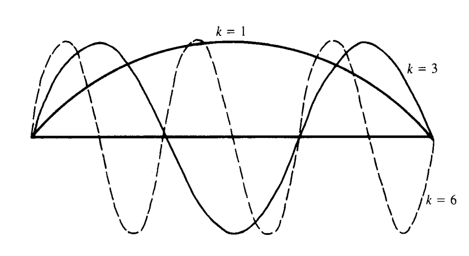

MULTIGRID 
==================================

#. `Multigrid Solver for 1D Poisson Problem <https://people.math.sc.edu/Burkardt/c_src/multigrid_poisson_1d/multigrid_poisson_1d.html>`_
#. `Multigrid methods <https://www.damtp.cam.ac.uk/user/hf323/M21-II-NA/demos/multigrid/multigrid.html>`_
#. `MIT Numerical Methods for PDE Lecture 6: Walkthough of a multigrid solver <https://www.youtube.com/watch?v=jqwyl9m5euI/>`_
#. `Elliptic Problems / Multigrid <http://bender.astro.sunysb.edu/classes/numerical_methods/lectures/elliptic-multigrid.pdf>`_
#. `numerical methods <http://bender.astro.sunysb.edu/classes/numerical_methods/>`_
#. `多重网格法 (Multigrid Method) 简述和示例 <https://zhuanlan.zhihu.com/p/337970166/>`_
#. `Algebraic Multigrid <https://amgcl.readthedocs.io/en/latest/amg_overview.html>`_
#. `Algebraic Multigrid Methods <https://www.wias-berlin.de/people/john/LEHRE/MULTIGRID/multigrid_7.pdf>`_
#. `Algebraic Multigrid AMG-An Introduction with Applications <https://www.scai.fraunhofer.de/content/dam/scai/de/documents/AllgemeineDokumentensammlung/SchnelleLoeser/SAMG/AMG_Introduction.pdf>`_
#. `Mathematical Methods for Engineers II <https://math.mit.edu/classes/18.086/2006/>`_

Multigrid Framework
---------------------------
We saw the rate of convergence for iterative methods depends upon the iteration matrix.
Point iterative methods like Jacobi and Gauss-Seidel methods have large eigenvalue and hence the slow convergence. As the grid becomes finer, the maximum eigenvalue of the iteration matrix becomes close to 1.
Therefore, for very high-resolution simulation, these iterative methods are not feasible due to the large computational time required for residuals to go below some specified tolerance.

The multigrid framework is one of the most efficient iterative algorithm to solve the linear system of equations arising due to the discretization of the Poisson equation. The multigrid framework works on the principle that low wavenumber errors on fine grid behave like a high wavenumber error on a coarse grid. In the multigrid framework, we restrict the residuals on the fine grid to the coarser grid.
The restricted residual is then relaxed to resolve the low wavenumber errors and the correction to the solution is prolongated back to the fine grid. We can use any of the iterative methods like Jacobi, Gauss-Seidel method for relaxation. The algorithm can be implemented recursively on the hierarchy of grids to get faster convergence.

Basic Iterative Methods
---------------------------
We now consider how model problems might be treated using conventional iterative or relaxation methods. We first establish the notation for this
and all remaining chapters. Let 

.. math::
  A\mathbf{u}=\mathbf{f}

denote a system of linear equations. We always use :math:`\mathbf{u}` to
denote the exact solution of this system and :math:`\mathbf{v}` to denote an approximation to the
exact solution, perhaps generated by some iterative method. Bold symbols, such as
:math:`\mathbf{u}` and :math:`\mathbf{v}`, represent vectors, while the :math:`j\text{th}` components of these vectors are denoted
by :math:`{u}_{j}` and :math:`{v}_{j}`. In later chapters, we need to associate :math:`\mathbf{u}` and :math:`\mathbf{v}` with a particular
grid, say :math:`{\Omega}^{h}`. In this case, the notation :math:`{u}^{h}` and :math:`{v}^{h}` is used.

Suppose that the system :math:`A\mathbf{u}=\mathbf{f}` has a unique solution and that :math:`\mathbf{v}` is a computed
approximation to :math:`\mathbf{u}`. There are two important measures of :math:`\mathbf{v}` as an approximation
to :math:`\mathbf{u}`. One is the error (or algebraic error) and is given simply by

.. math::
  \mathbf{e}=\mathbf{u}-\mathbf{v}
  
The error is also a vector and its magnitude may be measured by any of the standard
vector norms. The most commonly used norms for this purpose are the maximum
(or infinity) norm and the Euclidean or 2-norm, defined, respectively, by

.. math::
  \|\mathbf{e}\|_{\infty }=\underset{1\le j\le n }{\text{max}}|e_{j}|\quad \text{and } 
  \|\mathbf{e}\|_{2}=\Bigg\{{\sum_{j=1}^{n}e_{j}^{2}}\Bigg\}^{1/2}
  
Unfortunately, the error is just as inaccessible as the exact solution itself. However, a computable measure of how well :math:`\mathbf{v}` approximates :math:`\mathbf{u}` is the residual, given
by

.. math::
  \mathbf{r}=\mathbf{f}-A\mathbf{v}
  
  
The residual is simply the amount by which the approximation :math:`\mathbf{v}` fails to satisfy
the original problem :math:`A\mathbf{u}=\mathbf{f}`. It is also a vector and its size may be measured by
the same norm used for the error. By the uniqueness of the solution, :math:`\mathbf{r}=0` if and
only if :math:`\mathbf{e}=0`. However, it may not be true that when :math:`\mathbf{r}` is small in norm, :math:`\mathbf{e}` is also
small in norm.  

Residuals and Errors.
---------------------------
A residual may be defined for any numerical approximation and, in many cases, a small residual does not necessarily imply a small
error. This is certainly true for systems of linear equations, as shown by the
following two problems:

.. math::
  \begin{pmatrix}
  1& -1\\
  21&-20
  \end{pmatrix}
  \begin{pmatrix}
  u_{1}\\u_{2}
  \end{pmatrix}=
  \begin{pmatrix}
  -1\\-19
  \end{pmatrix}
  
and   

.. math::
  \begin{pmatrix}
  1& -1\\
  3&-1
  \end{pmatrix}
  \begin{pmatrix}
  u_{1}\\u_{2}
  \end{pmatrix}=
  \begin{pmatrix}
  -1\\1
  \end{pmatrix}
  
Both systems have the exact solution :math:`\mathbf{u}=(1,2)^{T}`. Suppose we have computed
the approximation :math:`\mathbf{v}=(1.95, 3)^{T}`. The error in this approximation is :math:`\mathbf{e}=(-0.95, -1)^{T}`,
for which :math:`\|\mathbf{e}\|_{2}=1.379`. The norm of the residual in :math:`\mathbf{v}` for the
first system is :math:`\|\mathbf{r}_{1}\|_{2}=0.071`, while the residual norm for the second system is
:math:`\|\mathbf{r}_{2}\|_{2}=1.851`. Clearly, the relatively small residual for the first system does
not reflect the rather large error.

Remembering that :math:`A\mathbf{u}=\mathbf{f}` and using the definitions of :math:`\mathbf{r}` and :math:`\mathbf{e}`, we can derive
an extremely important relationship between the error and the residual:

.. math::
  \begin{array}{l}
  A\mathbf{u}=\mathbf{f}\\
  \mathbf{r}=\mathbf{f}-A\mathbf{v}\\
  A\mathbf{u}=\mathbf{f}=\mathbf{r}+A\mathbf{v}\\
  \mathbf{r}=A(\mathbf{u}-\mathbf{v})\\
  \mathbf{r}=A\mathbf{e}\\
  \end{array}

-
  
.. math::
  A\mathbf{e}=\mathbf{r}  
  
We call this relationship the residual equation. It says that the error satisfies the
same set of equations as the unknown :math:`\mathbf{u}` when :math:`\mathbf{f}` is replaced by the residual :math:`\mathbf{r}`. The
residual equation plays a vital role in multigrid methods and it is used repeatedly
throughout this tutorial.

We can now anticipate, in an imprecise way, how the residual equation can be
used to great advantage. Suppose that an approximation :math:`\mathbf{v}` has been computed
by some method. It is easy to compute the residual :math:`\mathbf{r}=\mathbf{f}-\mathbf{A}\mathbf{v}`. To improve the
approximation :math:`\mathbf{v}`, we might solve the residual equation for e and then compute a
new approximation using the definition of the error  

.. math::
  \mathbf{u}=\mathbf{v}+\mathbf{e}
  
In practice, this method must be applied more carefully than we have indicated.
Nevertheless, this idea of residual correction is very important in all that follows. 

Model Problems
-------------------
Multigrid methods were originally applied to simple boundary value problems that
arise in many physical applications. For simplicity and for historical reasons, these
problems provide a natural introduction to multigrid methods. As an example,
consider the two-point boundary value problem that describes the steady-state
temperature distribution in a long uniform rod. It is given by the second-order
boundary value problem

.. math::
  -\cfrac{\text{d}^{2}u}{\text{d}u^{2}} +\sigma u(x)=f(x),\quad 0<x<1,\quad\sigma \ge 0
  
-

.. math::
   u(0)=u(1)=0
   
While this problem can be handled analytically, our present aim is to consider
numerical methods. Many such approaches are possible, the simplest of which is a
finite difference method. The domain of the problem :math:`\{x:0\le x\le 1\}` is partitioned into :math:`n` subintervals
by introducing the grid points :math:`x_{j}= jh`, where :math:`h = 1/n` is the constant width of the
subintervals. 

At each of the :math:`n−1` interior grid points, the original differential equation is
replaced by a second-order finite difference approximation. In making this replacement, we also introduce :math:`v_{j}` as an approximation to the exact solution :math:`u(x_{j})`. This
approximate solution may now be represented by a vector :math:`\mathbf{v}=(v_{1}, . . . , v_{n-1})^{T}`,
whose components satisfy the :math:`n−1` linear equations  

.. math::
  \begin{array}{c}
  \cfrac{-v_{j-1}+2v_{j}-v_{j+1}}{h^{2}}+\sigma v_{j}=f(x_{j}), \quad 1\le j\le n-1,\\
  v_{0}=v_{n}=0
  \end{array}
  
.. figure:: ../images/multigrid1.png
   :width: 800
   :align: center
   
   One-dimensional grid on the interval :math:`0\le x\le 1`. The grid spacing is :math:`h=\cfrac{1}{n}` and the jth grid point is :math:`x_{j} = jh` for :math:`0\le j\le n`.
   
Defining :math:`\mathbf{f}=(f(x_{1}),\cdots,f(x_{n-1}))^{T}=(f_{1},\cdots,f_{n-1})^{T}`, the vector of right-side
values, we may also represent this system of linear equations in matrix form as   

.. math::
  \cfrac{1}{h^{2}}\begin{bmatrix}
  2+\sigma h^{2}&-1 \\
  -1&2+\sigma h^{2}&-1 \\
  &\cdot&\cdot&\cdot \\
  &&\cdot&\cdot&\cdot \\
  &&&\cdot&\cdot&-1\\
  &&&&-1&2+\sigma h^{2}&\\
  \end{bmatrix} 
  \begin{bmatrix}
  v_{1}\\\cdot\\\cdot\\\cdot\\\cdot\\v_{n-1}
  \end{bmatrix}
  =\begin{bmatrix}
  f_{1}\\\cdot\\\cdot\\\cdot\\\cdot\\f_{n-1}
  \end{bmatrix}
  
or even more compactly as :math:`A\mathbf{v}=\mathbf{f}`. The matrix :math:`A` is :math:`(n-1)\times(n-1)`, tridiagonal,symmetric, and positive definite.

We now turn to relaxation methods for our first model problem  with :math:`\sigma = 0`.
Multiplying that equation by :math:`h^{2}` for convenience, the discrete problem becomes

.. math::
  \begin{array}{c}
  {-u_{j-1}+2u_{j}-u_{j+1}}={h^{2}}f_{j}, \quad 1\le j\le n-1,\\
  u_{0}=u_{n}=0
  \end{array}
  
One of the simplest schemes is the Jacobi (or simultaneous displacement) method.
It is produced by solving the :math:`j\text{th}` equation for the :math:`j\text{th}` unknown and using
the current approximation for the :math:`(j −1)\text{st}` and :math:`(j+1)\text{st}` unknowns. Applied to the
vector of current approximations, this produces an iteration scheme that may be
written in component form as  

.. math::
  v_{j}^{1}=\cfrac{1}{2}(v_{j-1}^{0}+v_{j+1}^{0}+{h^{2}}f_{j}), \quad 1\le j\le n-1,\\
  
To keep the notation as simple as possible, the current approximation (or the
initial guess on the first iteration) is denoted :math:`v^{(0)}`, while the new, updated approximation is denoted :math:`v^{(1)}`. In practice, once all of the :math:`v^{(1)}` components have been
computed, the procedure is repeated, with :math:`v^{(1)}` playing the role of :math:`v^{(0)}`. These iteration sweeps are continued until (ideally) convergence to the solution is obtained.

It is important to express these relaxation schemes in matrix form, as well as
component form. We split the matrix :math:`A` in the form  

.. math::
   A=D-L-U
   
where :math:`D` is the diagonal of :math:`A`, and :math:`−L` and :math:`−U` are the strictly lower and upper
triangular parts of :math:`A`, respectively. Including the :math:`h^{2}` term in the vector :math:`\mathbf{f}`, then
:math:`A\mathbf{u}=\mathbf{f}` becomes   

.. math::
   (D-L-U)\mathbf{u}=\mathbf{f}
   
Isolating the diagonal terms of :math:`A`, we have   

.. math::
   D\mathbf{u}=(L+U)\mathbf{u}+\mathbf{f}
   
or 

.. math::
   \mathbf{u}=D^{-1}(L+U)\mathbf{u}+D^{-1}\mathbf{f}
   
Multiplying by :math:`D^{-1}` corresponds exactly to solving the :math:`j\text{th}` equation for :math:`u_{j}`, for
:math:`1 \le j \le n − 1`. If we define the Jacobi iteration matrix by   

.. math::
   R_{J}=D^{-1}(L+U)
   
then the Jacobi method appears in matrix form as   

.. math::
   \mathbf{v}^{(1)}=R_{J}\mathbf{v}^{(0)}+D^{-1}\mathbf{f}
   
There is a simple but important modification that can be made to the Jacobi
iteration. As before, we compute the new Jacobi iterates using   

.. math::
  v_{j}^{*}=\cfrac{1}{2}(v_{j-1}^{(0)}+v_{j+1}^{(0)}+{h^{2}}f_{j}), \quad 1\le j\le n-1.
  
However, :math:`v_{j}^{*}` is now only an intermediate value. The new iterate is given by the
weighted average  

.. math::
  v_{j}^{*}=(1-\omega)v_{j}^{(0)}+\omega v_{j}^{*}=v_{j}^{(0)}+\omega(v_{j}^{*}-v_{j}^{(0)}), \quad 1\le j\le n-1
  
where :math:`\omega \in \mathbf{R}` is a weighting factor that may be chosen. This generates an entire
family of iterations called the weighted or damped Jacobi method. Notice that :math:`\omega = 1`
yields the original Jacobi iteration.  

In matrix form, the weighted Jacobi method is given by

.. math::
  \mathbf{v}^{(1)}=[(1-\omega)I+\omega R_{J}]\mathbf{v}^{(0)}+\omega D^{-1}\mathbf{f}
  
If we define the weighted Jacobi iteration matrix by

.. math::
  R_{\omega}=(1-\omega)I+\omega R_{J}
  
then the method may be expressed as 

.. math:: 
  \mathbf{v}^{(1)}=R_{\omega}\mathbf{v}^{(0)}+\omega D^{-1}\mathbf{f}
  
We should note in passing that the weighted Jacobi iteration can also be written
in the form

.. math:: 
  \begin{array}{l}
  \mathbf{r}=\mathbf{f}-A\mathbf{v}\\
  \mathbf{v}^{(1)}=[(1-\omega)I+\omega R_{J}]\mathbf{v}^{(0)}+\omega D^{-1}\mathbf{f}\\
  \mathbf{v}^{(1)}=[(1-\omega)I+\omega R_{J}]\mathbf{v}^{(0)}+\omega D^{-1}(\mathbf{r}^{(0)}+A\mathbf{v}^{(0)})\\
  \mathbf{v}^{(1)}=[(1-\omega)I+\omega (R_{J}+D^{-1}A)]\mathbf{v}^{(0)}+\omega D^{-1}\mathbf{r}^{(0)}\\
  R_{J}=D^{-1}(L+U)\\
  A=D-L-U,\quad D^{-1}A=I-D^{-1}(L+U)=I-R_{J}\\
  \mathbf{v}^{(1)}=\mathbf{v}^{(0)}+\omega D^{-1}\mathbf{r}^{(0)}\\
  \end{array} 

-
  
.. math::   
  \mathbf{v}^{(1)}=\mathbf{v}^{(0)}+\omega D^{-1}\mathbf{r}^{(0)}
  
This says that the new approximation is obtained from the current one by adding
an appropriate weighting of the residual.

This is just one example of a stationary linear iteration. This term refers to the
fact that the update rule is linear in the unknown :math:`\mathbf{v}` and does not change from one
iteration to the next. We can say more about such iterations in general. Recalling
that :math:`\mathbf{e} = \mathbf{u} − \mathbf{v}` and :math:`A\mathbf{e}=\mathbf{r}`, we have

.. math::
  \mathbf{u} − \mathbf{v}=A^{-1}\mathbf{r}

Identifying :math:`\mathbf{v}` with the current approximation :math:`\mathbf{v}^{(0)}` and :math:`\mathbf{u}` with the new approximation :math:`\mathbf{v}^{(1)}`, an iteration may be formed by taking

.. math::
  \mathbf{v}^{(1)}=\mathbf{v}^{(0)}+B\mathbf{r}^{(0)}
  
where :math:`B` is an approximation to :math:`A^{-1}`. If :math:`B` can be chosen “close” to :math:`A^{-1}`, then the
iteration should be effective.

It is useful to examine this general form of iteration a bit further. Rewriting
expression above, we see that

.. math::
  \begin{align}
  \mathbf{r}^{(0)} = \mathbf{f}-A\mathbf{v}^{(0)}\\
  \mathbf{v}^{(1)} = \mathbf{v}^{(0)}+B\mathbf{r}^{(0)} & = \mathbf{v}^{(0)}+B(\mathbf{f}-A\mathbf{v}^{(0)})\\
  &=(I-BA)\mathbf{v}^{(0)}+B\mathbf{f}\\
  &=R\mathbf{v}^{(0)}+B\mathbf{f}\\
  \end{align}
  
where we have defined the general iteration matrix as :math:`R = I − BA`. It can also be
shown that :math:`m` sweeps of this iteration result in  

.. math::
  \mathbf{v}^{(m)}=R^{m}\mathbf{v}^{(0)}+C(\mathbf{f})
  
where :math:`C(\mathbf{f})` represents a series of operations on :math:`\mathbf{f}`.  

Before analyzing or implementing these methods, we present a few more of
the basic iterative schemes. Weighted Jacobi computes all components of the new
approximation before using any of them. This requires :math:`2n` storage locations for the
approximation vector. It also means that new information cannot be used as soon
as it is available.

The Gauss–Seidel method incorporates a simple change: components of the new
approximation are used as soon as they are computed. This means that components
of the approximation vector :math:`\mathbf{v}` are overwritten as soon as they are updated. This
small change reduces the storage requirement for the approximation vector to only :math:`n` locations. The Gauss–Seidel method is also equivalent to successively setting
each component of the residual vector to zero and solving for the corresponding component of the solution. When applied to the model problem, this
method may be expressed in component form as

.. math::
  v_{j}\longleftarrow \cfrac{1}{2}(v_{j-1}+v_{j+1}+{h^{2}}f_{j}), \quad 1\le j\le n-1,\\
  
where the arrow notation stands for replacement or overwriting.

Once again it is useful to express this method in matrix form. Splitting the
matrix :math:`A` in the form :math:`A = D − L − U`, we can now write the original system of
equations as  

.. math::
  (D-L)\mathbf{u}=U\mathbf{u}+\mathbf{f}
  
or

.. math::
  \mathbf{u}=(D-L)^{-1}U\mathbf{u}+(D-L)^{-1}\mathbf{f}
  
This representation corresponds to solving the :math:`j\text{th}` equation for :math:`u_j` and using new
approximations for components :math:`1, 2, \cdots, j − 1`. Defining the Gauss–Seidel iteration
matrix by  

.. math::
  R_{G}=(D-L)^{-1}U
  
we can express the method as

.. math::
  \mathbf{v}=R_{G}\mathbf{v}+(D-L)^{-1}\mathbf{f}
  
Finally, we look at one important variation on the Gauss–Seidel iteration. For
weighted Jacobi, the order in which the components of :math:`\mathbf{v}` are updated is immaterial,
since components are never overwritten. However, for Gauss–Seidel, the order of
updating is significant. Instead of sweeping through the components (equivalently,
the grid points) in ascending order, we could sweep through the components in
descending order or we might alternate between ascending and descending orders.
The latter procedure is called the symmetric Gauss–Seidel method. 

Another effective alternative is to update all the even components first by the
expression

.. math::
  v_{2j}\longleftarrow \cfrac{1}{2}(v_{2j-1}+v_{2j+1}+{h^{2}}f_{2j})
  
and then update all the odd components using  

.. math::
  v_{2j+1}\longleftarrow \cfrac{1}{2}(v_{2j}+v_{2j+2}+{h^{2}}f_{2j+1})
  
This strategy leads to the red-black Gauss–Seidel method, which is illustrated in
following figure for both one-dimensional and two-dimensional grids. Notice that the red
points correspond to even-indexed points in one dimension and to points whose
index sum is even in two dimensions (assuming that :math:`i = 0` and :math:`j = 0` corresponds
to a boundary). The red points also correspond to what we soon call coarse-grid
points.  

.. figure:: ../images/multigrid2.png
   :width: 800
   :align: center
   
   A one-dimensional grid (top) and a two-dimensional grid (bottom),
   showing the red points (◦) and the black points (•) for red-black relaxation.
   
The advantages of red-black over regular Gauss–Seidel are not immediately
apparent; the issue is often problem-dependent. However, red-black Gauss–Seidel
does have a clear advantage in terms of parallel computation. The red points need
only the black points for their updating and may therefore be updated in any order.
This work represents :math:`\cfrac{n}{2}` (or :math:`\cfrac{n^{2}}{2}` in two dimensions) independent tasks that can be
distributed among several independent processors. In a similar way, the black sweep
can also be done by several independent processors. (The Jacobi iteration is also
well-suited to parallel computation.)   

There are many more basic iterative methods. However, we have seen enough
of the essential methods to move ahead toward multigrid. First, it is important to
gain some understanding of how these basic iterations perform. We proceed both
by analysis and by experimentation.

When studying stationary linear iterations, it is sufficient to work with the
homogeneous linear system :math:`A\mathbf{u}=0` and use arbitrary initial guesses to start the
relaxation scheme. One reason for doing this is that the exact solution
is known (:math:`\mathbf{u}=0`) and the error in an approximation :math:`\mathbf{v}` is simply :math:`-\mathbf{v}`. Therefore, we
return to the one-dimensional model problem with :math:`\mathbf{f}=0`. It appears as

.. math::
  \begin{array}{c}
  -u_{j-1}+2u_{j}-u_{j+1}=0, \quad 1\le j\le n-1,\\
  u_{0}=u_{n}=0
  \end{array}
  
We obtain some valuable insight by applying various iterations to this system
of equations with an initial guess consisting of the vectors (or Fourier modes)  

.. math::
  v_{j}=\text{sin}\bigg(\cfrac{jk\pi}{n}\bigg) \quad 0\le j\le n,\quad 1\le k\le n-1,\\
  
Recall that :math:`j` denotes the component (or associated grid point) of the vector :math:`\mathbf{v}`. The
integer :math:`k` now makes its first appearance. It is called the wavenumber (or frequency)
and it indicates the number of half sine waves that constitute :math:`\mathbf{v}` on the domain of
the problem. We use :math:`\mathbf{v}_{k}` to designate the entire vector :math:`\mathbf{v}` with wavenumber :math:`k`.
The following figure illustrates initial guesses :math:`\mathbf{v}_{1}`, :math:`\mathbf{v}_{3}`, and :math:`\mathbf{v}_{6}`. Notice that small values of
:math:`k` correspond to long, smooth waves, while large values of :math:`k` correspond to highly
oscillatory waves. We now explore how Fourier modes behave under iteration.  

   
   The modes :math:`v_{j}=\text{sin}\bigg(\cfrac{jk\pi}{n}\bigg)`, :math:`0 \le j \le n`, with wavenumbers :math:`k = 1, 3, 61`.
   The :math:`k\text{th}` mode consists of :math:`\cfrac{k}{2}` full sine waves on the interval.
   
We first apply the weighted Jacobi iteration with :math:`\omega=\cfrac{2}{3}` to problem (2.3) on
a grid with :math:`n = 64` points. Beginning with initial guesses of :math:`\mathbf{v}_{1}`, :math:`\mathbf{v}_{3}`, and :math:`\mathbf{v}_{6}`, the
iteration is applied 100 times. Recall that the error is just :math:`-\mathbf{v}`. Figure 2.3(a) shows
a plot of the maximum norm of the error versus the iteration number
   
.. math::
  h=\cfrac{1}{n}
  
Let :math:`\sigma = 0`

then
  

.. math::
  A=\cfrac{1}{h^{2}}\begin{bmatrix}
  2&  -1&  &  &  & \\
  -1&  2&-1  &  &  & \\
  &  \cdot&  \cdot& \cdot &  & \\
  &  &  \cdot&  \cdot&  \cdot& \\
  &  &  &  \cdot&  \cdot&-1 \\
  &  &  &  & -1 &2
  \end{bmatrix}
  
-
  
.. math::  
  A=D-L-U
  
where

.. math::
  D=\cfrac{1}{h^{2}}\begin{bmatrix}
  2&  &  &  &  & \\
  &  2&  &  &  & \\
  &  &  \cdot&  &  & \\
  &  &  &  \cdot&  & \\
  &  &  &  &  \cdot& \\
  &  &  &  &  &2
  \end{bmatrix}
  
-

.. math::
  L=\cfrac{1}{h^{2}}\begin{bmatrix}
  0&  &  &  &  & 0\\
  1&  0&  &  &  & \\
  0&  1&  \cdot&  &  & \\
  &  0&  \cdot&  \cdot&  & \\
  &  & \cdot &  \cdot&  \cdot& \\
  0&  &  &  0& 1 &0
  \end{bmatrix}

-
  
.. math::
  U=\cfrac{1}{h^{2}}\begin{bmatrix}
  0&  1& 0 &  &  & 0\\
  0&  0&1  &0  &  & \\
  &  \cdot&  \cdot& \cdot &  & \\
  &  &  \cdot&  \cdot&  \cdot&0 \\
  &  &  &  \cdot&  \cdot&1 \\
  0&  &  &  & 0 &0
  \end{bmatrix}
  
-
  
.. math::
  D^{-1}=\cfrac{h^{2}}{2}\begin{bmatrix}
  1&  &  &  &  & \\
  &  1&  &  &  & \\
  &  &  \cdot&  &  & \\
  &  &  &  \cdot&  & \\
  &  &  &  &  \cdot& \\
  &  &  &  &  &1
  \end{bmatrix}=\cfrac{h^{2}}{2}I  
  
-
  
.. math::
  L+U=\cfrac{1}{h^{2}}\begin{bmatrix}
  0&  1&  &  &  & \\
  1&  0&1  &  &  & \\
  &  \cdot&  \cdot& \cdot &  & \\
  &  &  \cdot&  \cdot&  \cdot& \\
  &  &  &  \cdot&  \cdot&1 \\
  &  &  &  & 1 &0
  \end{bmatrix}  
  
-
  
.. math::
  R_{J}=D^{-1}(L+U)=\cfrac{1}{2}\begin{bmatrix}
  0&  1&  &  &  & \\
  1&  0&1  &  &  & \\
  &  \cdot&  \cdot& \cdot &  & \\
  &  &  \cdot&  \cdot&  \cdot& \\
  &  &  &  1&  0&1 \\
  &  &  &  & 1 &0
  \end{bmatrix}
  
-
  
.. math::
  R_{\omega}=(1-\omega)I+\omega R_{J}=\begin{bmatrix}
  1-\omega&  \cfrac{1}{2}\omega&  &  &  & \\
  \cfrac{1}{2}\omega&  1-\omega&\cfrac{1}{2}\omega  &  &  & \\
  &  \cdot&  \cdot& \cdot &  & \\
  &  &  \cdot&  \cdot&  \cdot& \\
  &  &  &  \cfrac{1}{2}\omega&  1-\omega&\cfrac{1}{2}\omega \\
  &  &  &  & \cfrac{1}{2}\omega &1-\omega
  \end{bmatrix}  
  
-
  
.. math::
  \cfrac{\omega}{2} A=\cfrac{1}{h^{2}}\begin{bmatrix}
  \omega&  -\cfrac{1}{2}\omega&  &  &  & \\
  -\cfrac{1}{2}\omega&  \omega&-\cfrac{1}{2}\omega  &  &  & \\
  &  \cdot&  \cdot& \cdot &  & \\
  &  &  \cdot&  \cdot&  \cdot& \\
  &  &  &  -\cfrac{1}{2}\omega&  \omega&-\cfrac{1}{2}\omega \\
  &  &  &  & -\cfrac{1}{2}\omega &\omega
  \end{bmatrix}  
  
-
  
.. math::
  I-\cfrac{\omega}{2} Ah^{2}=\begin{bmatrix}
  1-\omega&  \cfrac{1}{2}\omega&  &  &  & \\
  \cfrac{1}{2}\omega&  1-\omega&\cfrac{1}{2}\omega  &  &  & \\
  &  \cdot&  \cdot& \cdot &  & \\
  &  &  \cdot&  \cdot&  \cdot& \\
  &  &  &  \cfrac{1}{2}\omega&  1-\omega&\cfrac{1}{2}\omega \\
  &  &  &  & \cfrac{1}{2}\omega &1-\omega
  \end{bmatrix}  
  
-
  
.. math::
  \mathbf{v}^{(1)}=R_{\omega}\mathbf{v}^{(0)}+\omega D^{-1}\mathbf{f}=R_{\omega}\mathbf{v}^{(0)}

-
  
.. math::
  \mathbf{v}^{(1)}=R_{\omega}\mathbf{v}^{(0)} 
  
-
  
.. math::
  \begin{array}{l}
  A\mathbf{u}=\mathbf{f}\\
  \mathbf{e}=\mathbf{u}-\mathbf{v}\\
  \mathbf{r}=\mathbf{f}-A\mathbf{v}\\
  \mathbf{r}=A\mathbf{e}\\
  \end{array}  
  
Let :math:`\mathbf{f}=0`, then

.. math::
  \begin{array}{l}
  A\mathbf{u}=0\\
  \mathbf{u}=0\\
  \mathbf{e}=0-\mathbf{v}=-\mathbf{v}\\
  \mathbf{r}=-A\mathbf{v}\\
  \end{array}

Gauss–Seidel method 
-----------------------------
The Gauss–Seidel method incorporates a simple change: components of the new
approximation are used as soon as they are computed. This means that components
of the approximation vector :math:`\mathbf{v}` are overwritten as soon as they are updated. This
small change reduces the storage requirement for the approximation vector to only :math:`n` locations. The Gauss–Seidel method is also equivalent to successively setting
each component of the residual vector to zero and solving for the corresponding component of the solution. When applied to the model problem, this
method may be expressed in component form as

.. math::
  v_{j}\longleftarrow \cfrac{1}{2}(v_{j-1}+v_{j+1}+{h^{2}}f_{j}), \quad 1\le j\le n-1,\\
  
-
  
.. math::
  D-L=\cfrac{1}{h^{2}}\begin{bmatrix}
  2&  0&  &  &  & \\
  -1&  2&0  &  &  & \\
  &  \cdot&  \cdot& \cdot &  & \\
  &  &  \cdot&  \cdot&  \cdot& \\
  &  &  &  \cdot&  \cdot&0 \\
  &  &  &  & -1 &2
  \end{bmatrix}  
  
-
  
.. math::
  U=\cfrac{1}{h^{2}}\begin{bmatrix}
  0&  1& 0 &  &  & 0\\
  0&  0&1  &0  &  & \\
  &  \cdot&  \cdot& \cdot &  & \\
  &  &  \cdot&  \cdot&  \cdot&0 \\
  &  &  &  \cdot&  \cdot&1 \\
  0&  &  &  & 0 &0
  \end{bmatrix}

-
  
.. math::
   R_{G}=(D-L)^{-1}U
  
-
  
.. math::
  A=\begin{bmatrix}
  2&  0&  &  &  & \\
  -1&  2&0  &  &  & \\
  &  \cdot&  \cdot& \cdot &  & \\
  &  &  \cdot&  \cdot&  \cdot& \\
  &  &  &  \cdot&  \cdot&0 \\
  &  &  &  & -1 &2
  \end{bmatrix}    
  
With some experimental evidence in hand, we now turn to a more analytical
approach. Each of the methods discussed so far may be represented in the form

.. math::
  \mathbf{v}^{(1)}=R\mathbf{v}^{(0)}+\mathbf{g}
  
where :math:`R` is one of the iteration matrices derived earlier. Furthermore, all of these
methods are designed such that the exact solution, :math:`\mathbf{u}`, is a fixed point of the iteration.
This means that iteration does not change the exact solution:

.. math::
  \mathbf{u}=R\mathbf{u}+\mathbf{g}
  
Subtracting these last two expressions, we find that  

.. math::
  \mathbf{e}^{(1)}=R\mathbf{e}^{(0)}
  
Repeating this argument, it follows that after :math:`m` relaxation sweeps, the error in
the :math:`m\text{th}` approximation is given by  

.. math::
  \mathbf{e}^{(m)}=R^{m}\mathbf{e}^{(0)}
  
Matrix Norms.
----------------------
Matrix norms can be defined in terms of the commonly used
vector norms. Let :math:`A` be an :math:`n\times n` matrix with elements :math:`a_{ij}`. Consider the vector
norm :math:`\|\mathbf{x}\|_{p}` defined by  

.. math::
  \begin{array}{l}
  \|\mathbf{x}\|_{p}=\bigg(\sum_{i=1}^{n}|x_{i}|^{p}\bigg)^{1/p},\quad 1\le p\lt\infty\\
  \|\mathbf{x}\|_{\infty}=\underset{1\le i\le n}{\text{sup}} |x_{i}|
  \end{array}
  
The matrix norm induced by the vector norm :math:`\|\cdot\|_{p}` is defined by  

.. math::
  \|A\|_{p}=\underset{x\ne 0}{\text{sup}}\cfrac{\|A\mathbf{x}\|_{p}}{\|\mathbf{x}\|_{p}} 
  
While not obvious without some computation, this definition leads to the following matrix norms induced by the vector norms  

.. math::
  \begin{array}{l}
  \displaystyle \|A\|_{1}=\text{max}_{j}\sum_{i=1}^{n}|a_{ij}|\quad(\text{maximum column sum})\\
  \displaystyle \|A\|_{\infty}=\text{max}_{i}\sum_{j=1}^{n}|a_{ij}|\quad(\text{maximum row sum})\\
  \displaystyle \|A\|_{2}=\sqrt{\text{spectral radius of }A^{T}A}
  \end{array}
  
  
Recall that the spectral radius of a matrix is given by  

.. math::
  \rho(A)=\max|\lambda(A)|
  
where :math:`\lambda(A)` denotes the eigenvalues of :math:`A`. For symmetric matrices, the matrix
:math:`2-\text{norm}` is just the spectral radius of :math:`A`:  

.. math::
  \displaystyle \|A\|_{2}=\sqrt{\rho(A^{T}A)}=\sqrt{\rho(A^{2})}=\rho(A)\\
  
If we now choose a particular vector norm and its associated matrix norm, it is
possible to bound the error after :math:`m` iterations by  

.. math::
  \|\mathbf{e}^{(m)}\|\le \|R\|^{m}\|\mathbf{e}^{(0)}\|
  
  
This leads us to conclude that if :math:`\|R\|<1`, then the error is forced to zero as the
iteration proceeds.  
It is shown in many standard texts that

.. math::
  \underset{m\to\infty}{\lim}R^{m}=0\quad \text{if and only if }\quad \rho(R) < 1
  
Therefore, it follows that the iteration associated with the matrix :math:`R` converges for
all initial guesses if and only if :math:`\rho(R)<1`.  

The spectral radius :math:`\rho(R)` is also called the asymptotic convergence factor when
it appears in the context of iterative methods. It has some useful interpretations.
First, it is roughly the worst factor by which the error is reduced with each relaxation sweep. By the following argument, it also tells us approximately how many
iterations are required to reduce the error by a factor of :math:`10^{−d}`. Let :math:`m` be the smallest
integer that satisfies

.. math::
  \cfrac{\|\mathbf{e}^{(m)}\|}{\|\mathbf{e}^{(0)}\|} \le 10^{-d}
  
This condition will be approximately satisfied if

.. math::
  [\rho(R)]^{m}\le 10^{-d}
  
Solving for :math:`m`, we have  

.. math::
  m\ge\cfrac{d}{\log_{10}[\rho(R)]} 
  
The quantity − :math:`\log_{10}[\rho(R)]` is called the asymptotic convergence rate. Its reciprocal
gives the approximate number of iterations required to reduce the error by one
decimal digit. We see that as :math:`\rho(R)` approaches 1, the convergence rate decreases.
Small values of :math:`\rho(R)` (that is, :math:`\rho(R)` positive and near zero) give a high convergence
rate.  

Interpreting the Spectral Radius.
--------------------------------------
The spectral radius is considered to be
an asymptotic measure of convergence because it predicts the worst-case error
reduction over many iterations. It can be shown that, in any vector norm

.. math::
  \rho(R)=\underset{m\to\infty}{\lim}\|R^{m}\|^{1/m}
  
Therefore, in terms of error reduction, we have

.. math::
  \rho(R)=\underset{m\to\infty}{\lim}\sup\bigg(\cfrac{\|\mathbf{e}^{(m)}\|}{\|\mathbf{e}^{(0)}\|} \bigg)^{1/m}\\
  
However, the spectral radius does not, in general, predict the behavior of the
error norm for a single iteration. For example, consider the matrix

.. math::
  R=\begin{pmatrix}
  0& 100\\
  0&0
  \end{pmatrix}
  
Clearly, :math:`\rho(R) = 0`. But if we start with :math:`\mathbf{e}^{(0)} = (0, 1)^{T}` and compute :math:`\mathbf{e}^{(1)}= R\mathbf{e}^{(0)}`,
then the convergence factor is  

.. math::
  \cfrac{\|\mathbf{e}^{(1)}\|_{2}}{\|\mathbf{e}^{(0)}\|_{2}} =100
  
The next iterate achieves the asymptotic estimate, :math:`\rho(R) = 0`, because :math:`\mathbf{e}^{(2)}=0`.
A better worst-case estimate of error reduction for one or a few iterations is
given by the matrix norm :math:`\|R^{(1)}\|_{2}`. For the above example, we have :math:`\|R\|_{2}=100`. 
The discrepancy between the asymptotic convergence factor, :math:`\rho(R)`, and
the worst-case estimate, :math:`\|R\|_{2}`, disappears when :math:`R` is symmetric because then
:math:`\rho(R) = \|R\|_{2}`.  
  
Written in this form, it follows that the eigenvalues of :math:`R_{\omega}` and :math:`A` are related by  

.. math::
  \lambda({R_{\omega}})=1-\cfrac{\omega}{2} \lambda(A)

-

.. math::
  \begin{array}{l}
  A\mathbf{v} = \lambda\mathbf{v}\\
  A\mathbf{v} = \lambda_{A}\mathbf{v}\\
  R_{\omega}=I-\cfrac{\omega}{2}A\\
  R_{\omega}\mathbf{v}=(I-\cfrac{\omega}{2}A)\mathbf{v}=\lambda_{\omega}\mathbf{v}\\
  I\mathbf{v}-\cfrac{\omega}{2}A\mathbf{v}=\lambda_{\omega}\mathbf{v}\\
  I\mathbf{v}-\cfrac{\omega}{2}\lambda_{A}\mathbf{v}=\lambda_{\omega}\mathbf{v}\\
  \lambda_{\omega}=1-\cfrac{\omega}{2}\lambda_{A}
  \end{array}  
  

Eigenvalues of the model problem
-----------------------------------------
Compute the eigenvalues of the
matrix A of the one-dimensional model problem. (Hint: Write out a typical
equation of the system :math:`A\mathbf{w}=\lambda \mathbf{w}` with :math:`w_{0} = w_{n} = 0`. Notice that vectors of
the form :math:`w_{j} = \sin(\cfrac{jk\pi}{n})` , :math:`1 \le k \le n − 1, 0 \le j \le n`, satisfy the boundary
conditions.) How many distinct eigenvalues are there? Compute :math:`\lambda_{1}, \lambda_{2}, \lambda_{n−2},
\lambda_{n−1}`, when :math:`n = 32`.

.. math::
  A=\begin{bmatrix}
  2&  -1&  &  &  & \\
  -1&  2&-1  &  &  & \\
  &  \cdot&  \cdot& \cdot &  & \\
  &  &  \cdot&  \cdot&  \cdot& \\
  &  &  &  -1&  2&-1 \\
  &  &  &  & -1 &2
  \end{bmatrix}
  
-  

.. math::
  \mathbf{w}=\begin{bmatrix}
  w_{1}\\ w_{2}\\\vdots\\w_{n-1}
  \end{bmatrix}=\begin{bmatrix}
  \sin\bigg(\cfrac{1k\pi}{n} \bigg)\\ \sin\bigg(\cfrac{2k\pi}{n} \bigg)\\\vdots\\\sin\bigg(\cfrac{(n-1)k\pi}{n} \bigg)
  \end{bmatrix}  
  
-  

.. math::
  \begin{array}{l}
  2\sin\bigg(\cfrac{1k\pi}{n} \bigg)-\sin\bigg(\cfrac{2k\pi}{n} \bigg)=\lambda_{m}\sin\bigg(\cfrac{1k\pi}{n} \bigg)\\
  -\sin\bigg(\cfrac{1k\pi}{n} \bigg)+2\sin\bigg(\cfrac{2k\pi}{n} \bigg)-\sin\bigg(\cfrac{3k\pi}{n} \bigg)=\lambda_{m}\sin\bigg(\cfrac{2k\pi}{n} \bigg)\\
  -\sin\bigg(\cfrac{2k\pi}{n} \bigg)+2\sin\bigg(\cfrac{3k\pi}{n} \bigg)-\sin\bigg(\cfrac{4k\pi}{n} \bigg)=\lambda_{m}\sin\bigg(\cfrac{3k\pi}{n} \bigg)\\
  \end{array} 
  
-  

.. math::
  \begin{array}{l}
  (2-\lambda_{m})\sin\bigg(\cfrac{1k\pi}{n} \bigg)=\sin\bigg(\cfrac{2k\pi}{n} \bigg)\\
  (2-\lambda_{m})\sin\bigg(\cfrac{2k\pi}{n} \bigg)=\sin\bigg(\cfrac{1k\pi}{n} \bigg)+\sin\bigg(\cfrac{3k\pi}{n} \bigg)\\
  (2-\lambda_{m})\sin\bigg(\cfrac{3k\pi}{n} \bigg)=\sin\bigg(\cfrac{2k\pi}{n} \bigg)+\sin\bigg(\cfrac{4k\pi}{n} \bigg)\\
  \end{array}
  
-  

.. math::
  \begin{array}{l}
  \sin(A)+\sin(B)=2\sin\bigg(\cfrac{A+B}{2}\bigg)\cos\bigg(\cfrac{A-B}{2}\bigg)\\
  \sin(A)-\sin(B)=2\cos\bigg(\cfrac{A+B}{2}\bigg)\sin\bigg(\cfrac{A-B}{2}\bigg)\\
  \cos(A)+\cos(B)=2\cos\bigg(\cfrac{A+B}{2}\bigg)\cos\bigg(\cfrac{A-B}{2}\bigg)\\
  \cos(A)-\cos(B)=-2\sin\bigg(\cfrac{A+B}{2}\bigg)\sin\bigg(\cfrac{A-B}{2}\bigg)\\
  \sin(A+B)=\sin(A)\cos(B)+\cos(A)\sin(B)\\
  \sin(A-B)=\sin(A)\cos(B)-\cos(A)\sin(B)\\
  \cos(A+B)=\cos(A)\cos(B)-\sin(A)\sin(B)\\
  \cos(A-B)=\cos(A)\cos(B)+\sin(A)\sin(B)\\
  \sin(2A)=2\sin(A)\cos(A)\\
  \cos(2A)=2\cos^{2}(A)-1\\
  \end{array}
  
-  

.. math::
  \begin{array}{l}
  \sin(2A)=2\sin(A)\cos(A)\\
  \sin\bigg(\cfrac{2k\pi}{n} \bigg)=2\sin\bigg(\cfrac{k\pi}{n} \bigg)\cos\bigg(\cfrac{k\pi}{n} \bigg)
  \end{array}  
  
-  

.. math::
  \sin\bigg(\cfrac{1k\pi}{n} \bigg)+\sin\bigg(\cfrac{3k\pi}{n} \bigg)
  =2\sin\bigg(\cfrac{4k\pi}{2n}\bigg)\cos\bigg(\cfrac{-2k\pi}{2n}\bigg)
  =2\sin\bigg(\cfrac{2k\pi}{n}\bigg)\cos\bigg(\cfrac{k\pi}{n}\bigg)\\  
  
-  

.. math::
  \begin{array}{l}
  \sin(2A)=2\sin(A)\cos(A)\\
  \cos(2A)=2\cos^{2}(A)-1\\
  1-\cos(2A)=2-2\cos^{2}(A)=2\sin^{2}(A)\\
  \sin\bigg(\cfrac{2k\pi}{n} \bigg)=2\sin\bigg(\cfrac{k\pi}{n} \bigg)\cos\bigg(\cfrac{k\pi}{n} \bigg)\\
  (2-\lambda_{m})\sin\bigg(\cfrac{1k\pi}{n} \bigg)=\sin\bigg(\cfrac{2k\pi}{n} \bigg)=2\sin\bigg(\cfrac{k\pi}{n} \bigg)\cos\bigg(\cfrac{k\pi}{n} \bigg)\\
  (2-\lambda_{m})=2\cos\bigg(\cfrac{k\pi}{n} \bigg)\\
  \lambda_{m}=2\bigg(1-\cos\bigg(\cfrac{k\pi}{n} \bigg)\bigg)=4\sin^{2}(\cfrac{k\pi}{2n})\\
  \lambda_{m}=4\sin^{2}(\cfrac{k\pi}{2n})\\
  \end{array}  
  
so that the eigenvalues of :math:`A` are

.. math::
  \lambda_{k}(A)=4\sin^{2}\bigg(\cfrac{k\pi}{2n}\bigg),\quad 1\le k\le n-1
  
We have established the importance of the spectral radius of the iteration matrix
in analyzing the convergence properties of relaxation methods. Now it is time to
compute some spectral radii. Consider the weighted Jacobi iteration applied to the
one-dimensional model problem. Recalling that :math:`R_{\omega} = (1 − \omega)I + \omega R_{J}`, we have

.. math::
  R_{\omega}=I-\cfrac{\omega}{2}\begin{bmatrix}
  2&  -1&  &  &  & \\
  -1&  2&-1  &  &  & \\
  &  \cdot&  \cdot& \cdot &  & \\
  &  &  \cdot&  \cdot&  \cdot& \\
  &  &  &  -1&  2&-1 \\
  &  &  &  & -1 &2
  \end{bmatrix}
  
Written in this form, it follows that the eigenvalues of :math:`R_{\omega}` and :math:`A` are related by  

.. math::
  \lambda({R_{\omega}})=1-\cfrac{\omega}{2} \lambda(A)
  
The problem becomes one of finding the eigenvalues of the original matrix :math:`A`. This
useful exercise may be done in several different ways. The result is that the eigenvalues of :math:`A` are

.. math::
  \lambda_{k}(A)=4\sin^{2}\bigg(\cfrac{k\pi}{2n} \bigg),\quad 1\le k \le n-1
  
Also of interest are the corresponding eigenvectors of :math:`A`. In all that follows, we
let :math:`\omega_{k,j}` be the :math:`j\text{th}` component of the :math:`k\text{th}` eigenvector, :math:`\boldsymbol{\omega}_{k}`. The eigenvectors of :math:`A`
are then given by

.. math::
  \omega_{k,j}=\sin\bigg(\cfrac{jk\pi}{n}\bigg),\quad 1\le k \le n-1,\quad 0 \le j \le n
  
-  

.. math::
  \boldsymbol{\omega}_{k}=\begin{bmatrix}
  \omega_{1}\\ \omega_{2}\\\vdots\\\omega_{n-1}
  \end{bmatrix}=\begin{bmatrix}
  \sin\bigg(\cfrac{1k\pi}{n} \bigg)\\ \sin\bigg(\cfrac{2k\pi}{n} \bigg)\\\vdots\\\sin\bigg(\cfrac{(n-1)k\pi}{n} \bigg)
  \end{bmatrix}    

while the eigenvectors of :math:`R_{\omega}` are the same as the eigenvectors of :math:`A` (Exercise 10). It
is important to note that if :math:`0 < \omega \le 1`, then :math:`|\lambda_{k}(R_{\omega})| < 1` and the weighted Jacobi
iteration converges. We return to these convergence properties in more detail after
a small detour.

The eigenvectors of the matrix A are important in much of the following discussion. They correspond very closely to the eigenfunctions of the continuous model
problem. Just as we can expand fairly arbitrary functions using this set of eigenfunctions, it is also possible to expand arbitrary vectors in terms of a set of eigenvectors.
Let :math:`\mathbf{e}^{(0)}` be the error in an initial guess used in the weighted Jacobi method. Then
it is possible to represent :math:`\mathbf{e}^{(0)}` using the eigenvectors of :math:`A` in the form

.. math::
  \mathbf{e}^{(0)}=\sum_{k=1}^{n-1}c_{k}\boldsymbol{\omega}_{k}
  
where the coefficients :math:`c_{k}\in \mathbf{R}` give the “amount” of each mode in the error. We
have seen that after :math:`m` sweeps of the iteration, the error is given by  

.. math::
  \mathbf{e}^{(m)}=R_{\omega}^{m}\mathbf{e}^{(0)}
  
Using the eigenvector expansion for :math:`\mathbf{e}^{(0)}`, we have 

.. math::
  \mathbf{e}^{(m)}=R_{\omega}^{m}\mathbf{e}^{(0)}
  =\sum_{k=1}^{n-1}c_{k}R_{\omega}^{m}\boldsymbol{\omega}_{k}
  =\sum_{k=1}^{n-1}c_{k}\lambda (R_{\omega})\boldsymbol{\omega}_{k}
  
The last equality follows because the eigenvectors of :math:`A` and :math:`R_{\omega}` are the same; therefore, :math:`R_{\omega}\boldsymbol{\omega}_{k}=\lambda_{k} (R_{\omega})\boldsymbol{\omega}_{k}`.  

This expansion for :math:`\mathbf{e}^{(m)}` shows that after :math:`m` iterations, the :math:`k\text{th}` mode of the
initial error has been reduced by a factor of :math:`\lambda_{k} (R_{\omega})`. It should also be noted that
the weighted Jacobi method does not mix modes: when applied to a single mode,
the iteration can change the amplitude of that mode, but it cannot convert that
mode into different modes. In other words, the Fourier modes are also eigenvectors
of the iteration matrix. As we will see, this property is not shared by all stationary
iterations.

To develop some familiarity with these Fourier modes, Fig. 2.6 shows them on
a grid with :math:`n = 12` points. Notice that the :math:`k\text{th}` mode consists of :math:`\cfrac{k}{2}` full sine waves
and has a wavelength of :math:`l=\cfrac{24h}{k}=\cfrac{2}{k}` (the entire interval has length 1). The :math:`k=\cfrac{n}{2}`
mode has a wavelength of :math:`l=4h` and the :math:`k = n − 1` mode has a wavelength of
almost :math:`l=2h`. Waves with wavenumbers greater than :math:`n` (wavelengths less than :math:`2h`)
cannot be represented on the grid. In fact (Exercise 12), through the phenomenon
of aliasing, a wave with a wavelength less than :math:`2h` actually appears on the grid with
a wavelength greater than :math:`2h`.

At this point, it is important to establish some terminology that is used throughout the remainder of the tutorial. We need some qualitative terms for the various
Fourier modes that have been discussed. The modes in the lower half of the spectrum, with wavenumbers in the range :math:`1 \le k < n2`, are called low-frequency or smooth
modes. The modes in the upper half of the spectrum, with :math:`n2 \le k \le n − 1`, are
called high-frequency or oscillatory modes.

Having taken this excursion through Fourier modes, we now return to the analysis of the weighted Jacobi method. We established that the eigenvalues of the
iteration matrix are given by

.. math::
  \begin{array}{l}
  \lambda({R_{\omega}})=1-\cfrac{\omega}{2} \lambda(A)\\
  \lambda_{k}(A)=4\sin^{2}\bigg(\cfrac{k\pi}{2n}\bigg),\quad 1\le k\le n-1\\
  \lambda_{k}(R_{\omega})=1-2\omega\sin^{2}\bigg(\cfrac{k\pi}{2n}\bigg),\quad 1\le k\le n-1
  \end{array}
  
What choice of :math:`\omega` gives the best iterative scheme?  

Recall that for :math:`0 < \omega\le 1`, we have :math:`|\lambda_{k}(R_{\omega})|<1`. We would like to find the
value of :math:`\omega` that makes :math:`|\lambda_{k}(R_{\omega})|` as small as possible for all :math:`1 \le k \le n − 1`. Figure
2.7 is a plot of the eigenvalues :math:`\lambda_{k}` for four different values of :math:`\omega`. Notice that for all
values of :math:`\omega` satisfying :math:`0<\omega\le 1`,

.. math::
  \begin{array}{l}
  \lambda_{k}(R_{\omega})=1-2\omega\sin^{2}\bigg(\cfrac{k\pi}{2n}\bigg),\quad 1\le k\le n-1\\
  \lambda_{1}(R_{\omega})=1-2\omega\sin^{2}\bigg(\cfrac{1\pi}{2n}\bigg)\\
  \lambda_{2}(R_{\omega})=1-2\omega\sin^{2}\bigg(\cfrac{2\pi}{2n}\bigg)\\
  \lambda_{1}(R_{\omega})=1-2\omega\sin^{2}\bigg(\cfrac{1\pi}{2n}\bigg)
  =1-2\omega\sin^{2}\bigg(\cfrac{\pi h}{2}\bigg)\approx 1-\cfrac{\omega\pi^{2}h^{2}}{2} \\
  \end{array}
  
This fact implies that :math:`\lambda_{1}`, the eigenvalue associated with the smoothest mode, will
always be close to 1. Therefore, no value of :math:`\omega` will reduce the smooth components
of the error effectively. Furthermore, the smaller the grid spacing :math:`h`, the closer :math:`\lambda_{1}` is
to 1. Any attempt to improve the accuracy of the solution (by decreasing the grid
spacing) will only worsen the convergence of the smooth components of the error.
Most basic relaxation schemes share this ironic limitation.  

Having accepted the fact that no value of :math:`\omega` damps the smooth components
satisfactorily, we ask what value of :math:`\omega` provides the best damping of the oscillatory
components (those with :math:`n2 \le k \le n − 1`). We could impose this condition by
requiring that

.. math::
  \lambda_{n/2}(R_{\omega})=-\lambda_{n}(R_{\omega})
  
Solving this equation for ω leads to the optimal value :math:`\omega=\cfrac{2}{3}`.

We also find (Exercise 13) that with :math:`\omega=\cfrac{2}{3}`, :math:`|\lambda_{k}| < \cfrac{1}{3}` for all :math:`n2 \le k \le n − 1`.
This says that the oscillatory components are reduced at least by a factor of three
with each relaxation. This damping factor for the oscillatory modes is an important property of any relaxation scheme and is called the smoothing factor of the scheme.
An important property of the basic relaxation scheme that underlies much of the
power of multigrid methods is that the smoothing factor is not only small, but also
independent of the grid spacing :math:`h`.

We now turn to some numerical experiments to illustrate the analytical results
that have just been obtained. Once again, the weighted Jacobi method is applied
to the one-dimensional model problem :math:`A\mathbf{u} = 0` on a grid with :math:`n = 64` points. We
use initial guesses (which are also initial errors) consisting of single modes with
wavenumbers :math:`1 \le k \le n − 1`. Figure 2.8 shows how the method performs in terms
of different wavenumbers. Specifically, the wavenumber of the initial error is plotted
against the number of iterations required to reduce the norm of the initial error by
a factor of 100. This experiment is done for weighting factors of :math:`\omega = 1` and :math:`\omega = \cfrac{2}{3}`.

With :math:`\omega =1`, both the high- and low-frequency components of the error are
damped very slowly. Components with wavenumbers near :math:`n2` are damped rapidly.
This behavior is consistent with the eigenvalue curves of Fig. 2.7. We see a quite
different behavior in Fig. 2.8(b) with :math:`\omega =\cfrac{2}{3}`. Recall that :math:`\omega =\cfrac{2}{3}` was chosen to
give preferential damping to the oscillatory components. Indeed, the smooth waves
are damped very slowly, while the upper half of the spectrum (:math:`k \ge n2`) shows rapid
convergence. Again, this is consistent with Fig. 2.7.

Another perspective on these convergence properties is provided in Figure 2.9.
This time the actual approximations are plotted. The weighted Jacobi method
with :math:`\omega =\cfrac{2}{3}` is applied to the same model problem on a grid with :math:`n = 64` points.
Figure 2.9(a) shows the error with wavenumber :math:`k = 3` after one relaxation sweep
(left plot) and after 10 relaxation sweeps (right plot). This smooth component is
damped very slowly. Figure 2.9(b) shows a more oscillatory error (:math:`k = 16`) after one
and after 10 iterations. The damping is now much more dramatic. Notice also, as
mentioned before, that the weighted Jacobi method preserves modes: once a :math:`k = 3`
mode, always a :math:`k = 3` mode.

.. math::
  \begin{array}{l}
  y(x)=A\cos(2\pi(\cfrac{x}{\lambda}))\\
  \omega_{k,j}=\sin\bigg(\cfrac{jk\pi}{n} \bigg),\quad 0\le j\le n\\
  h=\Delta x=\cfrac{L}{n}=\cfrac{1}{n}\\
  x=jh=j\Delta x=\cfrac{jL}{n}=\cfrac{j}{n}\\
  \omega_{k,j}=\sin\bigg({xk\pi} \bigg)=\sin\bigg(2\pi\cfrac{k x}{2} \bigg)
  =\sin\bigg(2\pi\cfrac{x}{\cfrac{2}{k}} \bigg)\\
  l=wavelength=\lambda=\cfrac{2}{k}
  \end{array}
  
To develop some familiarity with these Fourier modes, Fig. 2.6 shows them on
a grid with :math:`n = 12` points. Notice that the :math:`k\text{th}` mode consists of :math:`\cfrac{k}{2}` full sine waves
and has a wavelength of :math:`l=\cfrac{24h}{k}=\cfrac{2}{k}` (the entire interval has length 1). The :math:`k=\cfrac{n}{2}`
mode has a wavelength of :math:`l=4h` and the :math:`k = n − 1` mode has a wavelength of
almost :math:`l=2h`. Waves with wavenumbers greater than :math:`n` (wavelengths less than :math:`2h`)
cannot be represented on the grid. In fact (Exercise 12), through the phenomenon
of aliasing, a wave with a wavelength less than :math:`2h` actually appears on the grid with
a wavelength greater than :math:`2h`.  

.. math::
  \begin{array}{l}
  n=12\\
  h=1/n=1/12\\
  l=wavelength=\lambda=\cfrac{2}{k}\\
  \omega_{k,j}=\sin\bigg(\cfrac{jk\pi}{n} \bigg),\quad 0\le j\le n\\
  k=1:\omega_{1,j}=\sin\bigg(\cfrac{j\pi}{n} \bigg)=\sin\bigg(\cfrac{j\pi}{12} \bigg)\\
  l=\cfrac{2}{k}=2=2n\cfrac{1}{n}=2nh=24h
  \end{array}
  
-
  
.. math::
  \begin{array}{l}
  n=12\\
  h=1/n=1/12\\
  l=wavelength=\lambda=\cfrac{2}{k}\\
  \omega_{k,j}=\sin\bigg(\cfrac{jk\pi}{n} \bigg),\quad 0\le j\le n\\
  k=1:\omega_{1,j}=\sin\bigg(\cfrac{j\pi}{n} \bigg)=\sin\bigg(\cfrac{j\pi}{12} \bigg)\\
  l=\cfrac{2}{k}=2=2n\cfrac{1}{n}=2nh=24h\\
  k=2:\omega_{2,j}=\sin\bigg(\cfrac{2j\pi}{n} \bigg)=\sin\bigg(\cfrac{j\pi}{6} \bigg)\\
  l=\cfrac{2}{k}=1=n\cfrac{1}{n}=nh=12h\\
  k=3:\omega_{3,j}=\sin\bigg(\cfrac{3j\pi}{n} \bigg)=\sin\bigg(\cfrac{j\pi}{4} \bigg)\\
  l=\cfrac{2}{k}=\cfrac{2}{3}=\cfrac{2}{3}n\cfrac{1}{n}=8h\\
  k=4:\omega_{4,j}=\sin\bigg(\cfrac{4j\pi}{n} \bigg)=\sin\bigg(\cfrac{j\pi}{3} \bigg)\\
  l=\cfrac{2}{k}=\cfrac{1}{2}=\cfrac{1}{2}n\cfrac{1}{n}=6h\\
  \end{array}  
  
-
  
.. math::
  \begin{array}{l}
  n=12\\
  h=1/n=1/12\\
  l=wavelength=\lambda=\cfrac{2}{k}\\
  \omega_{k,j}=\sin\bigg(\cfrac{jk\pi}{n} \bigg),\quad 0\le j\le n\\
  k=6:\omega_{6,j}=\sin\bigg(\cfrac{6j\pi}{n} \bigg)=\sin\bigg(\cfrac{j\pi}{2} \bigg)\\
  l=\cfrac{2}{k}=\cfrac{2}{6}=\cfrac{1}{3}n\cfrac{1}{n}=4h\\
  k=8:\omega_{8,j}=\sin\bigg(\cfrac{8j\pi}{n} \bigg)=\sin\bigg(\cfrac{2j\pi}{3} \bigg)\\
  l=\cfrac{2}{k}=\cfrac{2}{8}=\cfrac{1}{4}n\cfrac{1}{n}=3h\\
  k=9:\omega_{9,j}=\sin\bigg(\cfrac{9j\pi}{n} \bigg)=\sin\bigg(\cfrac{3j\pi}{4} \bigg)\\
  l=\cfrac{2}{k}=\cfrac{2}{9}=\cfrac{2}{9}n\cfrac{1}{n}=\cfrac{8}{3}h\\
  \end{array}  
  
Numerical experiments   
---------------------------

.. math::
  R_{\omega}=(1-\omega)I+\omega R_{J}=\begin{bmatrix}
  1-\omega&  \cfrac{1}{2}\omega&  &  &  & \\
  \cfrac{1}{2}\omega&  1-\omega&\cfrac{1}{2}\omega  &  &  & \\
  &  \cdot&  \cdot& \cdot &  & \\
  &  &  \cdot&  \cdot&  \cdot& \\
  &  &  &  \cfrac{1}{2}\omega&  1-\omega&\cfrac{1}{2}\omega \\
  &  &  &  & \cfrac{1}{2}\omega &1-\omega
  \end{bmatrix}  
  
-
  
.. math::
  \mathbf{v}^{(1)}=R_{\omega}\mathbf{v}^{(0)}+\omega D^{-1}\mathbf{f}=R_{\omega}\mathbf{v}^{(0)}

-
  
.. math::
  \mathbf{v}^{(1)}=R_{\omega}\mathbf{v}^{(0)}   

Gauss–Seidel iteration matrix
------------------------------------------------
We have belabored the discussion of the weighted Jacobi method because it is
easy to analyze and because it shares many properties with other basic relaxation
schemes. In much less detail, let us look at the Gauss–Seidel iteration. We can
show (Exercise 14) that the Gauss–Seidel iteration matrix for the model problem
(matrix :math:`A`) has eigenvalues  

.. math::
  \lambda(R_{G})=\cos^{2}\bigg(\cfrac{k\pi}{n} \bigg), \quad 1\le k\le n-1
  
These eigenvalues, must be interpreted carefully.
We see that when :math:`k` is close to 1 or :math:`n`, the corresponding eigenvalues are close to 1
and convergence is slow. However, the eigenvectors of :math:`R_{G}` are given by (Exercise
14) 
 
.. math::
  \omega_{k,j}=\bigg[\cos\bigg(\cfrac{k\pi}{n}\bigg)\bigg]^{j}\sin\bigg(\cfrac{jk\pi}{n}\bigg)
  
where :math:`0 \le j \le n` and :math:`1 \le k \le n − 1`. These eigenvectors do not coincide with the
eigenvectors of :math:`A`. Therefore, :math:`\lambda_{k}(R_{G})` gives the convergence rate, not for the kth
mode of :math:`A`, but for the kth eigenvector of :math:`R_{G}`.  

Gauss–Seidel eigenvalues and eigenvectors.
----------------------------------------------------------
(a) Show that the eigenvalue problem for the Gauss–Seidel iteration matrix, :math:`R_{G}\mathbf{w}=\lambda \mathbf{w}`,
may be expressed in the form :math:`U\mathbf{w}=(D − L)\lambda I \mathbf{w}`, where
:math:`U`, :math:`L`, :math:`D` are defined in the text.

(b) Write out the equations of this system and note the boundary condition :math:`w_{0}=w_{n}=0`. Look for solutions of this system of equations of the form
:math:`w_{j} = \mu_{j}`, where :math:`\mu \in C` must be determined. Show that the boundary
conditions can be satisfied only if :math:`\lambda = \lambda_{k} = \cos^{2}\bigg(\cfrac{k\pi}{n}\bigg)`, :math:`\quad 1\le k \le n-1`.

(c) Show that the eigenvector associated with :math:`\lambda_{k}` is 
:math:`w_{k,j} = \bigg[\cos\bigg( \cfrac{k\pi}{n}\bigg)\bigg]^{j}\sin\bigg( \cfrac{jk\pi}{n}\bigg)`

Once again it is useful to express this method in matrix form. Splitting the
matrix :math:`A` in the form :math:`A = D − L − U`, we can now write the original system of
equations as  

.. math::
  A\mathbf{u}=\mathbf{f}

-

.. math::
  (D-L)\mathbf{u}=U\mathbf{u}+\mathbf{f}
  
or

.. math::
  \mathbf{u}=(D-L)^{-1}U\mathbf{u}+(D-L)^{-1}\mathbf{f}
  
This representation corresponds to solving the :math:`j\text{th}` equation for :math:`u_j` and using new
approximations for components :math:`1, 2, \cdots, j − 1`. Defining the Gauss–Seidel iteration
matrix by  

.. math::
  R_{G}=(D-L)^{-1}U
  
we can express the method as

.. math::
  \mathbf{v}=R_{G}\mathbf{v}+(D-L)^{-1}\mathbf{f}
  
Let 

.. math::
  \mathbf{f}=0
  
then

.. math::
  \mathbf{u}=R_{G}\mathbf{u}
  
-
  
.. math::
  \begin{array}{l}
  R_{G}\mathbf{w}=\lambda\mathbf{w}\\
  (D-L)^{-1}U\mathbf{w}=\lambda\mathbf{w}\\
  U\mathbf{w}=(D-L)\lambda\mathbf{w}\\
  U\mathbf{w}=(D-L)\lambda I\mathbf{w}\\
  \end{array}  
  
-
  
.. math::
  D-L=\begin{bmatrix}
  2&  0&  &  &  & \\
  -1&  2&0  &  &  & \\
  &  \cdot&  \cdot& \cdot &  & \\
  &  &  \cdot&  \cdot&  \cdot& \\
  &  &  &  -1&  2&0 \\
  &  &  &  & -1 &2
  \end{bmatrix}    
  
-
  
.. math::
  U=\begin{bmatrix}
  0&  1& 0 &  &  & 0\\
  0&  0&1  &0  &  & \\
  &  \cdot&  \cdot& \cdot &  & \\
  &  &  \cdot&  \cdot&  \cdot&0 \\
  &  &  &  0&  0&1 \\
  0&  &  &  & 0 &0
  \end{bmatrix}  
  
-
  
.. math::
  U\mathbf{w}=\begin{bmatrix}
  0&  1& 0 &  &  & 0\\
  0&  0&1  &0  &  & \\
  &  \cdot&  \cdot& \cdot &  & \\
  &  &  \cdot&  \cdot&  \cdot&0 \\
  &  &  &  0&  0&1 \\
  0&  &  &  & 0 &0
  \end{bmatrix}\begin{bmatrix}
   w_{1}\\w_{2}\\\vdots\\w_{n-2}\\w_{n-1}
  \end{bmatrix}=\begin{bmatrix}
   w_{2}\\w_{3}\\\vdots\\w_{n-2}\\w_{n-1}\\0
  \end{bmatrix}  
  
-
  
.. math::
  (D-L)\lambda \mathbf{w}=\lambda \begin{bmatrix}
  2&  0&  &  &  & \\
  -1&  2&0  &  &  & \\
  &  \cdot&  \cdot& \cdot &  & \\
  &  &  \cdot&  \cdot&  \cdot& \\
  &  &  &  -1&  2&0 \\
  &  &  &  & -1 &2
  \end{bmatrix}\begin{bmatrix}
   w_{1}\\w_{2}\\\vdots\\w_{n-2}\\w_{n-1}
  \end{bmatrix}=\lambda\begin{bmatrix}
   2w_{1}\\-w_{1}+2w_{2}\\-w_{2}+2w_{3}\\\vdots\\-w_{n-2}+2w_{n-1}
  \end{bmatrix}  
  
-
  
.. math::
  \begin{bmatrix}
   w_{2}\\w_{3}\\\vdots\\w_{n-2}\\w_{n-1}\\0
  \end{bmatrix} =\lambda\begin{bmatrix}
   2w_{1}\\-w_{1}+2w_{2}\\-w_{2}+2w_{3}\\\vdots\\-w_{n-3}+2w_{n-2}\\-w_{n-2}+2w_{n-1}
  \end{bmatrix}
  \Rightarrow \begin{bmatrix}
  w_{2}=2\lambda w_{1}\\
  w_{3}=\lambda(-w_{1}+2w_{2})\\
  w_{4}=\lambda(-w_{2}+2w_{3})\\
  \vdots\\
  w_{n-1}=\lambda(-w_{n-3}+2w_{n-2})\\
  0=\lambda(-w_{n-2}+2w_{n-1})
  \end{bmatrix} 
  
-
  
.. math::
  \{w_{k,j}\}=\begin{bmatrix}
   w_{1}\\w_{2}\\\vdots\\w_{n-2}\\w_{n-1}
  \end{bmatrix}=\begin{bmatrix}
   \sqrt{\lambda_{k}}\sin\bigg(\cfrac{k\pi}{n}\bigg) \\
   (\sqrt{\lambda_{k}})^{2}\sin\bigg(\cfrac{2k\pi}{n}\bigg) \\
   \vdots\\
    (\sqrt{\lambda_{k}})^{n-2}\sin\bigg(\cfrac{(n-2)k\pi}{n}\bigg)\\
   (\sqrt{\lambda_{k}})^{n-1}\sin\bigg(\cfrac{(n-1)k\pi}{n}\bigg)\\
  \end{bmatrix}  
  
- 
 
.. math::  
  \lambda=\lambda_{k}=\cos^{2}\bigg(\cfrac{k\pi}{n}\bigg),\quad 1\le k \le n-1 \\  

- 
 
.. math::  
  \begin{array}{l}
  \lambda=\lambda_{k}=\cos^{2}\bigg(\cfrac{k\pi}{n}\bigg),\quad 1\le k \le n-1 \\
  (\sqrt{\lambda_{k}})^{2}\sin\bigg(\cfrac{2k\pi}{n}\bigg) \\
  \cfrac{w_{2}}{w_{1}} =\cfrac{(\sqrt{\lambda_{k}})^{2}\sin\bigg(\cfrac{2k\pi}{n}\bigg) }{\sqrt{\lambda_{k}}\sin\bigg(\cfrac{k\pi}{n}\bigg)}
  =\cfrac{\sqrt{\lambda_{k}}2\sin\bigg(\cfrac{k\pi}{n}\bigg)\cos\bigg(\cfrac{k\pi}{n}\bigg)}{\sin\bigg(\cfrac{k\pi}{n}\bigg)}
  ={2\sqrt{\lambda_{k}}\cos\bigg(\cfrac{k\pi}{n}\bigg)}
  =2\lambda_{k}
  \end{array}
  
- 
 
.. math::
  \begin{align}
  w_{3} & = \lambda(-w_{1}+2w_{2})\\
  \lambda  = \cfrac{w_{3}}{-w_{1}+2w_{2}} & = \cfrac{(\sqrt{\lambda_{k}})^{3}\sin\bigg(\cfrac{3k\pi}{n}\bigg)}{-\sqrt{\lambda_{k}}\sin\bigg(\cfrac{k\pi}{n}\bigg)+2(\sqrt{\lambda_{k}})^{2}\sin\bigg(\cfrac{2k\pi}{n}\bigg)} \\& = \cfrac{(\sqrt{\lambda_{k}})^{2}\sin\bigg(\cfrac{3k\pi}{n}\bigg)}{-\sin\bigg(\cfrac{k\pi}{n}\bigg)+2(\sqrt{\lambda_{k}})\sin\bigg(\cfrac{2k\pi}{n}\bigg)}
  \end{align}
  
- 
 
.. math::  
  \begin{align}
  &-\sin\bigg(\cfrac{k\pi}{n}\bigg)+2(\sqrt{\lambda_{k}})\sin\bigg(\cfrac{2k\pi}{n}\bigg)\\ & = -\sin\bigg(\cfrac{k\pi}{n}\bigg)+2\cos\bigg(\cfrac{k\pi}{n}\bigg)2\cos\bigg(\cfrac{k\pi}{n}\bigg)\sin\bigg(\cfrac{k\pi}{n}\bigg)\\ & = \sin\bigg(\cfrac{k\pi}{n}\bigg)\bigg(-1+4\cos^{2}\bigg(\cfrac{k\pi}{n}\bigg)\bigg)
  \end{align}
  
- 
 
.. math::
  \begin{array}{l}
  \sin\bigg(\cfrac{3k\pi}{n}\bigg)=\sin\bigg(\cfrac{k\pi}{n}\bigg)\cos\bigg(\cfrac{2k\pi}{n}\bigg)
  +\cos\bigg(\cfrac{k\pi}{n}\bigg)\sin\bigg(\cfrac{2k\pi}{n}\bigg)\\
  =\sin\bigg(\cfrac{k\pi}{n}\bigg)\bigg(2\cos^{2}\bigg(\cfrac{k\pi}{n}\bigg)-1\bigg)
  +\cos\bigg(\cfrac{k\pi}{n}\bigg)2\sin\bigg(\cfrac{k\pi}{n}\bigg)\cos\bigg(\cfrac{k\pi}{n}\bigg)\\
  =\sin\bigg(\cfrac{k\pi}{n}\bigg)\bigg(4\cos^{2}\bigg(\cfrac{k\pi}{n}\bigg)-1\bigg)\\
  \end{array}  
  
  
Basis of Eigenvectors and Principal Vectors Associated with Gauss-Seidel Matrix of A Tridiag [-1 2 -1]
  