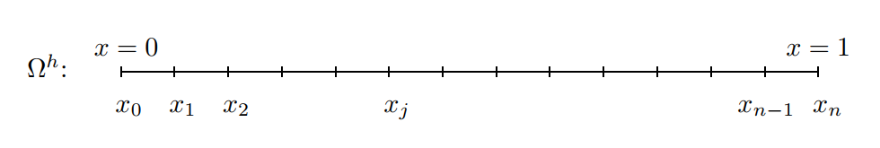
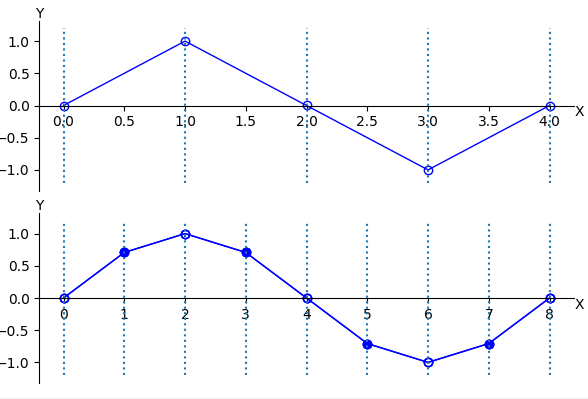
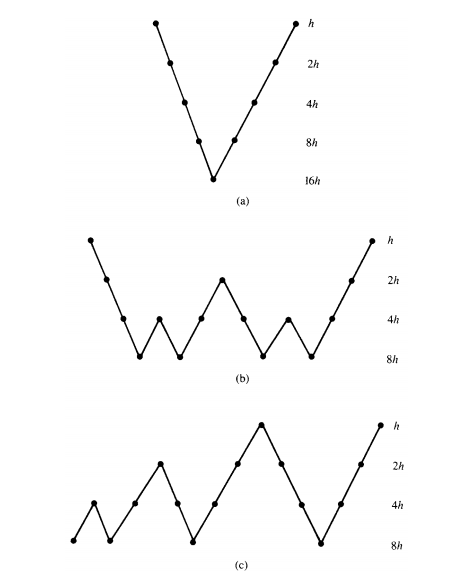

MULTIGRID Continued
==================================

#. `Multigrid Solver for 1D Poisson Problem <https://people.math.sc.edu/Burkardt/c_src/multigrid_poisson_1d/multigrid_poisson_1d.html>`_
#. `Multigrid methods <https://www.damtp.cam.ac.uk/user/hf323/M21-II-NA/demos/multigrid/multigrid.html>`_
#. `MIT Numerical Methods for PDE Lecture 6: Walkthough of a multigrid solver <https://www.youtube.com/watch?v=jqwyl9m5euI/>`_
#. `Elliptic Problems / Multigrid <http://bender.astro.sunysb.edu/classes/numerical_methods/lectures/elliptic-multigrid.pdf>`_
#. `numerical methods <http://bender.astro.sunysb.edu/classes/numerical_methods/>`_
#. `多重网格法 (Multigrid Method) 简述和示例 <https://zhuanlan.zhihu.com/p/337970166/>`_
#. `Algebraic Multigrid <https://amgcl.readthedocs.io/en/latest/amg_overview.html>`_
#. `Algebraic Multigrid Methods <https://www.wias-berlin.de/people/john/LEHRE/MULTIGRID/multigrid_7.pdf>`_
#. `Algebraic Multigrid AMG-An Introduction with Applications <https://www.scai.fraunhofer.de/content/dam/scai/de/documents/AllgemeineDokumentensammlung/SchnelleLoeser/SAMG/AMG_Introduction.pdf>`_
#. `Mathematical Methods for Engineers II <https://math.mit.edu/classes/18.086/2006/>`_
#. `Fast Methods for Partial Differential and Integral Equations Fall 2017 <https://math.mit.edu/~cperezar/18.336.html>`_
#. `Multigrid solvers <http://www.math.pitt.edu/~sussmanm/3040Summer14/multigrid.pdf>`_
#. `multigrid preconditioned Krylov solver <https://abhila.sh/writing/2/multigrid.html>`_
#. `3.1 Multigrid Methods <http://www.hector.ac.uk/cse/distributedcse/reports/citcom/Citcom/3_Multigrids.html>`_
#. `copper-multigrid-tutorial <https://github.com/lukeolson/copper-multigrid-tutorial/>`_
#. `Multigrid Methods-Techniques of High-Performance Computing  <https://tbetcke.github.io/hpc_lecture_notes/multigrid.html>`_
#. `James Demmel <https://people.eecs.berkeley.edu/~demmel/>`_
  

Elements of Multigrid
-----------------------------
Through analysis and experimentation, we have examined some of the basic iterative methods. Our discoveries have formed the beginnings of what we might call
a spectral (or Fourier mode) picture of relaxation schemes. As we proceed, more
essential details of this picture will become clear. So far we have established that
many standard iterative methods possess the smoothing property. This property
makes these methods very effective at eliminating the high-frequency or oscillatory
components of the error, while leaving the low-frequency or smooth components relatively unchanged. The immediate issue is whether these methods can be modified
in some way to make them effective on all error components.

One way to improve a relaxation scheme, at least in its early stages, is to use
a good initial guess. A well-known technique for obtaining an improved initial
guess is to perform some preliminary iterations on a coarse grid. Relaxation on a
coarse grid is less expensive because there are fewer unknowns to be updated. Also,
because the convergence factor behaves like :math:`1 − O(h^{2})`, the coarse grid will have a
marginally improved convergence rate. This line of reasoning at least suggests that
coarse grids might be worth considering.

With the coarse grid idea in mind, we can think more carefully about its implications. Recall that most basic relaxation schemes suffer in the presence of smooth
components of the error. Assume that a particular relaxation scheme has been applied until only smooth error components remain. We now ask what these smooth
components look like on a coarser grid. A smooth
wave with :math:`k = 4` on a grid Ωh with :math:`n = 12` points has been projected directly to
the grid :math:`\Omega^{2h}` with :math:`n = 6` points. On this coarse grid, the original wave still has a
wavenumber of :math:`k = 4`. We see that a smooth wave on :math:`\Omega^{h}` looks more oscillatory on
:math:`\Omega^{2h}`.

To be more precise, note that the grid points of the coarse grid :math:`\Omega^{2h}` are the
even-numbered grid points of the fine grid :math:`\Omega^{h}`. Consider the :math:`k\text{th}` mode on the fine
grid evaluated at the even-numbered grid points. If :math:`1 \le k < \cfrac{n}{2}`, its components
may be written as

.. math::
  \omega_{k,2j}^{h}=\sin\bigg(\cfrac{2jk\pi}{n}\bigg)=\sin\bigg(\cfrac{jk\pi}{n/2}\bigg)=\omega_{k,j}^{2h},
  \quad 1 \le k \lt \cfrac{n}{2} 
  
Notice that superscripts have been used to indicate the grids on which the vectors
are defined. From this identity, we see that the :math:`k\text{th}` mode on :math:`\Omega^{h}` becomes the :math:`k\text{th}` 
mode on :math:`\Omega^{2h}`; this fact is easier to understand by noting that there are half as many
modes on :math:`\Omega^{2h}` as there are on :math:`\Omega^{h}`. The important consequence of this fact is that
in passing from the fine grid to the coarse grid, a mode becomes more oscillatory.
This is true provided that :math:`1 \le k < \cfrac{n}{2}`. It should be verified that the :math:`k = \cfrac{n}{2}` mode
on :math:`\Omega^{h}` becomes the zero vector on :math:`\Omega^{2h}`.

As an aside, it is worth mentioning that fine-grid modes with :math:`k > \cfrac{n}{2}` undergo
a more curious transformation. Through the phenomenon of aliasing mentioned
earlier, the kth mode on :math:`\Omega^{h}` becomes the (n − k)th mode on :math:`\Omega^{2h}` when :math:`k > \cfrac{n}{2}`. In other words, the oscillatory modes of :math:`\Omega^{h}` are misrepresented as
relatively smooth modes on :math:`\Omega^{2h}`.

The important point is that smooth modes on a fine grid look less smooth on
a coarse grid. This suggests that when relaxation begins to stall, signaling the
predominance of smooth error modes, it is advisable to move to a coarser grid;
there, the smooth error modes appear more oscillatory and relaxation will be more
effective. The question is: how do we move to a coarser grid and relax on the more
oscillatory error modes?

It is at this point that multigrid begins to come together like a jigsaw puzzle.
We must keep all of the related facts in mind. Recall that we have an equation
for the error itself, namely, the residual equation. If :math:`\mathbf{v}` is an approximation to the
exact solution :math:`\mathbf{u}`, then the error :math:`\mathbf{e}=\mathbf{u}-\mathbf{v}` satisfies

.. math::
  A\mathbf{e}=\mathbf{r}=\mathbf{f}-A\mathbf{v}
  
which says that we can relax directly on the error by using the residual equation.
There is another argument that justifies the use of the residual equation:

Relaxation on the original equation :math:`A\mathbf{u}=\mathbf{f}` with an arbitrary initial
guess :math:`\mathbf{v}` is equivalent to relaxing on the residual equation :math:`A\mathbf{e}=\mathbf{r}` with
the specific initial guess :math:`\mathbf{e}=0`.  

This intimate connection between the original and the residual equations further
motivates the use of the residual equation.

We must now gather these loosely connected ideas. We know that many relaxation schemes possess the smoothing property. This leads us to consider using
coarser grids during the computation to focus the relaxation on the oscillatory
components of the error. In addition, there seems to be good reason to involve
the residual equation in the picture. We now try to give these ideas a little more
definition by proposing two strategies.

We begin by proposing a strategy that uses coarse grids to obtain better initial
guesses.

- Relax on :math:`A\mathbf{u}=\mathbf{f}` on a very coarse grid to obtain an initial guess for the next finer grid.
- ...
- Relax on :math:`A\mathbf{u}=\mathbf{f}` on :math:`\Omega^{4h}` to obtain an initial guess for :math:`\Omega^{2h}`.
- Relax on :math:`A\mathbf{u}=\mathbf{f}` on :math:`\Omega^{2h}` to obtain an initial guess for :math:`\Omega^{h}`.
- Relax on :math:`A\mathbf{u}=\mathbf{f}` on :math:`\Omega^{h}` to obtain a final approximation to the solution.

This idea of using coarser grids to generate improved initial guesses is the basis
of a strategy called nested iteration. Although the approach is attractive, it also
leaves some questions. For instance, what does it mean to relax on :math:`A\mathbf{u}=\mathbf{f}` on :math:`\Omega^{2h}`?
We must somehow define the original problem on the coarser grids. Also, what
happens if, having once reached the fine grid, there are still smooth components
in the error? We may have obtained some improvement by using the coarse grids,
but the final iteration will stall if smooth components still remain. We return to
these questions and find answers that will allow us to use nested iteration in a very
powerful way.

   
   One-dimensional grid on the interval :math:`0\le x\le 1`. The grid spacing is :math:`h=\cfrac{1}{n}` and the :math:`j\text{th}` grid point is :math:`x_{j} = jh\quad` for :math:`\quad 0\le j\le n`.

.. math::
  \begin{align}
  \omega_{k,j}=\sin\bigg(\cfrac{jk\pi}{n}\bigg),
  \quad 1 \le k \lt n-1,\quad 0 \le j \le n
  \end{align}
  
-

.. math::
  \begin{array}{l}
  L=1\\
  \Omega^{h}:\Delta x=h=\cfrac{L}{n}=\cfrac{1}{n},\text{ ngridpoint}=n\\
  \Omega^{2h}:\Delta x=2h=\cfrac{L}{n/2}=\cfrac{2}{n},\text{ ngridpoint}=\cfrac{n}{2}\\
  \Omega^{4h}:\Delta x=4h=\cfrac{L}{n/4}=\cfrac{4}{n},\text{ ngridpoint}=\cfrac{n}{4}\\
  \end{array}

-
  
.. math::
  \begin{align}
  \omega_{k,j}=\sin\bigg(\cfrac{jk\pi}{n}\bigg),
  \quad 1 \le k \lt n-1,\quad 0 \le j \le n
  \end{align}
  
-
  
.. math::
  \begin{array}{l}
  L=1\\
  \Omega^{h}:\Delta x=h=\cfrac{1}{n},\text{ ngridpoint}=n=1/h\\
  \omega_{k,j}^{h}=\sin\bigg(\cfrac{jk\pi}{n}\bigg)=\sin\bigg(jk\pi h\bigg),\quad 0 \le j \le n\\
  \Omega^{2h}:\Delta x=2h=\cfrac{L}{n/2}=\cfrac{2}{n},\text{ ngridpoint}=\cfrac{n}{2}\\
  \omega_{k,j}^{2h}=\sin\bigg(\cfrac{jk\pi}{n/2}\bigg)=\sin\bigg(\cfrac{2jk\pi}{n}\bigg)=\sin\bigg(jk\pi 2h\bigg),\quad 0 \le j \le \cfrac{n}{2}\\
  \Omega^{4h}:\Delta x=4h=\cfrac{L}{n/4}=\cfrac{4}{n},\text{ ngridpoint}=\cfrac{n}{4}\\
  \omega_{k,j}^{4h}=\sin\bigg(\cfrac{jk\pi}{n/4}\bigg)=\sin\bigg(\cfrac{4jk\pi}{n}\bigg)=\sin\bigg(jk\pi 4h\bigg),\quad 0 \le j \le \cfrac{n}{4}\\
  \end{array}  
  
-
  
.. math::
  \begin{array}{l}
  L=1\\
  \Omega^{h}:\Delta x=h=\cfrac{1}{n},\text{ ngridpoint}=n=1/h\\
  \omega_{k,j}^{h}=\sin\bigg(\cfrac{jk\pi}{n}\bigg)=\sin\bigg(jk\pi h\bigg),\quad 0 \le j \le n\\
  \omega_{k,2j}^{h}=\sin\bigg(\cfrac{2jk\pi}{n}\bigg)=\sin\bigg(2jk\pi h\bigg),\quad 0 \le 2j \le n\\
  \Omega^{2h}:\Delta x=2h=\cfrac{L}{n/2}=\cfrac{2}{n},\text{ ngridpoint}=\cfrac{n}{2}\\
  \omega_{k,j}^{2h}=\sin\bigg(\cfrac{jk\pi}{n/2}\bigg)=\sin\bigg(\cfrac{2jk\pi}{n}\bigg)=\sin\bigg(jk\pi 2h\bigg),\quad 0 \le j \le \cfrac{n}{2}\\
  \omega_{k,2j}^{h}=\sin\bigg(\cfrac{2jk\pi}{n}\bigg)=\sin\bigg(2jk\pi h\bigg)=\omega_{k,j}^{2h},\quad 0 \le j \le \cfrac{n}{2}\\
  \end{array}
  
This idea of using coarser grids to generate improved initial guesses is the basis
of a strategy called nested iteration. Although the approach is attractive, it also
leaves some questions. For instance, what does it mean to relax on :math:`A\mathbf{u} = \mathbf{f}` on :math:`\Omega^{2h}`?
We must somehow define the original problem on the coarser grids. Also, what
happens if, having once reached the fine grid, there are still smooth components
in the error? We may have obtained some improvement by using the coarse grids,
but the final iteration will stall if smooth components still remain. We return to
these questions and find answers that will allow us to use nested iteration in a very
powerful way.  

A second strategy incorporates the idea of using the residual equation to relax
on the error. It can be represented by the following procedure:

- Relax on :math:`A\mathbf{u} = \mathbf{f}` on :math:`\Omega^{h}` to obtain an approximation :math:`\mathbf{v}^{h}`.
- Compute the residual :math:`\mathbf{r}=\mathbf{f}-A\mathbf{v}^{h}`.
  Relax on the residual equation :math:`A\mathbf{e} = \mathbf{r}` on :math:`\Omega^{2h}` to obtain
  an approximation to the error :math:`\mathbf{e}^{2h}`.
- Correct the approximation obtained on :math:`\Omega^{h}` with the error estimate obtained
  on :math:`\Omega^{2h} : \mathbf{v}^{h} \leftarrow \mathbf{v}^{h} + \mathbf{e}^{2h}`.
  
This procedure is the basis of what is called the correction scheme. Having
relaxed on the fine grid until convergence deteriorates, we relax on the residual
equation on a coarser grid to obtain an approximation to the error itself. We then
return to the fine grid to correct the approximation first obtained there.  

There is a rationale for using this correction strategy, but it also leaves some
questions to be answered. For instance, what does it mean to relax on :math:`A\mathbf{e} = \mathbf{r}` on
:math:`\Omega^{2h}`? To answer this question, we first need to know how to compute the residual
on :math:`\Omega^{h}` and transfer it to :math:`\Omega^{2h}`. We also need to know how to relax on :math:`\Omega^{2h}` and what
initial guess should be used. Moreover, how do we transfer the error estimate from
:math:`\Omega^{2h}` back to :math:`\Omega^{h}`? These questions suggest that we need mechanisms for transferring
information between the grids. We now turn to this important consideration.

In our discussion of intergrid transfers, we consider only the case in which the
coarse grid has twice the grid spacing of the next finest grid. This is a nearly
universal practice, because there is usually no advantage in using grid spacings
with ratios other than 2. Think for a moment about the step in the correction
scheme that requires transferring the error approximation :math:`\mathbf{e}^{2h}` from the coarse grid
:math:`\Omega^{2h}` to the fine grid :math:`\Omega^{h}`. This is a common procedure in numerical analysis and is
generally called interpolation or prolongation. Many interpolation methods could
be used. Fortunately, for most multigrid purposes, the simplest of these is quite
effective. For this reason, we consider only linear interpolation.

The linear interpolation operator will be denoted :math:`I_{2h}^{h}`. It takes coarse-grid vectors and produces fine-grid vectors according to the rule :math:`I_{2h}^{h}\mathbf{v}^{2h}=\mathbf{v}^{h}`, where

.. math::
  \begin{array}{l}
  v_{2j}^{h}=v_{j}^{2h}\\
  v_{2j+1}^{h}=\cfrac{1}{2}(v_{j}^{2h}+v_{j+1}^{2h}),\quad 0\le j\le\cfrac{n}{2}-1\\
  \end{array}
  
At even-numbered fine-grid points,
the values of the vector are transferred directly from :math:`\Omega^{2h}` to :math:`\Omega^{h}`. At odd-numbered
fine-grid points, the value of :math:`\mathbf{v}^{h}` is the average of the adjacent coarse-grid values.  

In anticipation of discussions to come, we note that :math:`I_{2h}^{h}` is a linear operator from
:math:`\mathbf{R}^{\cfrac{n}{2}-1}` to :math:`\mathbf{R}^{n-1}`. It has full rank and the trivial null space, :math:`\mathcal{N} = {0}`. For the case
n = 8, this operator has the form

.. math::
  I_{2h}^{h}\mathbf{v}^{2h}=\cfrac{1}{2} \begin{bmatrix}
  1&  & \\
  2&  & \\
  1&  1&\\
  &  2&\\
  &  1&1\\
  &  &2\\
  &  &1\\
  \end{bmatrix}\begin{bmatrix}
  v_{1}\\v_{2}\\v_{3}\\
  \end{bmatrix}_{2h}=\begin{bmatrix}
  v_{1}\\v_{2}\\v_{3}\\
  v_{4}\\v_{5}\\v_{6}\\
  v_{7}\\
  \end{bmatrix}_{h}
  =\mathbf{v}^{h}
  
How well does this interpolation process work? First assume that the “real”
error (which is not known exactly) is a smooth vector on the fine grid. Assume also that a coarse-grid approximation to the error has been determined on :math:`\Omega^{2h}`
and that this approximation is exact at the coarse-grid points. When this coarsegrid approximation is interpolated to the fine grid, the interpolant is also smooth.
Therefore, we expect a relatively good approximation to the fine-grid error. By contrast, if the “real” error is oscillatory, even a very good
coarse-grid approximation may produce an interpolant that is not very accurate.

.. math::
  I_{2h}^{h}\mathbf{v}^{2h}=\begin{bmatrix}
  \cfrac{1}{2}(v_{1} )_{2h}=(v_{1})_{h}\\
  \cfrac{1}{2}\times2(v_{1} )_{2h}=(v_{2})_{h}\\
  \cfrac{1}{2}((v_{1} )_{2h}+(v_{2} )_{2h})=(v_{3})_{h}\\
  \cfrac{1}{2}(2(v_{2} )_{2h})=(v_{4})_{h}\\
  \cfrac{1}{2}((v_{2} )_{2h}+(v_{3} )_{2h})=(v_{5})_{h}\\
  \cfrac{1}{2}(2(v_{3} )_{2h})=(v_{6})_{h}\\
  \cfrac{1}{2}((v_{3} )_{2h})=(v_{7})_{h}\\
  \end{bmatrix}=\begin{bmatrix}
  (v_{1})_{h}\\
  (v_{2})_{h}\\
  (v_{3})_{h}\\
  (v_{4})_{h}\\
  (v_{5})_{h}\\
  (v_{6})_{h}\\
  (v_{7})_{h}\\
  \end{bmatrix}

   
.. math::
  \begin{array}{l}
  v_{2j}^{h}=v_{j}^{2h}\\
  v_{2j+1}^{h}=\cfrac{1}{2}(v_{j}^{2h}+v_{j+1}^{2h}),\quad 0\le j\le \cfrac{n}{2}-1 \\
  \text{let } n=8, \text{ then } \quad \cfrac{n}{2}-1=3,\quad j=0,1,2,3\\
  v_{j}^{2h}=(v_{0}^{2h},v_{1}^{2h},v_{2}^{2h},v_{3}^{2h},v_{4}^{2h}),\quad(j=0,1,2,3,4)\\
  v_{2j}^{h}=(v_{0}^{h},v_{2}^{h},v_{4}^{h},v_{6}^{h},v_{8}^{h}),\quad(j=0,1,2,3,4)\\
  v_{2j+1}^{h}=(v_{2\times0+1}^{h},v_{2\times1+1}^{h},v_{2\times2+1}^{h},v_{2\times3+1}^{h}),\quad(j=0,1,2,3)\\
  v_{2j+1}^{h}=(v_{1}^{h},v_{3}^{h},v_{5}^{h},v_{7}^{h}),\quad(j=0,1,2,3)\\
  v_{2j+1}^{h}=(\cfrac{1}{2}(v_{0}^{2h}+v_{1}^{2h}),\cfrac{1}{2}(v_{1}^{2h}+v_{2}^{2h}),\cfrac{1}{2}(v_{2}^{2h}+v_{3}^{2h}),\cfrac{1}{2}(v_{3}^{2h}+v_{4}^{2h})),\quad(j=0,1,2,3)\\
  \end{array}
  
We now have a well-defined way to transfer vectors between fine and coarse
grids. Therefore, we can return to the correction scheme and make it precise. To
do this, we define the following two-grid correction scheme.

Two-Grid Correction Scheme
---------------------------------

.. math::
  \mathbf{v}^{h}\leftarrow MG(\mathbf{v}^{h},\mathbf{f}^{h})
  
- Relex :math:`\nu_{1}` times on :math:`A^{h}\mathbf{u}^{h}=\mathbf{f}^{h}` on :math:`\Omega^{h}` with initial guess :math:`\mathbf{v}^{h}`.
- Compute the fine-grid residual :math:`\mathbf{r}^{h}=\mathbf{f}^{h}-A^{h}\mathbf{v}^{h}` and restrict it to the coarse grid by :math:`\mathbf{r}^{2h}=I_{h}^{2h}\mathbf{r}^{h}`
- Solve :math:`A^{2h}\mathbf{e}^{2h}=\mathbf{r}^{2h}` on :math:`\Omega^{2h}`.
- Interpolate the coarse-grid error to the fine grid by :math:`\mathbf{e}^{h}=I_{2h}^{h}\mathbf{e}^{2h}` and correct the fine-grid approximation by :math:`\mathbf{v}^{h}\leftarrow\mathbf{v}^{h}+\mathbf{e}^{h}`
- Relex :math:`\nu_{2}` times on :math:`A^{h}\mathbf{u}^{h}=\mathbf{f}^{h}` on :math:`\Omega^{h}` with initial guess :math:`\mathbf{v}^{h}`.

This procedure is simply the original correction scheme, now refined by the
use of the intergrid transfer operators. We relax on the fine grid until it ceases
to be worthwhile; in practice, :math:`\nu_{1}` is often 1, 2, or 3. The residual of the current
approximation is computed on :math:`\Omega^{h}` and then transferred by a restriction operator
to the coarse grid. As it stands, the procedure calls for the exact solution of the
residual equation on :math:`\Omega^{2h}`, which may not be possible. However, if the coarse-grid
error can at least be approximated, it is then interpolated up to the fine grid, where
it is used to correct the fine-grid approximation. This is followed by :math:`\nu_{2}` additional
fine-grid relaxation sweeps.

Several comments are in order. First, notice that the superscripts :math:`h` or :math:`2h` are
essential to indicate the grid on which a particular vector or matrix is defined.
Second, all of the quantities in the above procedure are well defined except for :math:`A^{2h}`.
For the moment, we take :math:`A^{2h}` simply to be the result of discretizing the problem
on :math:`\Omega^{2h}`. Finally, the integers :math:`\nu_{1}` and :math:`\nu_{2}` are parameters in the scheme that control
the number of relaxation sweeps before and after visiting the coarse grid. They
are usually fixed at the start, based on either theoretical considerations or on past
experimental results.

It is important to appreciate the complementarity at work in the process. Relaxation on the fine grid eliminates the oscillatory components of the error, leaving
a relatively smooth error. Assuming the residual equation can be solved accurately
on :math:`\Omega^{2h}`, it is still important to transfer the error accurately back to the fine grid.
Because the error is smooth, interpolation should work very well and the correction
of the fine-grid solution should be effective.

Numerical example.
---------------------------------
A numerical example will be helpful. Consider the weighted Jacobi method with :math:`\omega=\cfrac{2}{3}` applied to the one-dimensional model problem :math:`A\mathbf{u}=0`
on a grid with :math:`n = 64` points. We use an initial guess,

.. math::
   v_{j}^{h}=\cfrac{1}{2}\bigg[\sin\bigg(\cfrac{16j\pi}{n}\bigg)+\sin\bigg(\cfrac{40j\pi}{n}\bigg)\bigg]

consisting of the :math:`k = 16` and :math:`k = 40` modes. The following two-grid correction
scheme is used:

- Relex three times on :math:`A^{h}\mathbf{u}^{h}=0` on :math:`\Omega^{h}` with initial :math:`\mathbf{v}^{h}`.
- Compute :math:`\mathbf{r}^{2h}=I_{h}^{2h}\mathbf{r}^{h}`.
- Relex three times on :math:`A^{2h}\mathbf{e}^{2h}=\mathbf{r}^{2h}` on :math:`\Omega^{2h}` with initial guess :math:`\mathbf{e}^{2h}=0`
- Correct the fine-grid approximation: :math:`\mathbf{v}^{h}\leftarrow\mathbf{v}^{h}+I_{2h}^{h}\mathbf{e}^{2h}`.
- Relex three times on :math:`A^{h}\mathbf{u}^{h}=0` on :math:`\Omega^{h}` with initial :math:`\mathbf{v}^{h}`.

Let :math:`\mathbf{f}=0`, then

.. math::
  \begin{array}{l}
  A\mathbf{u}=0\\
  \mathbf{u}=0\\
  \mathbf{e}=\mathbf{u}-\mathbf{v}=0-\mathbf{v}=-\mathbf{v}\\
  \mathbf{r}=\mathbf{f}-A\mathbf{u}=0-A\mathbf{u}=-A\mathbf{v}\\
  \end{array}

-

.. math::
  A=\begin{bmatrix}
  2&  -1&  &  &  & \\
  -1&  2&-1  &  &  & \\
  &  \cdot&  \cdot& \cdot &  & \\
  &  &  \cdot&  \cdot&  \cdot& \\
  &  &  &  -1&  2&-1 \\
  &  &  &  & -1 &2
  \end{bmatrix}
  
- Relex :math:`\nu_{1}` times on :math:`A^{h}\mathbf{u}^{h}=\mathbf{f}^{h}` on :math:`\Omega^{h}` with initial guess :math:`\mathbf{v}^{h}`.
- Compute the fine-grid residual :math:`\mathbf{r}^{h}=\mathbf{f}^{h}-A^{h}\mathbf{v}^{h}=-A^{h}\mathbf{v}^{h}` and restrict it to the coarse grid by :math:`\mathbf{r}^{2h}=I_{h}^{2h}\mathbf{r}^{h}`
- Solve :math:`A^{2h}\mathbf{e}^{2h}=\mathbf{r}^{2h}` on :math:`\Omega^{2h}`.
- Interpolate the coarse-grid error to the fine grid by :math:`\mathbf{e}^{h}=I_{2h}^{h}\mathbf{e}^{2h}` and correct the fine-grid approximation by :math:`\mathbf{v}^{h}\leftarrow\mathbf{v}^{h}+\mathbf{e}^{h}`
- Relex :math:`\nu_{2}` times on :math:`A^{h}\mathbf{u}^{h}=\mathbf{f}^{h}` on :math:`\Omega^{h}` with initial guess :math:`\mathbf{v}^{h}`.

.. math::
  \begin{array}{l}
  2v_{1}-v_{2}=-r_{1}\\
  -v_{1}+2v_{2}-v_{3}=-r_{2}\\
  -v_{2}+2v_{3}-v_{4}=-r_{3}\\
  \cdots \\
  -v_{n-3}+2v_{n-2}-v_{n-1}=-r_{n-2}\\
  -v_{n-2}+2v_{n-1}=-r_{n-1}\\
  \end{array}
  
Let :math:`n=8`, then

.. math::
  \begin{array}{l}
  2v_{1}-v_{2}=-r_{1}\\
  -v_{1}+2v_{2}-v_{3}=-r_{2}\\
  -v_{2}+2v_{3}-v_{4}=-r_{3}\\
  -v_{3}+2v_{4}-v_{5}=-r_{4}\\
  -v_{4}+2v_{5}-v_{6}=-r_{5}\\
  -v_{5}+2v_{6}-v_{7}=-r_{6}\\
  -v_{6}+2v_{7}=-r_{7}\\
  \end{array}
  
-
  
.. math::
  \begin{array}{l}
  \cfrac{-v_{j-1}+2v_{j}-v_{j+1}}{h^{2}} =f_{j}\\
  -v_{j-1}+2v_{j}-v_{j+1} =h^{2}f_{j}\\
  v_{j} =\cfrac{1}{2}( v_{j-1}+v_{j+1}+h^{2}f_{j})\\
  v_{j}^{(*)}=\cfrac{1}{2}(v_{j-1}^{(k-1)}+v_{j+1}^{(k-1)}+h^{2}f_{j})\\
  v_{j}^{(k)}=(1-\omega)v_{j}^{(k-1)}+\omega v_{j}^{(*)}\\
  v_{j}^{(k)}=(1-\omega)v_{j}^{(k-1)}+\omega \cfrac{1}{2}(v_{j-1}^{(k-1)}+v_{j+1}^{(k-1)}+h^{2}f_{j})\\
  v_{j}^{(k)}=\bigg(\cfrac{1}{2}\omega v_{j-1}^{(k-1)}+(1-\omega)v_{j}^{(k-1)}+\cfrac{1}{2}\omega v_{j+1}^{(k-1)}\bigg)+\omega h^{2}f_{j}\\
  \end{array}  
  
-
  
.. math::
  \begin{array}{l}
  A=D-L-U\\
  A\mathbf{u}=\mathbf{f}\\
  (D-L-U)\mathbf{u}=\mathbf{f}\\
  D\mathbf{u}=(L+U)\mathbf{u}+\mathbf{f}\\
  \mathbf{u}=D^{-1}(L+U)\mathbf{u}+D^{-1}\mathbf{f}\\
  \mathbf{u}^{(k+1)}=D^{-1}(L+U)\mathbf{u}^{(k)}+D^{-1}\mathbf{f}\\
  \mathbf{u}^{(*)}=D^{-1}(L+U)\mathbf{u}^{(k)}+D^{-1}\mathbf{f}\\
  \mathbf{u}^{(k+1)}=\omega(D^{-1}(L+U)\mathbf{u}^{(k)}+D^{-1}\mathbf{f})+(1-\omega)\mathbf{u}^{(k)}\\
  \mathbf{u}^{(k+1)}=[(1-\omega)I+\omega(D^{-1}(L+U)]\mathbf{u}^{(k)}+\omega D^{-1}\mathbf{f}\\
  \end{array}  

-

.. math::
  A=\begin{bmatrix}
  2&  -1&  &  &  & \\
  -1&  2&-1  &  &  & \\
  &  \cdot&  \cdot& \cdot &  & \\
  &  &  \cdot&  \cdot&  \cdot& \\
  &  &  &  -1&  2&-1 \\
  &  &  &  & -1 &2
  \end{bmatrix}  

-

.. math::
  D=\begin{bmatrix}
  2&  0&  &  &  & \\
  0&  2&0  &  &  & \\
  &  \cdot&  \cdot& \cdot &  & \\
  &  &  \cdot&  \cdot&  \cdot& \\
  &  &  &  0&  2&0 \\
  &  &  &  & 0 &2
  \end{bmatrix}  
  
-

.. math::
  D^{-1}=\begin{bmatrix}
  \cfrac{1}{2}&  0&  &  &  & \\
  0&  \cfrac{1}{2}&0  &  &  & \\
  &  \cdot&  \cdot& \cdot &  & \\
  &  &  \cdot&  \cdot&  \cdot& \\
  &  &  &  0&  \cfrac{1}{2}&0 \\
  &  &  &  & 0 &\cfrac{1}{2}
  \end{bmatrix}  
  
-

.. math::
  L+U=\begin{bmatrix}
  0&  1&  &  &  & \\
  1&  0&1  &  &  & \\
  &  \cdot&  \cdot& \cdot &  & \\
  &  &  \cdot&  \cdot&  \cdot& \\
  &  &  &  1&  0&1 \\
  &  &  &  & 1 &0
  \end{bmatrix}    
  
-

.. math::
  D^{-1}(L+U)=\begin{bmatrix}
  0&  \cfrac{1}{2}&  &  &  & \\
  \cfrac{1}{2}&  0&\cfrac{1}{2}  &  &  & \\
  &  \cdot&  \cdot& \cdot &  & \\
  &  &  \cdot&  \cdot&  \cdot& \\
  &  &  &  \cfrac{1}{2}&  0&\cfrac{1}{2} \\
  &  &  &  & \cfrac{1}{2} &0
  \end{bmatrix}    
  
-

.. math::
  [(1-\omega)I+\omega(D^{-1}(L+U)]=\begin{bmatrix}
  1-\omega&  \cfrac{1}{2}\omega&  &  &  & \\
  \cfrac{1}{2}\omega&  1-\omega&\cfrac{1}{2}\omega  &  &  & \\
  &  \cdot&  \cdot& \cdot &  & \\
  &  &  \cdot&  \cdot&  \cdot& \\
  &  &  &  \cfrac{1}{2}\omega&  1-\omega&\cfrac{1}{2}\omega \\
  &  &  &  & \cfrac{1}{2}\omega &1-\omega
  \end{bmatrix}    
  
-

.. math::
  \begin{array}{l}
  \mathbf{u}^{(k+1)}=[(1-\omega)I+\omega(D^{-1}(L+U)]\mathbf{u}^{(k)}+\omega D^{-1}\mathbf{f}\\
  \mathbf{u}_{j}^{(k+1)}=[\cfrac{1}{2}\omega\mathbf{u}_{j-1}^{(k)}+(1-\omega)\mathbf{u}_{j}^{(k)}+\cfrac{1}{2}\omega\mathbf{u}_{j+1}^{(k)}]+\cfrac{1}{2}\omega\mathbf{f}\\
  \end{array}  
  
The second class of intergrid transfer operations involves moving vectors from
a fine grid to a coarse grid. They are generally called restriction operators and are
denoted by :math:`I_{h}^{2h}`. The most obvious restriction operator is injection. It is defined by
:math:`I_{h}^{2h}\mathbf{v}^{h}=\mathbf{v}^{2h}`, where  

.. math::
  v_{j}^{2h} = v_{2j}^{h}
  
The two-grid correction scheme, as outlined above, leaves one looming procedural question: what is the best way to solve the coarse-grid problem :math:`A^{2h}\mathbf{e}^{2h}=\mathbf{r}^{2h}`?
The answer may be apparent, particularly to those who think recursively. The
coarse-grid problem is not much different from the original problem. Therefore, we
can apply the two-grid correction scheme to the residual equation on :math:`Ω^{2h}`, which
means relaxing there and then moving to :math:`Ω^{4h}` for the correction step. We can repeat this process on successively coarser grids until a direct solution of the residual
equation is possible.

To facilitate the description of this procedure, some economy of notation is desirable. The same notation is used for the computer implementation of the resulting
algorithm. We call the right-side vector of the residual equation :math:`\mathbf{f}^{2h}`, rather than
:math:`\mathbf{r}^{2h}`, because it is just another right-side vector. Instead of calling the solution of the
residual equation :math:`\mathbf{e}^{2h}`, we use :math:`\mathbf{u}^{2h}` because it is just a solution vector. We can then
use :math:`\mathbf{v}^{2h}` to denote approximations to :math:`\mathbf{u}^{2h}`. These changes simplify the notation, but
it is still important to remember the meaning of these variables.
One more point needs to be addressed: what initial guess do we use for :math:`\mathbf{v}^{2h}` on
the first visit to :math:`Ω^{2h}`? Because there is presumably no information available about
the solution, :math:`\mathbf{u}^{2h}`, we simply choose :math:`\mathbf{v}^{2h}=0`. Here then is the two-grid correction
scheme, now imbedded within itself. We assume that there are :math:`l > 1` grids with
grid spacings :math:`h, 2h, 4h, . . . , Lh = 2^{l-1}h`.

V-Cycle Scheme
---------------------

.. math::
  \mathbf{v}^{h}\leftarrow V^{h}(\mathbf{v}^{h},\mathbf{f}^{h})
  
- Relex :math:`\nu_{1}` times on :math:`A^{h}\mathbf{u}^{h}=\mathbf{f}^{h}` on :math:`\Omega^{h}` with initial guess :math:`\mathbf{v}^{h}`.
- Compute the fine-grid residual :math:`\mathbf{r}^{h}=\mathbf{f}^{h}-A^{h}\mathbf{v}^{h}` and restrict it to the coarse grid by :math:`\mathbf{r}^{2h}=I_{h}^{2h}\mathbf{r}^{h}`
   - Relax on :math:`A^{2h}\mathbf{u}^{2h}=\mathbf{f}^{2h}` :math:`\nu_{1}` times with initial guess :math:`\mathbf{v}^{2h}=0` ( :math:`A^{2h}\mathbf{e}^{2h}=\mathbf{r}^{2h}` )
   - Relax on :math:`A^{2h}\mathbf{u}^{2h}=\mathbf{f}^{2h}` :math:`\nu_{2}` times with initial guess :math:`\mathbf{v}^{2h}`
- Correct the fine-grid approximation :math:`\mathbf{v}^{h}\leftarrow\mathbf{v}^{h}+I_{2h}^{h}\mathbf{e}^{2h}`
- Relex :math:`\nu_{2}` times on :math:`A^{h}\mathbf{u}^{h}=\mathbf{f}^{h}` on :math:`\Omega^{h}` with initial guess :math:`\mathbf{v}^{h}`.

V-Cycle Scheme (Recursive Definition)
------------------------------------------

.. math::
  \mathbf{v}^{h}\leftarrow V^{h}(\mathbf{v}^{h},\mathbf{f}^{h})
  
1. Relex :math:`\nu_{1}` times on :math:`A^{h}\mathbf{u}^{h}=\mathbf{f}^{h}` on :math:`\Omega^{h}` with initial guess :math:`\mathbf{v}^{h}`.  
2. If :math:`\Omega^{h}` = coarsest grid, then go to step 4. 

  Else 
  
.. math::
  \begin{array}{l}
  \mathbf{f}^{2h}\leftarrow I_{h}^{2h}(\mathbf{f}^{h}-A^{h}\mathbf{v}^{h}),\\
  \mathbf{v}^{2h}\leftarrow 0,\\
  \mathbf{v}^{2h}\leftarrow V^{2h}(\mathbf{v}^{2h},\mathbf{f}^{2h})
  \end{array}
  
3. Correct :math:`\mathbf{v}^{h}\leftarrow v^{h}+I_{2h}^{h}\mathbf{v}^{2h}`.
4. Relax :math:`\nu_{2}` times on :math:`A^{h}\mathbf{u}^{h}=\mathbf{f}^{h}` with initial guess :math:`\mathbf{v}^{h}`.

The V-cycle is just one of a family of multigrid cycling schemes. The entire
family is called the µ-cycle method and is defined recursively by the following.

µ-Cycle Scheme
------------------------------------------

.. math::
  \mathbf{v}^{h}\leftarrow M^{h}(\mathbf{v}^{h},\mathbf{f}^{h})

1. Relex :math:`\nu_{1}` times on :math:`A^{h}\mathbf{u}^{h}=\mathbf{f}^{h}` on :math:`\Omega^{h}` with initial guess :math:`\mathbf{v}^{h}`.  
2. If :math:`\Omega^{h}` = coarsest grid, then go to step 4. 

  Else 
  
.. math::
  \begin{array}{l}
  \mathbf{f}^{2h}\leftarrow I_{h}^{2h}(\mathbf{f}^{h}-A^{h}\mathbf{v}^{h}),\\
  \mathbf{v}^{2h}\leftarrow 0,\\
  \mathbf{v}^{2h}\leftarrow M^{2h}(\mathbf{v}^{2h},\mathbf{f}^{2h}) \quad \mu \text{ times}.
  \end{array}
  
3. Correct :math:`\mathbf{v}^{h}\leftarrow v^{h}+I_{2h}^{h}\mathbf{v}^{2h}`.
4. Relax :math:`\nu_{2}` times on :math:`A^{h}\mathbf{u}^{h}=\mathbf{f}^{h}` with initial guess :math:`\mathbf{v}^{h}`.

   
   Schedule of grids for (a) V-cycle, (b) W-cycle, and (c) FMG scheme,
   all on four levels.

In practice, only :math:`\mu=1` (which gives the V-cycle) and :math:`\mu=2` are used. The above figure
shows the schedule of grids for :math:`\mu=2` and the resulting W-cycle. We refer
to a V-cycle with :math:`\nu_{1}` relaxation sweeps before the correction step and :math:`\nu_{2}` relaxation
sweeps after the correction step as a :math:`V(\nu_{1},\nu_{2})`-cycle, with a similar notation for
W-cycles.

We originally stated that two ideas would lead to multigrid. So far we have
developed only the correction scheme. The nested iteration idea has yet to be
explored. Recall that nested iteration uses coarse grids to obtain improved initial
guesses for fine-grid problems. In looking at the V-cycle, we might ask how to
obtain an informed initial guess for the first fine-grid relaxation. Nested iteration
would suggest solving a problem on :math:`\Omega^{2h}`. But how can we obtain a good initial
guess for the :math:`\Omega^{2h}` problem? Nested iteration sends us to :math:`\Omega^{4h}`. Clearly, we are on
another recursive path that leads to the coarsest grid.
The algorithm that joins nested iteration with the V-cycle is called the full
multigrid V-cycle (FMG) . Given first in explicit terms, it appears as follows.

We initialize the coarse-grid right sides by transferring :math:`\mathbf{f}^{h}` from the fine grid. Another option is to use the original right-side function :math:`\mathbf{f}`. The cycling parameter,
:math:`\nu_{0}`, sets the number of V-cycles done at each level. It is generally determined by
a previous numerical experiment; :math:`\nu_{0}=1` is the most common choice. Expressed
recursively, the algorithm has the following compact form.

Full Multigrid V-Cycle (Recursive Form)
------------------------------------------

.. math::
  \mathbf{v}^{h}\leftarrow FMG^{h}(\mathbf{f}^{h})

1. If :math:`\Omega^{h}` = coarsest grid, set :math:`\mathbf{v}^{h}\leftarrow 0` and go to step 3. 

  Else 
  
.. math::
  \begin{array}{l}
  \mathbf{f}^{2h}\leftarrow I_{h}^{2h}(\mathbf{f}^{h}),\\
  \mathbf{v}^{2h}\leftarrow FMG^{2h}(\mathbf{f}^{2h}).
  \end{array}
  
2. Correct :math:`\mathbf{v}^{h}\leftarrow \mathbf{v}^{h}+I_{2h}^{h}\mathbf{v}^{2h}`.
3. :math:`\mathbf{v}^{h}\leftarrow V^{h}(\mathbf{v}^{h},\mathbf{f}^{h})` :math:`\nu_{0}` times.

Full Multigrid V-Cycle
------------------------------------------

.. math::
  \mathbf{v}^{h}\leftarrow FMG^{h}(\mathbf{v}^{h},\mathbf{f}^{h})
  
1. Compute residual

.. math::
  \mathbf{r}^{h}=\mathbf{f}^{h}-A^{h}\mathbf{v}^{h}
  
2. Restrict residual  

.. math::
  \begin{array}{l}
  \mathbf{r}^{2h}=I_{h}^{2h}(\mathbf{r}^{h})\\
  \mathbf{r}^{4h}=I_{2h}^{4h}(\mathbf{r}^{2h})\\
  \mathbf{r}^{8h}=I_{4h}^{8h}(\mathbf{r}^{4h})\\
  \mathbf{r}^{16h}=I_{8h}^{16h}(\mathbf{r}^{8h})\\
  \end{array}
  
3. Solve Error Equation

.. math::
  \begin{array}{l}
  \mathbf{e}^{16h}\leftarrow 0\\
  \text{Solve }A^{16h}\mathbf{e}^{16h}=\mathbf{r}^{16h}\\
  \text{Interpolation: }\quad\mathbf{e}^{8h}=I_{16h}^{8h}\mathbf{e}^{16h}\\
  \text{Solve }A^{8h}\mathbf{e}^{8h}=\mathbf{r}^{8h}\\
  \text{Interpolation: }\quad\mathbf{e}^{4h}=I_{8h}^{4h}\mathbf{e}^{8h}\\
  \text{Solve }A^{4h}\mathbf{e}^{4h}=\mathbf{r}^{4h}\\
  \text{Interpolation: }\quad\mathbf{e}^{2h}=I_{4h}^{2h}\mathbf{e}^{4h}\\
  \text{Solve }A^{2h}\mathbf{e}^{2h}=\mathbf{r}^{2h}\\
  \text{Interpolation: }\quad\mathbf{e}^{h}=I_{2h}^{h}\mathbf{e}^{2h}\\
  \text{Solve }A^{h}\mathbf{e}^{h}=\mathbf{r}^{h}\\
  \end{array}
  
4. Correct result

.. math::
  \mathbf{v}^{h}=\mathbf{v}^{h}+\mathbf{e}^{h}

