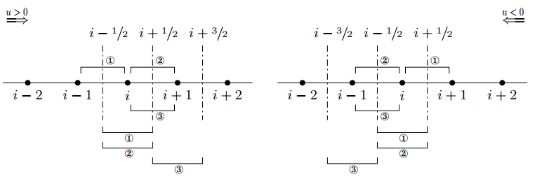

WENO schemes
==================================

#. `CFD Julia: A Learning Module Structuring an Introductory Course on Computational Fluid Dynamics <https://www.mdpi.com/2311-5521/4/3/159/>`_
#. `Weighted Essentially Non-Oscillatory ( WENO ) - CFD <https://www.youtube.com/watch?v=ytl2Y9WfHmw/>`_
#. `Chi Wang Shu: High order schemes for convection dominated problems. Lecture 1. September, 19, 2013 - CFD <https://www.youtube.com/watch?v=KT4l3lSSpDY/>`_
#. `SU2 Conference 21: Implementation of Higher Order WENO Schemes into SU2, Y. Chandukrishna <https://www.youtube.com/watch?v=U8OCmPEvHfc/>`_
#. `Compact-Reconstruction Weighted Essentially Non-Oscillatory (CRWENO) Schemes <http://debog.github.io/CRWENO/Overview.html>`_

Inviscid Burgers Equation: Non-Conservative Form
-----------------------------------------------------

In this section, we discuss the solution of the inviscid Burgers equation which is a nonlinear hyperbolic partial differential equation.
The hyperbolic equations admit discontinuities, and the numerical schemes used for solving hyperbolic PDEs need to be higher-order accurate for smooth solutions, and non-oscillatory for discontinuous solutions.
The inviscid Burgers equation is given below

.. math::
  \cfrac{\partial u}{\partial t}+u\cfrac{\partial u}{\partial x}=0

WENO-5 Scheme
------------------------
We refer readers to a text by Shu for a comprehensive overview of the development of WENO schemes, 
their mathematical formulation, and the application of WENO schemes for convection dominated problems. 
We will use WENO-5 scheme for one-dimensional inviscid Burgers equation with the shock developed by a sine wave. 
We will discuss how one can go about applying WENO reconstruction for finite difference schemes. 
The finite difference approximation to the inviscid Burgers equation in non-conserved form can be written as

.. math::
  \left\{\begin{matrix}
  \cfrac{\partial u_{i}}{\partial t}+u_{i}\cfrac{u^{L}_{i+1/2}-u^{L}_{i-1/2}}{\Delta x}=0,& if \quad u_{i}>0\\
  \cfrac{\partial u_{i}}{\partial t}+u_{i}\cfrac{u^{R}_{i+1/2}-u^{R}_{i-1/2}}{\Delta x}=0,& \text{otherwise}\\
  \end{matrix}\right.
  
which can be combined into a more compact upwind/downwind notation as follows

.. math::
  \cfrac{\partial u_{i}}{\partial t}
  +u^{+}_{i}\cfrac{u^{L}_{i+1/2}-u^{L}_{i-1/2}}{\Delta x}
  +u^{-}_{i}\cfrac{u^{R}_{i+1/2}-u^{R}_{i-1/2}}{\Delta x}
  =0
  
where we define :math:`u^{+}_{i}=max(u_{i},0)` and :math:`u^{-}_{i}=min(u_{i},0)`. the reconstruction of :math:`u^{L}_{i+1/2}` uses a biased stencil with one more point to the left,
and that for :math:`u^{R}_{i+1/2}` uses a biased stencil with one more point to the right. The stencil used for reconstruction of left and right side state
(i.e., :math:`u^{L}_{i+1/2}` and :math:`u^{R}_{i+1/2}`) is shown in the following figure. The WENO-5 reconstruction for left and right side reconstructed values is given as 

.. figure:: ../images/weno1.png
   :width: 800
   :align: center
   
   Finite difference grid for one-dimensional problems where the the solution is stored at the interface of the cells. The first and last points lie on the left and right boundary of the domain. The stencil required for reconstruction of left and right side state is highlighted with blue rectangle. Ghost points are shown by red color.
   
.. math::
  \begin{align}
  u^{L}_{i+1/2} & = w^{L}_{0}(\cfrac{1}{3}u_{i-2}-\cfrac{7}{6}u_{i-1}+\cfrac{11}{6}u_{i})\\
             &+w^{L}_{1}(-\cfrac{1}{6}u_{i-1}+\cfrac{5}{6}u_{i}+\cfrac{1}{3}u_{i+1})\\
             &+w^{L}_{2}(\cfrac{1}{3}u_{i}+\cfrac{5}{6}u_{i+1}-\cfrac{1}{6}u_{i+2})\\
  u^{R}_{i-1/2}& = w^{R}_{0}(-\cfrac{1}{6}u_{i-2}+\cfrac{5}{6}u_{i-1}+\cfrac{1}{3}u_{i})\\
             & + w^{R}_{1}(\cfrac{1}{3}u_{i-1}+\cfrac{5}{6}u_{i}-\cfrac{1}{6}u_{i+1})\\
             & + w^{R}_{2}(\cfrac{11}{6}u_{i}-\cfrac{7}{6}u_{i+1}+\cfrac{1}{3}u_{i+2})
  \end{align}
  
This formula can also be written as

.. math::
  \begin{align}
  u^{L}_{i+1/2} & = w^{L}_{0}q^{L}_{0}+w^{L}_{1}q^{L}_{1}+w^{L}_{2}q^{L}_{2}\\
  u^{R}_{i-1/2} & = w^{R}_{0}q^{R}_{0}+w^{R}_{1}q^{R}_{1}+w^{L}_{2}q^{R}_{2}\\
  \end{align}
  
-
  
.. math::
  q^{L}_{i+1/2}=\begin{bmatrix}
   q^{L}_{0}(i-2,i-1,i)\\q^{L}_{1}(i-1,i,i+1)\\q^{L}_{2}(i,i+1,i+2)
  \end{bmatrix}
  =\begin{bmatrix}
   \cfrac{1}{3}u_{i-2}-\cfrac{7}{6}u_{i-1}+\cfrac{11}{6}u_{i}\\
   -\cfrac{1}{6}u_{i-1}+\cfrac{5}{6}u_{i}+\cfrac{1}{3}u_{i+1}\\
  \cfrac{1}{3}u_{i}+\cfrac{5}{6}u_{i+1}-\cfrac{1}{6}u_{i+2}
  \end{bmatrix}
  
-
  
.. math::
  q^{R}_{i-1/2}=\begin{bmatrix}
   q^{R}_{0}(i-2,i-1,i)\\q^{R}_{1}(i-1,i,i+1)\\q^{R}_{2}(i,i+1,i+2)
  \end{bmatrix}
  =\begin{bmatrix}
   -\cfrac{1}{6}u_{i-2}+\cfrac{5}{6}u_{i-1}+\cfrac{1}{3}u_{i}\\
    \cfrac{1}{3}u_{i-1}+\cfrac{5}{6}u_{i}-\cfrac{1}{6}u_{i+1}\\
    \cfrac{11}{6}u_{i}-\cfrac{7}{6}u_{i+1}+\cfrac{1}{3}u_{i+2}
  \end{bmatrix}  

-
  
.. math::
  q^{R}_{i+1/2}=\begin{bmatrix}
   q^{R}_{0}(i-1,i,i+1)\\q^{R}_{1}(i,i+1,i+2)\\q^{R}_{2}(i+1,i+2,i+3)
  \end{bmatrix}
  =\begin{bmatrix}
   -\cfrac{1}{6}u_{i-1}+\cfrac{5}{6}u_{i}+\cfrac{1}{3}u_{i+1}\\
    \cfrac{1}{3}u_{i}+\cfrac{5}{6}u_{i+1}-\cfrac{1}{6}u_{i+2}\\
    \cfrac{11}{6}u_{i+1}-\cfrac{7}{6}u_{i+2}+\cfrac{1}{3}u_{i+3}
  \end{bmatrix}  

  
where the nonlinear weights are defined as  

.. math::
  \begin{array}{c}
  w^{L}_{k}=\cfrac{\alpha_{k}}{\alpha_{0}+\alpha_{1}+\alpha_{2}},\quad \alpha_{k}=\cfrac{d^{L}_{k}}{(\beta_{k}+\epsilon)^{2}},\quad k=0,1,2\\
  w^{R}_{k}=\cfrac{\alpha_{k}}{\alpha_{0}+\alpha_{1}+\alpha_{2}},\quad \alpha_{k}=\cfrac{d^{R}_{k}}{(\beta_{k}+\epsilon)^{2}},\quad k=0,1,2
  \end{array}
  
in which the smoothness indicators are defined as  

.. math::
  \begin{array}{l}
  \beta_{0}=\cfrac{13}{12}(u_{i-2}-2u_{i-1}+u_{i})^2+\cfrac{1}{4}(u_{i-2}-4u_{i-1}+3u_{i})^2\\
  \beta_{1}=\cfrac{13}{12}(u_{i-1}-2u_{i}+u_{i+1})^2+\cfrac{1}{4}(u_{i-1}-u_{i+1})^2\\
  \beta_{2}=\cfrac{13}{12}(u_{i}-2u_{i+1}+u_{i+2})^2+\cfrac{1}{4}(3u_{i}-4u_{i+1}+u_{i+2})^2
  \end{array}
  
We use :math:`d^{L}_{0}=1/10,\quad d^{L}_{1}=3/5,\quad d^{L}_{2}=3/10` to compute nonlinear weights for calculation of left side state
and :math:`d^{R}_{0}=3/10,\quad d^{R}_{1}=3/5,\quad d^{R}_{2}=1/10` to compute nonlinear weights for calculation of right side state.
We set :math:`\epsilon =1\times10^{-6}` to avoid division by zero. 

.. math::
  d^{L}=\begin{bmatrix}
   d^{L}_{0}\\d^{L}_{1}\\d^{L}_{2}
  \end{bmatrix}
  =\begin{bmatrix}
   1/10\\3/5\\3/10
  \end{bmatrix}
  =\begin{bmatrix}
   0.1\\0.6\\0.3
  \end{bmatrix}

-

.. math::  
  d^{R}=\begin{bmatrix}
   d^{R}_{0}\\d^{R}_{1}\\d^{R}_{2}
  \end{bmatrix}
  =\begin{bmatrix}
   3/10\\3/5\\1/10
  \end{bmatrix}
  =\begin{bmatrix}
   0.3\\0.6\\0.1
  \end{bmatrix}  

We demonstrate two types of boundary conditions for the inviscid Burgers equation. The first one is the Dirichlet boundary condition. For Dirichlet boundary condition, we use 
:math:`u(x=0)=0` and :math:`u(x=1)=0`. For computing numerical state at the interface, we need the information of five neighboring grid points.
When we compute the left side state at :math:`i+1/2` interface, we use three points on left side (i.e., :math:`u_{i-2},u_{i-1},u_{i}` )
and two points on right side (i.e., :math:`u_{i+1},u_{i+2}`). Therefore, we use two ghost points on the left side of the domain and one ghost point on right side of the domain for computing left side state 
(i.e., :math:`u^{L}` at :math:`x=3/2` and :math:`x=N-1/2` respectively). Similarly, we use one ghost points on the left side of the domain and two ghost point on right side of the domain for computing right side state
(i.e., :math:`u^{R}` at :math:`x=3/2` and :math:`x=N-1/2` respectively).
We use linear interpolation to compute the value of discrete field u at ghost points. The computation of :math:`u` at ghost points is given below

.. math::
  \begin{align}
  u_{-2} & = 3u_{1}-2u_{2}\\u_{-1} & = 2u_{1}-u_{2}\\
  u_{N+3} & = 3u_{N+1}-2u_{N}\\u_{N+2} & = 2u_{N+1}-u_{N}\\
  \end{align}

where :math:`u` is stored from :math:`1` to :math:`N+1` from left :math:`(x=0)` to right boundary :math:`(x=L)` on the computational domain respectively. 

We also use the periodic boundary condition for the same problem. For periodic boundary condition, we do not need to use any interpolation formula to compute the variable at ghost points. The periodic boundary condition for two left and right side points outside the domain is given below

.. math::
  \begin{align}
  u_{-2} & = u_{N-1}\\
  u_{-1} & = u_{N}\\
  u_{N+2} & = u_{2}\\
  u_{N+3} & = u_{3}\\
  \end{align}
  
where :math:`u` is stored from :math:`1` to :math:`N+1` from left :math:`(x=0)` to right boundary :math:`(x=L)` on the computational domain respectively.   

detail:

.. math::
  \begin{array}{l}
  u^{L}_{i-1/2}=List(i-3,i-2,i-1,i,i+1)\\
  u^{L}_{i+1/2}=List(i-2,i-1,i,i+1,i+2)\\
  u^{R}_{i-1/2}=List(i-2,i-1,i,i+1,i+2)\\
  u^{R}_{i+1/2}=List(i-1,i,i+1,i+2,i+3)\\
  \end{array}

-

.. math::
  \cfrac{\partial u_{i}}{\partial t}
  +u^{+}_{i}\cfrac{u^{L}_{i+1/2}-u^{L}_{i-1/2}}{\Delta x}
  +u^{-}_{i}\cfrac{u^{R}_{i+1/2}-u^{R}_{i-1/2}}{\Delta x}
  =0 
  
-

.. math::
  \underbrace{\quad-1, \quad 0\quad}_{\text{ghost points}}
  \underbrace{\quad\quad1\quad\quad}_{\text{boundary points}}
  \underbrace{\quad2,3,\cdots,N-1,N\quad}_{\text{inner points}}
  \underbrace{\quad N+1\quad}_{\text{boundary points}}
  \underbrace{\quad N+2, \quad N+3}_{\text{ghost points}}
 
-

.. math::
  \begin{array}{l}
  \cfrac{\partial u_{2}}{\partial t}
  +u^{+}_{2}\cfrac{u^{L}_{2+1/2}-u^{L}_{2-1/2}}{\Delta x}
  +u^{-}_{2}\cfrac{u^{R}_{2+1/2}-u^{R}_{2-1/2}}{\Delta x}
  =0\\
  \cfrac{\partial u_{3}}{\partial t}
  +u^{+}_{3}\cfrac{u^{L}_{3+1/2}-u^{L}_{3-1/2}}{\Delta x}
  +u^{-}_{3}\cfrac{u^{R}_{3+1/2}-u^{R}_{3-1/2}}{\Delta x}
  =0\\
  \cdots\\
  \cfrac{\partial u_{N-1}}{\partial t}
  +u^{+}_{N-1}\cfrac{u^{L}_{N-1+1/2}-u^{L}_{N-1-1/2}}{\Delta x}
  +u^{-}_{N-1}\cfrac{u^{R}_{N-1+1/2}-u^{R}_{N-1-1/2}}{\Delta x}
  =0\\
  \cdots\\
  \cfrac{\partial u_{N}}{\partial t}
  +u^{+}_{N}\cfrac{u^{L}_{N+1/2}-u^{L}_{N-1/2}}{\Delta x}
  +u^{-}_{N}\cfrac{u^{R}_{N+1/2}-u^{R}_{N-1/2}}{\Delta x}
  =0\\
  \end{array}  
  
-

.. math::
  u^{L}=\left[\begin{array}{l}
  1=\text{ boundary point}\\
  u^{L}_{1+1/2=3/2}= List(-1,0,1,2,3)=\hat{u}^{L}(1)\\
  2=\text{ inner point}\\
  u^{L}_{2+1/2=5/2}= List(0,1,2,3,4)=\hat{u}^{L}(2)\\
  3=\text{ inner point}\\
  u^{L}_{3+1/2=7/2}= List(1,2,3,4,5)=\hat{u}^{L}(3)\\
  \vdots\\
  N-1=\text{ inner point}\\
  u^{L}_{N-1/2}= List(N-3,N-2,N-1,N,N+1)=\hat{u}^{L}(N-1)\\
  N=\text{ inner point}\\
  u^{L}_{N+1/2}= List(N-2,N-1,N,N+1,N+2)=\hat{u}^{L}(N)\\
  N+1=\text{ boundary point}\\
 \end{array}\right] 

-

.. math::
  u^{R}=\left[\begin{array}{l}
  1=\text{ boundary point}\\
  u^{R}_{1+1/2=3/2}= List(0,1,2,3,4)=\hat{u}^{R}(1)\\
  2=\text{ inner point}\\
  u^{R}_{2+1/2=5/2}= List(1,2,3,4,5)=\hat{u}^{R}(2)\\
  3=\text{ inner point}\\
  u^{R}_{3+1/2=7/2}= List(2,3,4,5,6)=\hat{u}^{R}(3)\\
  \vdots\\
  N-1=\text{ inner point}\\
  u^{R}_{N-1/2}= List(N-2,N-1,N,N+1,N+2)=\hat{u}^{R}(N-1)\\
  N=\text{ inner point}\\
  u^{R}_{N+1/2}= List(N-1,N,N+1,N+2,N+3)=\hat{u}^{R}(N)\\
  N+1=\text{ boundary point}\\
  \end{array}\right] 
  
We also use the periodic boundary condition for the same problem. For periodic boundary condition, we do not need to use any interpolation formula to compute the variable at ghost points. The periodic boundary condition for two left and right side points outside the domain is given below  

.. math::
  \begin{align}
  u_{-1} & = u_{N-1}\\
  u_{0} & = u_{N}\\
  u_{N+2} & = u_{2}\\
  u_{N+3} & = u_{3}\\
  \end{align}
  
C or python array index starts from zero:
  
.. math::  
  \underbrace{\quad-2, \quad -1\quad}_{\text{ghost points}}
  \underbrace{\quad\quad0\quad\quad}_{\text{boundary points}}
  \underbrace{\quad1,2,\cdots,N-2,N-1\quad}_{\text{inner points}}
  \underbrace{\quad N\quad}_{\text{boundary points}}
  \underbrace{\quad N+1, \quad N+2}_{\text{ghost points}} 

then

.. math::  
  \begin{align}
  u_{-2} & = u_{N-2}\\
  u_{-1} & = u_{N-1}\\
  u_{N+1} & = u_{1}\\
  u_{N+2} & = u_{2}\\
  \end{align}
  
  
-

.. math::
  \begin{array}{l}
  \cfrac{\partial u_{1}}{\partial t}
  +u^{+}_{1}\cfrac{u^{L}_{1+1/2}-u^{L}_{1-1/2}}{\Delta x}
  +u^{-}_{1}\cfrac{u^{R}_{1+1/2}-u^{R}_{1-1/2}}{\Delta x}
  =0\\
  \cfrac{\partial u_{2}}{\partial t}
  +u^{+}_{2}\cfrac{u^{L}_{2+1/2}-u^{L}_{2-1/2}}{\Delta x}
  +u^{-}_{2}\cfrac{u^{R}_{2+1/2}-u^{R}_{2-1/2}}{\Delta x}
  =0\\
  \cdots\\
  \cfrac{\partial u_{N-2}}{\partial t}
  +u^{+}_{N-2}\cfrac{u^{L}_{N-2+1/2}-u^{L}_{N-2-1/2}}{\Delta x}
  +u^{-}_{N-2}\cfrac{u^{R}_{N-2+1/2}-u^{R}_{N-2-1/2}}{\Delta x}
  =0\\
  \cdots\\
  \cfrac{\partial u_{N-1}}{\partial t}
  +u^{+}_{N-1}\cfrac{u^{L}_{N-1+1/2}-u^{L}_{N-1-1/2}}{\Delta x}
  +u^{-}_{N-1}\cfrac{u^{R}_{N-1+1/2}-u^{R}_{N-1-1/2}}{\Delta x}
  =0\\
  \end{array}    
  
-

.. math::
  u^{L}=\left[\begin{array}{l}
  0=\text{ boundary point}\\
  u^{L}_{0+1/2=1/2}= List(-2,-1,0,1,2)=\hat{u}^{L}(0)\\
  1=\text{ inner point}\\
  u^{L}_{1+1/2=3/2}= List(-1,0,1,2,3)=\hat{u}^{L}(1)\\
  2=\text{ inner point}\\
  u^{L}_{2+1/2=5/2}= List(0,1,2,3,4)=\hat{u}^{L}(2)\\
  \vdots\\
  N-2=\text{ inner point}\\
  u^{L}_{N-2+1/2}= List(N-4,N-3,N-2,N-1,N)=\hat{u}^{L}(N-2)\\
  N-1=\text{ inner point}\\
  u^{L}_{N-1+1/2}= List(N-3,N-2,N-1,N,N+1)=\hat{u}^{L}(N-1)\\
  N=\text{ boundary point}\\
 \end{array}\right]  
  
  
-

.. math::
  u^{R}=\left[\begin{array}{l}
  0=\text{ boundary point}\\
  u^{R}_{0+1/2=1/2}= List(-1,0,1,2,3)=\hat{u}^{R}(0)\\
  1=\text{ inner point}\\
  u^{R}_{1+1/2=3/2}= List(0,1,2,3,4)=\hat{u}^{R}(1)\\
  2=\text{ inner point}\\
  u^{R}_{2+1/2=5/2}= List(1,2,3,4,5)=\hat{u}^{R}(2)\\
  \vdots\\
  N-2=\text{ inner point}\\
  u^{R}_{N-2+1/2}= List(N-3,N-2,N-1,N,N+1)=\hat{u}^{R}(N-2)\\
  N-1=\text{ inner point}\\
  u^{R}_{N-1+1/2}= List(N-2,N-1,N,N+1,N+2)=\hat{u}^{R}(N-1)\\
  N=\text{ boundary point}\\
  \end{array}\right] 

For periodic boundary condition, 

.. math::
  \cfrac{\partial u_{0}}{\partial t}
  +u^{+}_{0}\cfrac{u^{L}_{1/2}-u^{L}_{-1/2}}{\Delta x}
  +u^{-}_{0}\cfrac{u^{R}_{1/2}-u^{R}_{-1/2}}{\Delta x}
  =0\\  
  
-
  
.. math::
  \underbrace{\overset{\otimes}{-2}, \overset{\otimes}{-1}}_{\text{ghost points}}
  \underbrace{\overset{|}{-1/2}}_{\text{face}}
  \underbrace{\overset{\otimes}{0}}_{\text{bc}}
  \underbrace{\overset{|}{1/2}}_{\text{face}}
  \underbrace{,\overset{\otimes}{1},\overset{\otimes}{2},\cdots,\overset{\otimes}{N-2},\overset{\otimes}{N-1},}_{\text{inner points}}
  \underbrace{\overset{|}{N-1/2}}_{\text{face}}
  \underbrace{\overset{\otimes}{N}}_{\text{bc}}
  \underbrace{\overset{|}{N+1/2}}_{\text{face}}
  \underbrace{,\overset{\otimes}{N+1},\overset{\otimes}{N+2}}_{\text{ghost points}} 
  
-
  
.. math::
  \begin{array}{l}
  u^{L}_{-1/2}=u^{L}_{N-1/2}\Leftrightarrow \hat{u}^{L}_{-1}=\hat{u}^{L}_{N-1}\\
  u^{R}_{-1/2}=u^{R}_{N-1/2}\Leftrightarrow \hat{u}^{R}_{-1}=\hat{u}^{R}_{N-1}\\
  u^{L}_{N+1/2}=u^{L}_{1/2}\Leftrightarrow \hat{u}^{L}_{N}=\hat{u}^{L}_{1}\\
  u^{R}_{N+1/2}=u^{R}_{1/2}\Leftrightarrow \hat{u}^{R}_{N}=\hat{u}^{R}_{1}\\
  \end{array}  
  
Fifth-order Compact Reconstruction WENO (CRWENO)
--------------------------------------------------------
High-order WENO schemes have wider stencils as the order increases. The fifthorder Compact Reconstruction WENO (CRWENO) [Ghosh & Baeder, 2012] uses implicit interpolation to obtain higher resolution than its explicit counterpart while having
smaller candidate stencils, although since the smoothness indicators are the same, in
practice the overall stencil ends up being the same as the fifth-order WENO scheme.

The same procedure explained for the WENO5 applies to this scheme. There exist
optimal weights :math:`\left\{ c_{k}\right\}^{r}_{k=1}` such that if :math:`\omega_{k}=c_{k}\ \forall k`, a :math:`(2r − 1)-\text{th}` accurate interpolation
is obtained. For the CRWENO5 the coefficients are:

.. math::
  c_{1}=2/10,\quad c_{2}=5/10, \quad c_{3}=3/10
  
The candidate stencils now have the form:

.. math::
  \begin{array}{c}
  \cfrac{2}{3}f_{i-1/2}+\cfrac{1}{3}f_{i+1/2}=\cfrac{1}{6}(f_{i-1}+5f_{i})\\
  \cfrac{1}{3}f_{i-1/2}+\cfrac{2}{3}f_{i+1/2}=\cfrac{1}{6}(5f_{i}+f_{i+1})\\
  \cfrac{2}{3}f_{i+1/2}+\cfrac{1}{3}f_{i+3/2}=\cfrac{1}{6}(5f_{i}+f_{i+1})\\
  \end{array}  
  

   
   CRWENO5 interface reconstruction. The three candidate stencils and the
   corresponding reconstructed interfaces are plotted for the case u > 0 and u < 0. Each
   number corresponds to a different stencil.
   
The underlying scheme is the compact fifth-order interpolation that can be obtained
by weighting the stencils with the optimal weights can be expressed as:   

.. math::
  \cfrac{3}{10}f_{i-1/2}+\cfrac{6}{10}f_{i+1/2}+\cfrac{1}{10}f_{i+3/2}
  =\cfrac{1}{30}f_{i-1}+\cfrac{19}{30}f_{i}+\cfrac{1}{3}f_{i+1}\\
  
As before, if the implicit candidate stencils are combined with a generic set of
weights :math:`\omega_{k}`, the CRWENO interpolation is obtained:

.. math::
  \begin{array}{l}
  (\cfrac{2}{3}\omega_{1}+\cfrac{1}{3}\omega_{2}){f}_{i-1/2}
  +\left[\cfrac{1}{3}\omega_{1}+\cfrac{2}{3}(\omega_{2}+\omega_{3})\right]{f}_{i+1/2}
  +\cfrac{1}{3}\omega_{3}{f}_{i+3/2}\\
  =\cfrac{\omega_{1}}{6}{f}_{i-1}
  +\cfrac{5(\omega_{1}+\omega_{2})+\omega_{3}}{6}{f}_{i}
  +\cfrac{\omega_{2}+5\omega_{3}}{6}{f}_{i+1}
  \end{array}

Compact Reconstruction WENO-5 Scheme
---------------------------------------------
The WENO schemes are based on the idea of
combining lower order candidate stencils at an interface to get a higher order interpolation in smooth regions and a nonoscillatory interpolation near discontinuities. The
general form of the interface flux reconstructed by the WENO scheme is  

.. math::
  \hat{f}_{j+1/2}=\sum_{k=1}^{r} \omega_{k}\hat{f}^{k}_{j+1/2}
  
where :math:`r` is the number of candidate stencils (of :math:`r\text{th}` order),  :math:`\hat{f}^{k}_{j+1/2}` is the interpolated
flux at :math:`x_{j+1/2}` using the :math:`k\text{th}` candidate stencil, and :math:`\omega_{k}` is the weight of :math:`k\text{th}` stencil
in the convex combination. There exist optimal weights :math:`c_{k}, k = 1, . . . , r`, such that if :math:`\omega_{k}=c_{k}\quad \forall k`, 
the resulting interpolation is :math:`(2r − 1)\text{th}` order accurate.
The WENO limiting process causes the stencil weights to attain their optimal values where the
solution is smooth. Across or near a discontinuity, the weight of the stencil containing
the discontinuity approaches zero to yield a nonoscillatory interpolated flux. This is
achieved by scaling the optimal weights by smoothness indicators of the respective
stencils, i.e.,

.. math::
  \alpha_{k}=\cfrac{c_{k}}{(\beta_{k}+\epsilon)^{m}}
  
where :math:`\beta_{k}` is the smoothness indicator of the :math:`k\text{th}` stencil, is a small number to prevent division by zero, and :math:`m` is chosen such that the weights for nonsmooth stencils
approach zero quickly (in the present study, :math:`m=2` is used for all cases). To ensure
convexity, the weights :math:`\alpha_{k}` are normalized as 

.. math::
  \omega_{k}=\cfrac{\alpha_{k}}{ {\textstyle \sum_{k}\alpha_{k}}} 
  
The resulting interpolation is thus :math:`(2r − 1)\text{th}` order accurate in smooth regions of the
solution and nonoscillatory near discontinuities.  

The main drawback of the WENO-5 scheme is that we have to increase the stencil size to get more accuracy. Compact reconstruction of WENO-5 scheme has been developed that uses smaller stencil without reducing the accuracy of the solution.
CRWENO-5 scheme uses compact stencils as their basis to calculate the left and right side state at the interface. The procedure for CRWENO-5 is similar to the WENO-5 scheme. However, its candidate stencils are implicit and hence smaller stencils can be used to get the same accuracy.
The implicit system used to compute the left and right side state is given below

.. math::
  \begin{array}{l}
  (\cfrac{2}{3}\omega_{1}+\cfrac{1}{3}\omega_{2})\hat{f}_{j-1/2}
  +\left[\cfrac{1}{3}\omega_{1}+\cfrac{2}{3}(\omega_{2}+\omega_{3})\right]\hat{f}_{j+1/2}
  +\cfrac{1}{3}\omega_{3}\hat{f}_{j+3/2}\\
  =\cfrac{\omega_{1}}{6}{f}_{j-1}
  +\cfrac{5(\omega_{1}+\omega_{2})+\omega_{3}}{6}{f}_{j}
  +\cfrac{\omega_{2}+5\omega_{3}}{6}{f}_{j+1}
  \end{array}
  
-
  
.. math::
  \begin{array}{l}
  (\cfrac{2}{3}\omega^{L}_{1}+\cfrac{1}{3}\omega^{L}_{2}){u}^{L}_{i-1/2}
  +\left[\cfrac{1}{3}\omega^{L}_{1}+\cfrac{2}{3}(\omega^{L}_{2}+\omega^{L}_{3})\right]{u}^{L}_{i+1/2}
  +\cfrac{1}{3}\omega^{L}_{3}{u}^{L}_{i+3/2}\\
  =\cfrac{\omega^{L}_{1}}{6}{u}_{i-1}
  +\cfrac{5(\omega^{L}_{1}+\omega^{L}_{2})+\omega^{L}_{3}}{6}{u}_{i}
  +\cfrac{\omega^{L}_{2}+5\omega^{L}_{3}}{6}{u}_{i+1}
  \end{array} 

-
  
.. math::
  \begin{array}{l}
  \cfrac{1}{3}\omega^{R}_{1}{u}^{R}_{i-1/2}
  +\left[\cfrac{1}{3}\omega^{R}_{3}+\cfrac{2}{3}(\omega^{R}_{2}+\omega^{R}_{1})\right]{u}^{R}_{i+1/2}
  +(\cfrac{2}{3}\omega^{R}_{3}+\cfrac{1}{3}\omega^{R}_{2}){u}^{R}_{i+3/2}\\
  =\cfrac{\omega^{R}_{2}+5\omega^{R}_{1}}{6}{u}_{i-1}
  +\cfrac{5(\omega^{R}_{3}+\omega^{R}_{2})+\omega^{R}_{1}}{6}{u}_{i}
  +\cfrac{\omega^{R}_{3}}{6}{u}_{i+1}
  \end{array}
  
The linear weights are given by  
:math:`d^{L}_{0}=1/5`, :math:`d^{L}_{1}=1/2`, and :math:`d^{L}_{2}=3/10` and
:math:`d^{R}_{0}=3/10`, :math:`d^{R}_{1}=1/2`, and :math:`d^{R}_{2}=1/5`. 

where the nonlinear weights are defined as  

.. math::
  \begin{array}{c}
  w^{L}_{k}=\cfrac{\alpha_{k}}{\alpha_{0}+\alpha_{1}+\alpha_{2}},\quad \alpha_{k}=\cfrac{d^{L}_{k}}{(\beta_{k}+\epsilon)^{2}},\quad k=0,1,2\\
  w^{R}_{k}=\cfrac{\alpha_{k}}{\alpha_{0}+\alpha_{1}+\alpha_{2}},\quad \alpha_{k}=\cfrac{d^{R}_{k}}{(\beta_{k}+\epsilon)^{2}},\quad k=0,1,2
  \end{array}
  
in which the smoothness indicators are defined as  

.. math::
  \begin{array}{l}
  \beta_{0}=\cfrac{13}{12}(u_{i-2}-2u_{i-1}+u_{i})^2+\cfrac{1}{4}(u_{i-2}-4u_{i-1}+3u_{i})^2\\
  \beta_{1}=\cfrac{13}{12}(u_{i-1}-2u_{i}+u_{i+1})^2+\cfrac{1}{4}(u_{i-1}-u_{i+1})^2\\
  \beta_{2}=\cfrac{13}{12}(u_{i}-2u_{i+1}+u_{i+2})^2+\cfrac{1}{4}(3u_{i}-4u_{i+1}+u_{i+2})^2
  \end{array}
  
.. math::
  d^{L}=\begin{bmatrix}
   d^{L}_{0}\\d^{L}_{1}\\d^{L}_{2}
  \end{bmatrix}
  =\begin{bmatrix}
   1/5\\1/2\\3/10
  \end{bmatrix}
  =\begin{bmatrix}
   0.2\\0.5\\0.3
  \end{bmatrix}

-

.. math::  
  d^{R}=\begin{bmatrix}
   d^{R}_{0}\\d^{R}_{1}\\d^{R}_{2}
  \end{bmatrix}
  =\begin{bmatrix}
   3/10\\1/2\\1/5
  \end{bmatrix}
  =\begin{bmatrix}
   0.3\\0.5\\0.2
  \end{bmatrix} 

Implicit equations  

.. math::  
  a{f}_{i-1/2}+b{f}_{i+1/2} +c{f}_{i+3/2}=d_{i}  
  
-

.. math::
  \begin{array}{l}
  a_{0}{f}_{0-1/2}+b_{0}{f}_{0+1/2}+c_{0}{f}_{0+3/2}=d_{0}\\
  a_{1}{f}_{1-1/2}+b_{1}{f}_{1+1/2}+c_{1}{f}_{1+3/2}=d_{1}\\
  a_{2}{f}_{2-1/2}+b_{2}{f}_{2+1/2}+c_{2}{f}_{2+3/2}=d_{2}\\
  \vdots\\
  a_{i}{f}_{i-1/2}+b_{i}{f}_{i+1/2}+c_{i}{f}_{i+3/2}=d_{i}\\
  \vdots\\
  a_{N-2}{f}_{N-2-1/2}+b_{N-2}{f}_{N-2+1/2}+c_{N-2}{f}_{N-2+3/2}=d_{N-2}\\
  a_{N-1}{f}_{N-1-1/2}+b_{N-1}{f}_{N-1+1/2}+c_{N-1}{f}_{N-1+3/2}=d_{N-1}\\
  \end{array} 
  
-

.. math::
  \begin{array}{l}
  a_{0}{f}_{-1/2}+b_{0}{f}_{1/2}+c_{0}{f}_{3/2}=d_{0}\\
  a_{1}{f}_{1/2}+b_{1}{f}_{3/2}+c_{1}{f}_{5/2}=d_{1}\\
  a_{2}{f}_{3/2}+b_{2}{f}_{5/2}+c_{2}{f}_{7/2}=d_{2}\\
  \vdots\\
  a_{i}{f}_{i-1/2}+b_{i}{f}_{i+1/2}+c_{i}{f}_{i+3/2}=d_{i}\\
  \vdots\\
  a_{N-2}{f}_{N-5/2}+b_{N-2}{f}_{N-3/2}+c_{N-2}{f}_{N-1/2}=d_{N-2}\\
  a_{N-1}{f}_{N-3/2}+b_{N-1}{f}_{N-1/2}+c_{N-1}{f}_{N+1/2}=d_{N-1}\\
  \end{array} 
  
-

.. math::
  \begin{array}{l}
  b_{0}{f}_{1/2}+c_{0}{f}_{3/2}=d_{0}-a_{0}{f}_{-1/2}\\
  a_{1}{f}_{1/2}+b_{1}{f}_{3/2}+c_{1}{f}_{5/2}=d_{1}\\
  a_{2}{f}_{3/2}+b_{2}{f}_{5/2}+c_{2}{f}_{7/2}=d_{2}\\
  \vdots\\
  a_{i}{f}_{i-1/2}+b_{i}{f}_{i+1/2}+c_{i}{f}_{i+3/2}=d_{i}\\
  \vdots\\
  a_{N-2}{f}_{N-5/2}+b_{N-2}{f}_{N-3/2}+c_{N-2}{f}_{N-1/2}=d_{N-2}\\
  a_{N-1}{f}_{N-3/2}+b_{N-1}{f}_{N-1/2}=d_{N-1}-c_{N-1}{f}_{N+1/2}\\
  \end{array}  
  
Matrix form:

.. math::
  \begin{bmatrix}
  b_{0}&c_{0}& \\
  a_{1}&b_{1}&c_{1}&  & \\
  &  \ddots&\ddots &\ddots \\
  &&a_{i}&b_{i}&c_{i} \\
  &&&\ddots&\ddots &\ddots \\
  &&&&a_{N-2}&b_{N-2}&c_{N-2} \\
  &&&&&a_{N-1}&b_{N-1}
  \end{bmatrix}
  \begin{bmatrix}
  {f}_{1/2}\\
  {f}_{3/2}\\
  \vdots\\
  {f}_{i+1/2}\\
  \vdots\\
  {f}_{N-3/2}\\
  {f}_{N-1/2}\\
  \end{bmatrix}  
  =\begin{bmatrix}
  {d}_{0}-{a}_{0}{f}_{-1/2}\\
  {d}_{1}\\
  \vdots\\
  {d}_{i}\\
  \vdots\\
  {d}_{N-2}\\
  {d}_{N-1}-{c}_{N-1}{f}_{N+1/2}\\
  \end{bmatrix}  
  
-

.. math::
  \begin{array}{l}
  a_{i}=\cfrac{2}{3}\omega^{L}_{1}+\cfrac{1}{3}\omega^{L}_{2}\\
  b_{i}=\cfrac{1}{3}\omega^{L}_{1}+\cfrac{2}{3}(\omega^{L}_{2}+\omega^{L}_{3})\\
  c_{i}=\cfrac{1}{3}\omega^{L}_{3}\\
  d_{i}=\cfrac{\omega^{L}_{1}}{6}{u}_{i-1}
  +\cfrac{5(\omega^{L}_{1}+\omega^{L}_{2})+\omega^{L}_{3}}{6}{u}_{i}
  +\cfrac{\omega^{L}_{2}+5\omega^{L}_{3}}{6}{u}_{i+1}
  \end{array}  
  
Let  

.. math::
  a_{0}=\cfrac{2}{3}\omega^{L}_{1}+\cfrac{1}{3}\omega^{L}_{2}=0
  
then

.. math::
  \begin{array}{l}
  \omega^{L}_{1}=0\\
  \omega^{L}_{2}=0\\
  \omega^{L}_{3}=1\\
  \end{array}
  
-

.. math::  
  \begin{align}
  b_{0} & = (\cfrac{1}{3}\omega^{L}_{1} = 0)+\cfrac{2}{3}((\omega^{L}_{2} = 0)+(\omega^{L}_{3} = 1)) = \cfrac{2}{3}\\
  c_{0} & = \cfrac{1}{3}(\omega^{L}_{3} = 1) = \cfrac{1}{3}\\
  d_{0} & = \cfrac{\omega^{L}_{1} = 0}{6}{u}_{-1}
  +\cfrac{5((\omega^{L}_{1} = 0)+(\omega^{L}_{2} = 0))+(\omega^{L}_{3} = 1)}{6}{u}_{0}
  +\cfrac{(\omega^{L}_{2} = 0)+5(\omega^{L}_{3}  = 1)}{6}{u}_{1}\\ & = \cfrac{1}{6}{u}_{0}+\cfrac{5}{6}{u}_{1}
  \end{align}
  
-

.. math::
  \begin{align}
  a_{0} & = 0\\
  b_{0} & = \cfrac{2}{3}\\
  c_{0} & =\cfrac{1}{3}\\
  d_{0} & = \cfrac{1}{6}{u}_{0}+\cfrac{5}{6}{u}_{1}
  \end{align}  
  
Let

.. math::
  \begin{array}{c}
  c_{N-1}=\cfrac{1}{3}\omega^{L}_{3}=0\\
  \cfrac{\omega^{L}_{2}+5\omega^{L}_{3}}{6}=0
  \end{array}
  
then

.. math::
  \begin{array}{l}
  \omega^{L}_{1}=1\\
  \omega^{L}_{2}=0\\
  \omega^{L}_{3}=0\\
  \end{array}
  
-

.. math::
  \begin{align}
  a_{N-1} & = \cfrac{2}{3}(\omega^{L}_{1}=1)+\cfrac{1}{3}(\omega^{L}_{2}=0)\\
  b_{N-1} & = \cfrac{1}{3}(\omega^{L}_{1}=1)+\cfrac{2}{3}((\omega^{L}_{2}=0)+(\omega^{L}_{3}=0))\\
  c_{N-1} & = \cfrac{1}{3}(\omega^{L}_{3}=0)\\
  d_{N-1} & = \cfrac{(\omega^{L}_{1}=1)}{6}{u}_{N-1}\\
  &+\cfrac{5((\omega^{L}_{1}=1)+(\omega^{L}_{2}=0))+(\omega^{L}_{3}=0)}{6}{u}_{N}\\
  &+\cfrac{(\omega^{L}_{2}=0)+5(\omega^{L}_{3}=0)}{6}{u}_{N+1}
  \end{align}

-

.. math::
  \begin{align}
  a_{N-1} & = \cfrac{2}{3}\\
  b_{N-1} & = \cfrac{1}{3}\\
  c_{N-1} & = 0\\
  d_{N-1} & = \cfrac{1}{6}{u}_{N-1}+\cfrac{5}{6}{u}_{N}\\
  \end{align}  
  
for 

.. math::
  \begin{array}{l}
  \cfrac{1}{3}\omega^{R}_{1}{u}^{R}_{i-1/2}
  +\left[\cfrac{1}{3}\omega^{R}_{3}+\cfrac{2}{3}(\omega^{R}_{2}+\omega^{R}_{1})\right]{u}^{R}_{i+1/2}
  +(\cfrac{2}{3}\omega^{R}_{3}+\cfrac{1}{3}\omega^{R}_{2}){u}^{R}_{i+3/2}\\
  =\cfrac{\omega^{R}_{2}+5\omega^{R}_{1}}{6}{u}_{i-1}
  +\cfrac{5(\omega^{R}_{3}+\omega^{R}_{2})+\omega^{R}_{1}}{6}{u}_{i}
  +\cfrac{\omega^{R}_{3}}{6}{u}_{i+1}
  \end{array}  
  
-
  
.. math::
  \begin{array}{l}
  a_{i}=\cfrac{1}{3}\omega^{R}_{1}\\
  b_{i}=\cfrac{1}{3}\omega^{R}_{3}+\cfrac{2}{3}(\omega^{R}_{2}+\omega^{R}_{1})\\
  c_{i}=\cfrac{2}{3}\omega^{R}_{3}+\cfrac{1}{3}\omega^{R}_{2}\\
  d_{i}=\cfrac{\omega^{R}_{2}+5\omega^{R}_{1}}{6}{u}_{i-1}
  +\cfrac{5(\omega^{R}_{3}+\omega^{R}_{2})+\omega^{R}_{1}}{6}{u}_{i}
  +\cfrac{\omega^{R}_{3}}{6}{u}_{i+1}
  \end{array}    
  
Let

.. math::
  a_{0}=\cfrac{1}{3}\omega^{R}_{1}=0\Rightarrow \omega^{R}_{1}=0

-

.. math::
  \omega^{R}_{1}=0,\cfrac{\omega^{R}_{2}+5\omega^{R}_{1}}{6}=0\Rightarrow \omega^{R}_{2}=0
  
then

.. math::
  \begin{array}{l}
  \omega^{R}_{1}=0\\
  \omega^{R}_{2}=0\\
  \omega^{R}_{3}=1
  \end{array}
  
-
  
.. math::
  \begin{array}{l}
  b_{0}=\cfrac{1}{3}(\omega^{R}_{3}=1)+\cfrac{2}{3}((\omega^{R}_{2}=0)+(\omega^{R}_{1}=0))\\
  c_{0}=\cfrac{2}{3}(\omega^{R}_{3}=1)+\cfrac{1}{3}(\omega^{R}_{2}=0)\\
  d_{0}=\cfrac{(\omega^{R}_{2}=0)+5(\omega^{R}_{1}=0)}{6}{u}_{-1}\\
  +\cfrac{5((\omega^{R}_{3}=1)+(\omega^{R}_{2}=0))+(\omega^{R}_{1}=0)}{6}{u}_{0}\\
  +\cfrac{(\omega^{R}_{3}=1)}{6}{u}_{1}
  \end{array}  

-
  
.. math::
  \begin{array}{l}
  a_{0}=0\\
  b_{0}=\cfrac{1}{3}\\
  c_{0}=\cfrac{2}{3}\\
  d_{0}=\cfrac{5}{6}{u}_{0}
  +\cfrac{1}{6}{u}_{1}
  \end{array} 
  
for

.. math::
  \begin{array}{l}
  a_{N-1}=\cfrac{1}{3}\omega^{R}_{1}\\
  b_{N-1}=\cfrac{1}{3}\omega^{R}_{3}+\cfrac{2}{3}(\omega^{R}_{2}+\omega^{R}_{1})\\
  c_{N-1}=\cfrac{2}{3}\omega^{R}_{3}+\cfrac{1}{3}\omega^{R}_{2}\\
  d_{N-1}=\cfrac{\omega^{R}_{2}+5\omega^{R}_{1}}{6}{u}_{N-2}
  +\cfrac{5(\omega^{R}_{3}+\omega^{R}_{2})+\omega^{R}_{1}}{6}{u}_{N-1}
  +\cfrac{\omega^{R}_{3}}{6}{u}_{N}
  \end{array}      

Let

.. math::
  c_{N-1}=\cfrac{2}{3}\omega^{R}_{3}+\cfrac{1}{3}\omega^{R}_{2}=0  
 
then

.. math::
  \begin{array}{l}
  \omega^{R}_{1}=1\\
  \omega^{R}_{2}=0\\
  \omega^{R}_{3}=0
  \end{array}
  
-
  
.. math::
  \begin{array}{l}
  a_{N-1}=\cfrac{1}{3}(\omega^{R}_{1}=1)\\
  b_{N-1}=\cfrac{1}{3}(\omega^{R}_{3}=0)+\cfrac{2}{3}((\omega^{R}_{2}=0)+(\omega^{R}_{1}=1))\\
  c_{N-1}=\cfrac{2}{3}(\omega^{R}_{3}=0)+\cfrac{1}{3}(\omega^{R}_{2}=0)\\
  d_{N-1}=\cfrac{(\omega^{R}_{2}=0)+5(\omega^{R}_{1}=1)}{6}{u}_{N-2}\\
  +\cfrac{5((\omega^{R}_{3}=0)+(\omega^{R}_{2}=0))+(\omega^{R}_{1}=1)}{6}{u}_{N-1}\\
  +\cfrac{(\omega^{R}_{3}=0)}{6}{u}_{N}
  \end{array}      
  
-
  
.. math::
  \begin{array}{l}
  a_{N-1}=\cfrac{1}{3}\\
  b_{N-1}=\cfrac{2}{3}\\
  c_{N-1}=0\\
  d_{N-1}=\cfrac{5}{6}{u}_{N-2}+\cfrac{1}{6}{u}_{N-1}\\
  \end{array}    
  
CRWENO-5 with periodic boundary condition 
--------------------------------------------

.. math::
  \underbrace{\overset{\otimes}{-2}, \overset{\otimes}{-1}}_{\text{ghost points}}
  \underbrace{\overset{|}{-1/2}}_{\text{face}}
  \underbrace{\overset{\otimes}{0}}_{\text{bc}}
  \underbrace{\overset{|}{1/2}}_{\text{face}}
  \underbrace{,\overset{\otimes}{1},\overset{\otimes}{2},\cdots,\overset{\otimes}{N-2},\overset{\otimes}{N-1},}_{\text{inner points}}
  \underbrace{\overset{|}{N-1/2}}_{\text{face}}
  \underbrace{\overset{\otimes}{N}}_{\text{bc}}
  \underbrace{\overset{|}{N+1/2}}_{\text{face}}
  \underbrace{,\overset{\otimes}{N+1},\overset{\otimes}{N+2}}_{\text{ghost points}} 
  
-
  
.. math::
  \begin{array}{l}
  u^{L}_{-1/2}=u^{L}_{N-1/2}\Leftrightarrow \hat{u}^{L}_{-1}=\hat{u}^{L}_{N-1}\\
  u^{R}_{-1/2}=u^{R}_{N-1/2}\Leftrightarrow \hat{u}^{R}_{-1}=\hat{u}^{R}_{N-1}\\
  u^{L}_{N+1/2}=u^{L}_{1/2}\Leftrightarrow \hat{u}^{L}_{N}=\hat{u}^{L}_{1}\\
  u^{R}_{N+1/2}=u^{R}_{1/2}\Leftrightarrow \hat{u}^{R}_{N}=\hat{u}^{R}_{1}\\
  \end{array} 

-
  
.. math::
  \begin{array}{l}
  b_{0}{f}_{1/2}+c_{0}{f}_{3/2}=d_{0}-a_{0}{f}_{-1/2}\\
  a_{1}{f}_{1/2}+b_{1}{f}_{3/2}+c_{1}{f}_{5/2}=d_{1}\\
  a_{2}{f}_{3/2}+b_{2}{f}_{5/2}+c_{2}{f}_{7/2}=d_{2}\\
  \vdots\\
  a_{i}{f}_{i-1/2}+b_{i}{f}_{i+1/2}+c_{i}{f}_{i+3/2}=d_{i}\\
  \vdots\\
  a_{N-2}{f}_{N-5/2}+b_{N-2}{f}_{N-3/2}+c_{N-2}{f}_{N-1/2}=d_{N-2}\\
  a_{N-1}{f}_{N-3/2}+b_{N-1}{f}_{N-1/2}=d_{N-1}-c_{N-1}{f}_{N+1/2}\\
  \end{array}  

-
  
.. math::
  \begin{array}{l}
  b_{0}{f}_{1/2}+c_{0}{f}_{3/2}=d_{0}-a_{0}{f}_{N-1/2}\\
  a_{1}{f}_{1/2}+b_{1}{f}_{3/2}+c_{1}{f}_{5/2}=d_{1}\\
  a_{2}{f}_{3/2}+b_{2}{f}_{5/2}+c_{2}{f}_{7/2}=d_{2}\\
  \vdots\\
  a_{i}{f}_{i-1/2}+b_{i}{f}_{i+1/2}+c_{i}{f}_{i+3/2}=d_{i}\\
  \vdots\\
  a_{N-2}{f}_{N-5/2}+b_{N-2}{f}_{N-3/2}+c_{N-2}{f}_{N-1/2}=d_{N-2}\\
  a_{N-1}{f}_{N-3/2}+b_{N-1}{f}_{N-1/2}=d_{N-1}-c_{N-1}{f}_{1/2}\\
  \end{array} 

-
  
.. math::
  \begin{array}{l}
  b_{0}{f}_{1/2}+c_{0}{f}_{3/2}+a_{0}{f}_{N-1/2}=d_{0}\\
  a_{1}{f}_{1/2}+b_{1}{f}_{3/2}+c_{1}{f}_{5/2}=d_{1}\\
  a_{2}{f}_{3/2}+b_{2}{f}_{5/2}+c_{2}{f}_{7/2}=d_{2}\\
  \vdots\\
  a_{i}{f}_{i-1/2}+b_{i}{f}_{i+1/2}+c_{i}{f}_{i+3/2}=d_{i}\\
  \vdots\\
  a_{N-2}{f}_{N-5/2}+b_{N-2}{f}_{N-3/2}+c_{N-2}{f}_{N-1/2}=d_{N-2}\\
  a_{N-1}{f}_{N-3/2}+b_{N-1}{f}_{N-1/2}+c_{N-1}{f}_{1/2}=d_{N-1}\\
  \end{array}    
  
Matrix form: 
 
.. math::
  \begin{bmatrix}
  b_{0}&c_{0}&&&&&{a}_{0}\\
  a_{1}&b_{1}&c_{1}&  & \\
  &  \ddots&\ddots &\ddots \\
  &&a_{i}&b_{i}&c_{i} \\
  &&&\ddots&\ddots &\ddots \\
  &&&&a_{N-2}&b_{N-2}&c_{N-2} \\
  c_{N-1}&&&&&a_{N-1}&b_{N-1}
  \end{bmatrix}
  \begin{bmatrix}
  {f}_{1/2}\\
  {f}_{3/2}\\
  \vdots\\
  {f}_{i+1/2}\\
  \vdots\\
  {f}_{N-3/2}\\
  {f}_{N-1/2}\\
  \end{bmatrix}  
  =\begin{bmatrix}
  {d}_{0}\\
  {d}_{1}\\
  \vdots\\
  {d}_{i}\\
  \vdots\\
  {d}_{N-2}\\
  {d}_{N-1}\\
  \end{bmatrix}  
  
Sherman-Morrison Formula
---------------------------------  
For some other sparse problems, the Sherman-Morrison formula cannot be
directly applied for the simple reason that storage of the whole inverse matrix :math:`\mathbf{A}^{-1}`
is not feasible. If you want to add only a single correction of the form :math:`\mathbf{p}\otimes\mathbf{q}`,
and solve the linear system

.. math::    
  (\mathbf{A}+\mathbf{p}\otimes\mathbf{q})\cdot\mathbf{x}=\mathbf{d}
  
then you proceed as follows. Using the fast method that is presumed available for
the matrix :math:`\mathbf{A}`, solve the two auxiliary problems 

.. math:: 
  \mathbf{A}\cdot\mathbf{y}=\mathbf{d}\quad \mathbf{A}\cdot\mathbf{z}=\mathbf{p} 
  
for the vectors :math:`\mathbf{y}` and :math:`\mathbf{z}`. In terms of these,  

.. math:: 
  \mathbf{x}=\mathbf{y}-\left[\cfrac{\mathbf{q}\cdot\mathbf{y}}{1+(\mathbf{q}\cdot\mathbf{z})}\right]\mathbf{z}  
  
We use the Sherman-Morrison formula, treating the system as tridiagonal plus
a correction. In the notation of equation, define vectors :math:`\mathbf{p}` and :math:`\mathbf{q}` to be

.. math::
  \mathbf{p}=\left[\begin{array}{c} 
  \gamma\\0\\ \vdots\\0\\ \alpha
  \end{array}\right] \quad
  \mathbf{q}=\left[\begin{array}{c} 
  1\\0\\ \vdots\\0\\ \beta/\gamma
  \end{array}\right]\\

Let

.. math::
  \mathbf{\hat{A}}=\begin{bmatrix}
  b_{0}&c_{0}&&&&&{a}_{0}\\
  a_{1}&b_{1}&c_{1}&  & \\
  &  \ddots&\ddots &\ddots \\
  &&a_{i}&b_{i}&c_{i} \\
  &&&\ddots&\ddots &\ddots \\
  &&&&a_{N-2}&b_{N-2}&c_{N-2} \\
  c_{N-1}&&&&&a_{N-1}&b_{N-1}
  \end{bmatrix}
  
-  

.. math::
  \begin{array}{l}
  \beta=a_{0}\\
  \alpha=c_{N-1}\\
  \gamma=-b_{0}
  \end{array}  
  
then

.. math::
  b'_{0}=b_{0}-\gamma, \quad b'_{N-1}=b_{N-1}-\alpha\beta/\gamma\\ 
  
-  

.. math::  
  \mathbf{{A}}=\begin{bmatrix}
  b'_{0}&c_{0}&&&&&&\\
  a_{1}&b_{1}&c_{1}&  & \\
  &  \ddots&\ddots &\ddots \\
  &&a_{i}&b_{i}&c_{i} \\
  &&&\ddots&\ddots &\ddots \\
  &&&&a_{N-2}&b_{N-2}&c_{N-2} \\
  &&&&&&a_{N-1}&b'_{N-1}
  \end{bmatrix}
    