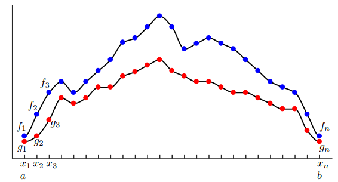

FOURIER TRANSFORMS
==================================

#. `Discrete Fourier Transform - Simple Step by Step <https://www.youtube.com/watch?v=mkGsMWi_j4Q/>`_
#. `The Two-Dimensional Discrete Fourier Transform <https://www.youtube.com/watch?v=Iz6C1ny-F2Q/>`_
#. `How the 2D FFT works <https://www.youtube.com/watch?v=v743U7gvLq0/>`_
#. `2D Fourier Transform Explained with Examples <https://www.youtube.com/watch?v=3gAZ0U66AEA/>`_
#. `2 Dimensional Discrete Fourier Transform <https://www.youtube.com/watch?v=7AddavtPWqM/>`_
#. `具体学习并实现快速傅里叶变换（FFT） <https://www.bilibili.com/video/BV1Y7411W73U/>`_
#. `fftpack <https://www.netlib.org/fftpack/>`_
#. `Netlib Repository <https://www.netlib.org/>`_
#. `Python Programming and Numerical Methods - A Guide for Engineers and Scientists <https://pythonnumericalmethods.berkeley.edu/notebooks/Index.html>`_
#. `fftw3_doc <https://www.fftw.org/fftw3_doc/index.html>`_

Inner products of functions and vectors
--------------------------------------------
In this section, we will make use of inner products and norms of functions. In
particular, we will use the common Hermitian inner product for functions :math:`f(x)`
and :math:`g(x)` defined for :math:`x` on a domain :math:`x\in [a,b]`:

.. math::
  \langle {f(x), \text{cos}(kx)} \rangle=\int^{b}_{a}f(x)\bar{g}(x)dx
  
where :math:`\bar{g}` denotes the complex conjugate.

The inner product of functions may seem strange or unmotivated at first,
but this definition becomes clear when we consider the inner product of vectors
of data. In particular, if we discretize the functions f(x) and g(x) into vectors
of data, as in following figure.   

   
   Discretized functions used to illustrate the inner product
   
we would like the vector inner product to converge to
the function inner product as the sampling resolution is increased. The inner
product of the data vectors :math:`\mathbf{f}=[f_{1},f_{2},\cdots,f_{n}]^{T}` and 
:math:`\mathbf{g}=[g_{1},g_{2},\cdots,g_{n}]^{T}` is defined by:

.. math::
  \langle {f, g} \rangle=g*f=\sum^{n}_{k=1}(f_{k}\bar{g}_{k})=\sum^{n}_{k=1}f(x_{k})\bar{g}(x_{k})
  
The magnitude of this inner product will grow as more data points are added;
i.e., as :math:`n` increases. Thus, we may normalize by :math:`\Delta x=\cfrac{b-a}{n-1}`:  

.. math::
  \cfrac{b-a}{n-1} \langle {f, g} \rangle=\sum^{n}_{k=1}f(x_{k})\bar{g}(x_{k})\Delta x
  
which is the Riemann approximation to the continuous function inner product.
It is now clear that as we take the limit of :math:`n\rightarrow \infty` (i.e., infinite data resolution, with :math:`\Delta x\rightarrow 0`), the vector inner product converges to the inner product of
functions in integral form.

This inner product also induces a norm on functions, given by

.. math::
  \|f\|_{2}=( \langle {f,f} \rangle )^{1/2}=\sqrt{\langle {f,f} \rangle} = \left(\int^{b}_{a}f(x)\bar{f}(x)\right)^{1/2}
  
The set of all functions with bounded norm define the set of square integrable
functions, denoted by :math:`L^{2}([a,b])`; this is also known as the set of Lebesgue integrable functions. The interval :math:`[a,b]` may also be chosen to be infinite (e.g.,
:math:`(-\infty,\infty)`), semi-infinite (e.g., :math:`[a,\infty)`), or periodic (e.g., :math:`[-\pi,\pi]`).
A fun example of a function in :math:`L^{2}([1,\infty))` is :math:`f(x) = 1/x`. The square of :math:`f` has finite integral
from :math:`1` to :math:`\infty`, although the integral of the function itself diverges. The shape
obtained by rotating this function about the x-axis is known as Gabriel’s horn, as the volume is finite (related to the integral of :math:`f^{2}`), while the surface area is
infinite (related to the integral of :math:`f`).

As in finite-dimensional vector spaces, the inner product may be used to
project a function into an new coordinate system defined by a basis of orthogonal functions. A Fourier series representation of a function :math:`f` is precisely a
projection of this function onto the orthogonal set of sine and cosine functions with integer period on the domain :math:`[a,b]`. This is the subject of the following sections.

Fourier series
----------------------
A fundamental result in Fourier analysis is that if :math:`f(x)` is periodic and piecewise
smooth, then it can be written in terms of a Fourier series, which is an infinite
sum of cosines and sines of increasing frequency. In particular, if :math:`f(x)` is :math:`2\pi`-
periodic, it may be written as:

.. math::
  f(x)=\cfrac{a_{0}}{2} +\sum_{k=1}^{\infty} (a_{k}\text{cos}(kx)+b_{k}\text{sin}(kx))
  
The coefficients :math:`a_{k}` and :math:`b_{k}` are given by  

.. math::
  \begin{array}{c}
  \displaystyle a_{k}=\cfrac{1}{\pi}\int^{\pi}_{-\pi }f(x)\text{cos}(kx)dx\\
  \displaystyle b_{k}=\cfrac{1}{\pi}\int^{\pi}_{-\pi }f(x)\text{sin}(kx)dx
  \end{array}
  
which may be viewed as the coordinates obtained by projecting the function
onto the orthogonal cosine and sine basis :math:`\{\text{cos}(kx),\text{sin}(kx)\}^{\infty}_{k=0}`.  
In other words, the above integrals may be re-written in terms of the inner product as:

.. math::
  \begin{array}{c}
  a_{k}=\cfrac{1}{\|\text{cos}(kx)\|^{2}}\left \langle {f(x), \text{cos}(kx)} \right \rangle\\ 
  b_{k}=\cfrac{1}{\|\text{sin}(kx)\|^{2}}\left \langle {f(x), \text{sin}(kx)} \right \rangle\\
  \end{array}
  
where :math:`\|\text{cos}(kx)\|^{2}=\|\text{sin}(kx)\|^{2}=\pi`. This factor of :math:`\cfrac{1}{\pi}` is easy to verify by
numerically integrating :math:`\text{cos}(x)^{2}` and :math:`\text{sin}(x)^{2}` from :math:`-{\pi}` to :math:`{\pi}`.

Discrete Fourier transform
-------------------------------------
Although we will always use the FFT for computations, it is illustrative to begin
with the simplest formulation of the DFT. The discrete Fourier transform is
given by:

.. math::
  \hat{f}_{k}=\sum^{n-1}_{j=0}f_{j}e^{\cfrac{-\mathbf{i}2\pi jk}{n}}
  
and the inverse discrete Fourier transform (iDFT) is given by:  

.. math::
  {f}_{k}=\cfrac{1}{n}\sum^{n-1}_{j=0}\hat{f}_{j}e^{\cfrac{\mathbf{i}2\pi jk}{n}}
  
Thus, the DFT is a linear operator (i.e., a matrix) that maps the data points in :math:`f`
to the frequency domain :math:`\hat{f}`:  

.. math::
  \{f_{1},f_{2},\cdots,f_{n}\} \overset{\text{DFT}}{\Longrightarrow  } \{\hat{f}_{1},\hat{f}_{2},\cdots,\hat{f}_{n}\} 
  
For a given number of points :math:`n`, the DFT represents the data using sine and
cosine functions with integer multiples of a fundamental frequency, :math:`\omega=e^{\cfrac{-\mathbf{i}2\pi }{n}}`.
The DFT may be computed by matrix multiplication: 

.. math::
  \left[\begin{array}{c} 
  \hat{f}_{1}\\\hat{f}_{2}\\\hat{f}_{3}\\\vdots\\\hat{f}_{n}
  \end{array}\right]
  =\left[\begin{array}{c} 
  1&1&1&\cdots &1\\
  1&\omega_{n}&\omega^{2}_{n}&\cdots &\omega^{n-1}_{n}\\
  1&\omega^{2}_{n}&\omega^{4}_{n}&\cdots &\omega^{2(n-1)}_{n}\\
  \vdots&\vdots&\vdots&\ddots&\vdots\\
  1&\omega^{n-1}_{n}&\omega^{2(n-1)}_{n}&\cdots &\omega^{(n-1)^2}_{n}\\
  \end{array}\right]\left[\begin{array}{c} 
  f_{1}\\f_{2}\\f_{3}\\\vdots\\f_{n}
  \end{array}\right]

-
  
.. math::
  \hat{f}_{k}=\sum^{n-1}_{j=0}f_{j}e^{\cfrac{-\mathbf{i}2\pi}{n}kj}=\sum^{n-1}_{j=0}f_{j}\omega_{n}^{kj}  
  
-
  
.. math::
  \omega_{n}=e^{\cfrac{-\mathbf{i}2\pi }{n}}  
  
-
  
.. math::  
  \hat{f}_{k}  = f_{0}\omega_{n}^{k0}+f_{1}\omega_{n}^{k1}+\cdots+f_{n-1}\omega_{n}^{k(n-1)}\\
  
-
  
.. math::
  \begin{array}{l}
  \displaystyle \hat{f}_{0}  = f_{0}\omega_{n}^{00}+f_{1}\omega_{n}^{01}+f_{2}\omega_{n}^{02}+\cdots+f_{n-1}\omega_{n}^{0(n-1)}\\
  \displaystyle \hat{f}_{1}  = f_{0}\omega_{n}^{10}+f_{1}\omega_{n}^{11}+f_{2}\omega_{n}^{12}+\cdots+f_{n-1}\omega_{n}^{1(n-1)}\\
  \displaystyle \hat{f}_{2}  = f_{0}\omega_{n}^{20}+f_{1}\omega_{n}^{21}+f_{1}\omega_{n}^{22}+\cdots+f_{n-1}\omega_{n}^{2(n-1)}\\
  \cdots\\
  \displaystyle \hat{f}_{k}  = f_{0}\omega_{n}^{k0}+f_{1}\omega_{n}^{k1}+f_{2}\omega_{n}^{k2}+\cdots+f_{n-1}\omega_{n}^{k(n-1)}\\  
  \cdots\\
  \displaystyle \hat{f}_{n-2}  = f_{0}\omega_{n}^{(n-2)0}+f_{1}\omega_{n}^{(n-2)1}+f_{2}\omega_{n}^{(n-2)2}+\cdots+f_{n-1}\omega_{n}^{(n-2)(n-1)}\\
  \displaystyle \hat{f}_{n-1}  = f_{0}\omega_{n}^{(n-1)0}+f_{1}\omega_{n}^{(n-1)1}+f_{2}\omega_{n}^{(n-1)2}+\cdots+f_{n-1}\omega_{n}^{(n-1)(n-1)}\\
  \end{array}  
  
-
  
.. math::
  \begin{array}{l}
  \displaystyle \hat{f}_{0}  = f_{0}\times1+f_{1}\times1+f_{2}\times1+\cdots+f_{n-1}\times1\\
  \displaystyle \hat{f}_{1}  = f_{0}\times1+f_{1}\omega_{n}^{1\times1}+f_{2}\omega_{n}^{2\times1}+\cdots+f_{n-1}\omega_{n}^{(n-1)\times1}\\
  \displaystyle \hat{f}_{2}  = f_{0}\times1+f_{1}\omega_{n}^{1\times2}+f_{1}\omega_{n}^{2\times2}+\cdots+f_{n-1}\omega_{n}^{(n-1)\times2}\\
  \cdots\\
  \displaystyle \hat{f}_{k}  = f_{0}\times1+f_{1}\omega_{n}^{1\times k}+f_{2}\omega_{n}^{2\times k}+\cdots+f_{n-1}\omega_{n}^{(n-1)\times k}\\  
  \cdots\\
  \displaystyle \hat{f}_{n-2}  = f_{0}\times1+f_{1}\omega_{n}^{1\times(n-2)}+f_{2}\omega_{n}^{2\times(n-2)}+\cdots+f_{n-1}\omega_{n}^{(n-1)\times(n-2)}\\
  \displaystyle \hat{f}_{n-1}  = f_{0}\times1+f_{1}\omega_{n}^{1\times(n-1)}+f_{2}\omega_{n}^{2\times(n-1)}+\cdots+f_{n-1}\omega_{n}^{(n-1)\times(n-1)}\\
  \end{array}    
  
Basic properties of complex roots of units.
---------------------------------------------------
Elimination lemma

.. math::
  \omega_{jn}^{jk}=\omega_{n}^{k}
  
proof:

.. math::
  \begin{array}{l}
  \omega_{n}=e^{\cfrac{2\pi\mathbf{i}}{n}}\\
  \omega_{n}^{k}=e^{\mathbf{i}\cfrac{2\pi k}{n}}\\
  \omega_{jn}^{jk}=e^{\mathbf{i}\cfrac{2\pi jk}{jn}}=e^{\mathbf{i}\cfrac{2\pi k}{n}}\\
  \omega_{n}^{n/2}=e^{\mathbf{i}\cfrac{2\pi n/2}{n}}=e^{\mathbf{i}\pi}=-1\\
  \omega_{n\times2/n}^{n/2\times2/n}=\omega_{2}=e^{\mathbf{i}\cfrac{2\pi n/2\times2/n}{n\times2/n}}=e^{\mathbf{i}\cfrac{2\pi }{2}}=-1\\
  \end{array}

Bind-in-half lemma:

.. math::
  (\omega_{n}^{k+\frac{n}{2}})^{2}=(\omega_{n}^{k})^{2}=\omega_{n/2}^{k}
  
proof: 

.. math:: 
  \begin{array}{l}
  \omega_{n}^{k+\frac{n}{2}}=\omega_{n}^{k}\omega_{n}^{\frac{n}{2}}=\omega_{n}^{k}\omega_{2}=-\omega_{n}^{k}\\
  (\omega_{n}^{k})^{2}=\omega_{n}^{2k}=\omega_{\frac{n}{2}}^{k}\\
  \omega_{n}^{j+\frac{n}{2}}=-\omega_{n}^{j}\\
  \end{array}  
  
Summation lemma:

.. math:: 
  \sum_{i=0}^{n-1}(\omega_{n}^{k})^{i}=\cfrac{(\omega_{n}^{k})^{n}-1}{\omega_{n}^{k}-1}=\cfrac{(\omega_{n}^{n})^{k}-1}{\omega_{n}^{k}-1}
  =\cfrac{(1)^{k}-1}{\omega_{n}^{k}-1}=0

The 2D Discrete Fourier Transform
------------------------------------------------

.. math::
  \hat{f}(m,n)=\sum_{i=0}^{M-1}\sum_{j=0}^{N-1}f(i,j)e^{-\mathbf{i}2\pi\left(\cfrac{mi}{M}+\cfrac{nj}{N}\right)}
  
the inverse discrete Fourier transform (iDFT) is given by  

.. math::
  {f}(i,j)=\cfrac{1}{MN}\sum_{m=0}^{M-1}\sum_{n=0}^{N-1}\hat{f}(m,n)e^{\mathbf{i}2\pi\left(\cfrac{mi}{M}+\cfrac{nj}{N}\right)}\\
  
Evaluation
------------------------------------------------

.. math::
  P(x)=3x^{5}+2x^{4}+x^{3}+7x^{2}+5x+1
  
-
  
.. math::
  P(x)=\underbrace{(2x^{4}+7x^{2}+1)}_{P_{e}(x^{2})}+x\underbrace{(3x^{4}+x^{2}+5)}_{P_{o}(x^{2})}
  
-
  
.. math::
  P(x)=P_{e}(x^{2})+xP_{o}(x^{2})
  
-
  
.. math::
  P(x)=p_{0}+p_{1}x+p_{2}x^{2}+\dots +p_{n-1}x^{n-1}
  
Evaluate at :math:`n` points :math:`\pm x_{1}, \pm x_{2},\dots,\pm x_{n/2}`

-

.. math::
  \begin{array}{l}
  P(x):[p_{0},p_{1},\dots,p_{n-1}]\\
  \text{Evaluate }[\pm x_{1}, \pm x_{2},\dots,\pm x_{n/2}]
  \end{array}
  
-
  
.. math::
  P(x)=P_{e}(x^{2})+xP_{o}(x^{2})  

-

.. math::
  \begin{array}{l}
  P_{e}(x^{2}):[p_{0},p_{2},\dots,p_{n-2}]\\
  \text{Evaluate }[x_{1}^{2},x_{2}^{2},\dots,x_{n/2}^{2}]\\
  [P_{e}(x_{1}^{2}),P_{e}(x_{2}^{2}),\dots,P_{e}(x_{n/2}^{2})]
  \end{array}
  
-

.. math::
  \begin{array}{l}
  P_{o}(x^{2}):[p_{1},p_{3},\dots,p_{n-1}]\\
  \text{Evaluate }[x_{1}^{2},x_{2}^{2},\dots,x_{n/2}^{2}]\\
  [P_{o}(x_{1}^{2}),P_{o}(x_{2}^{2}),\dots,P_{o}(x_{n/2}^{2})]
  \end{array} 
  
-

.. math::
  \begin{array}{l}
  P(x_{i})=P_{e}(x_{i}^{2})+x_{i}P_{o}(x_{i}^{2})\\
  P(-x_{i})=P_{e}(x_{i}^{2})-x_{i}P_{o}(x_{i}^{2})\\
  i=\{1,2,\dots,n/2\}
  \end{array}
  
FFT
--------------------

.. math::
  \begin{array}{l}
  P(x):[p_{0},p_{1},\dots,p_{n-1}]\\
  \text{FFT }\omega=e^{\cfrac{2\pi\mathbf{i}}{n}}[\omega^{0}, \omega^{1},\dots,\omega^{n-1}]
  \end{array}

-

.. math::
  \begin{array}{l}
  P_{e}(x^{2}):[p_{0},p_{2},\dots,p_{n-2}]\\
  \text{FFT }[\omega^{0},\omega^{2},\dots,\omega^{n-2}]\\
  y_{e}=[P_{e}(\omega^{0}),P_{e}(\omega^{2}),\dots,P_{e}(\omega^{n-2})]
  \end{array}  
  
-

.. math::
  \begin{array}{l}
  P_{o}(x^{2}):[p_{1},p_{3},\dots,p_{n-1}]\\
  \text{FFT }[\omega^{0},\omega^{2},\dots,\omega^{n-2}]\\
  y_{o}=[P_{o}(\omega^{0}),P_{o}(\omega^{2}),\dots,P_{o}(\omega^{n-2})]
  \end{array}    
  
-
  
.. math::
  \begin{array}{l}
  P(\omega^{j})=P_{e}(\omega^{2j})+\omega^{j}P_{o}(\omega^{2j}) \\
  P(-\omega^{j})=P_{e}(\omega^{2j})-\omega^{j}P_{o}(\omega^{2j}) \\
  j\in \{0,1,\dots,(n/2-1)\}
  \end{array}
  
-
  
.. math::
  \begin{array}{l}
  P(\omega^{j})=y_{e}[j]+\omega^{j}y_{o}[j] \\
  P(-\omega^{j})=y_{e}[j]-\omega^{j}y_{o}[j] \\
  j\in \{0,1,\dots,(n/2-1)\}
  \end{array}  
  
-
  
.. math::
  \begin{array}{l}
  y_{e}[j]= P_{e}(\omega^{2j})\\
  y_{o}[j]= P_{o}(\omega^{2j})\\
  \end{array}  
  
-
  
.. math::
  y=[P(\omega^{0}),P(\omega^{1}),\dots,P(\omega^{n-1})]  

python code
  
::

  for n in range( 10 ):
    nn= int(n/2)
    print("n=",n,"n/2=",n/2,"int(n/2)=",nn)

results:

::

  n= 0 n/2= 0.0 int(n/2)= 0
  n= 1 n/2= 0.5 int(n/2)= 0
  n= 2 n/2= 1.0 int(n/2)= 1
  n= 3 n/2= 1.5 int(n/2)= 1
  n= 4 n/2= 2.0 int(n/2)= 2
  n= 5 n/2= 2.5 int(n/2)= 2
  n= 6 n/2= 3.0 int(n/2)= 3
  n= 7 n/2= 3.5 int(n/2)= 3
  n= 8 n/2= 4.0 int(n/2)= 4
  n= 9 n/2= 4.5 int(n/2)= 4
  
Euler's formula
------------------------

.. math::
  \begin{array}{l}
  e^{\mathbf{i}\theta }=\text{cos}{\theta}+\mathbf{i}\text{sin}{\theta}\\
  \text{cos}{\theta}=\cfrac{e^{\mathbf{i}\theta}+e^{-\mathbf{i}\theta}}{2}\\
  \text{sin}{\theta}=\cfrac{e^{\mathbf{i}\theta}-e^{-\mathbf{i}\theta}}{2\mathbf{i}}\\
  \end{array}

Discrete Fourier transform
------------------------------
  
.. math::
  \begin{array}{l}
  \displaystyle \hat{f}_{k}=\sum_{j=0}^{n-1}{f}_{j}e^{-\cfrac{\mathbf{i}2\pi jk}{n}}
  =\sum_{j=0}^{n-1}{f}_{j}\{\text{cos}\cfrac{2\pi jk}{n}-\mathbf{i}\text{sin}\cfrac{2\pi jk}{n}\}
  \end{array}  
  
-
  
.. math::
  \omega_{n}^{k}=e^{-\cfrac{\mathbf{i}2\pi k}{n}}  
  
-
  
.. math::
  \begin{array}{l}
  \displaystyle \hat{f}_{k}=\sum_{j=0}^{n-1}{f}_{j}e^{-\cfrac{\mathbf{i}2\pi jk}{n}}\\
  =f_{0}e^{-\cfrac{\mathbf{i}2\pi k}{n}0}+f_{1}e^{-\cfrac{\mathbf{i}2\pi k}{n}1}
  +f_{2}e^{-\cfrac{\mathbf{i}2\pi k}{n}2}+\dots+f_{j}e^{-\cfrac{\mathbf{i}2\pi k}{n}j}+\dots
  +f_{n-1}e^{-\cfrac{\mathbf{i}2\pi k}{n}(n-1)}
  \end{array}
  
Compared  

.. math::
  P(x)=p_{0}+p_{1}x+p_{2}x^{2}+\dots +p_{n-1}x^{n-1}
  
algorithm

.. math::
  \begin{array}{l}
  a^{m}\cdot a^{n}=a^{m+n}\\
  (a^{m})^{n}=a^{mn}\\
  \cfrac{a^{m}}{a^{n}}=a^{m-n}\\
  (ab)^{m}=a^{m}b^{m}\\
  \end{array}
  
fk

.. math::
  \begin{array}{l}
  \omega_{n}^{k}=e^{-\cfrac{\mathbf{i}2\pi k}{n}} \\
  \displaystyle \hat{f}_{k}=\sum_{j=0}^{n-1}{f}_{j}e^{-\cfrac{\mathbf{i}2\pi jk}{n}}
  =\sum_{j=0}^{n-1}{f}_{j}{(\omega_{n}^{k})}^j\\
  =f_{0}{(\omega_{n}^{k})}^{0}+f_{1}{(\omega_{n}^{k})}^{1}
  +f_{2}{(\omega_{n}^{k})}^{2}+\dots+f_{j}{(\omega_{n}^{k})}^{j}+\dots
  +f_{n-1}{(\omega_{n}^{k})}^{n-1}
  \end{array}
  
-
  
.. math::  
  \begin{array}{l}
  \hat{f}_{0}
  =f_{0}{(\omega_{n}^{0})}^{0}+f_{1}{(\omega_{n}^{0})}^{1}
  +f_{2}{(\omega_{n}^{0})}^{2}+\dots+f_{j}{(\omega_{n}^{0})}^{j}+\dots
  +f_{n-1}{(\omega_{n}^{0})}^{n-1}\\
  \hat{f}_{1}
  =f_{0}{(\omega_{n}^{1})}^{0}+f_{1}{(\omega_{n}^{1})}^{1}
  +f_{2}{(\omega_{n}^{1})}^{2}+\dots+f_{j}{(\omega_{n}^{1})}^{j}+\dots
  +f_{n-1}{(\omega_{n}^{1})}^{n-1}\\
  \hat{f}_{2}
  =f_{0}{(\omega_{n}^{2})}^{0}+f_{1}{(\omega_{n}^{2})}^{1}
  +f_{2}{(\omega_{n}^{2})}^{2}+\dots+f_{j}{(\omega_{n}^{2})}^{j}+\dots
  +f_{n-1}{(\omega_{n}^{2})}^{n-1}\\
  \cdots\\
  \hat{f}_{k}
  =f_{0}{(\omega_{n}^{k})}^{0}+f_{1}{(\omega_{n}^{k})}^{1}
  +f_{2}{(\omega_{n}^{k})}^{2}+\dots+f_{j}{(\omega_{n}^{k})}^{j}+\dots
  +f_{n-1}{(\omega_{n}^{k})}^{n-1}\\
  \cdots\\
  \hat{f}_{n-1}
  =f_{0}{(\omega_{n}^{n-1})}^{0}+f_{1}{(\omega_{n}^{n-1})}^{1}
  +f_{2}{(\omega_{n}^{n-1})}^{2}+\dots+f_{j}{(\omega_{n}^{n-1})}^{j}+\dots
  +f_{n-1}{(\omega_{n}^{n-1})}^{n-1}\\
  \end{array}  
  
Let  

.. math::  
  \hat{F}(x)
  =f_{0}+f_{1}x
  +f_{2}x^{2}+\dots
  +f_{n-1}x^{n-1}\\  
  
then  

.. math::    
  \begin{array}{l}
  \hat{F}(x)=f_{0}+f_{1}x+f_{2}x^{2}+\dots+f_{n-1}x^{n-1}\\
  \hat{F}(x)=P_{e}(x^{2})+xP_{o}(x^{2})\\
  \hat{f}_{0}=\hat{F}(x_{0})=P_{e}(x_{0}^{2})+x_{0}P_{o}(x_{0}^{2})\\
  \hat{f}_{1}=\hat{F}(x_{1})=P_{e}(x_{1}^{2})+x_{1}P_{o}(x_{1}^{2})\\
  \hat{f}_{2}=\hat{F}(x_{2})=P_{e}(x_{2}^{2})+x_{2}P_{o}(x_{2}^{2})\\
  \cdots\\
  \hat{f}_{j}=\hat{F}(x_{j})=P_{e}(x_{j}^{2})+x_{j}P_{o}(x_{j}^{2})\\
  \cdots\\
  \hat{f}_{n-1}=\hat{F}(x_{n-1})=P_{e}(x_{n-1}^{2})+x_{n-1}P_{o}(x_{n-1}^{2})\\
  \end{array}  
  
-
  
.. math::    
  \begin{array}{l}
  \hat{F}(x)=f_{0}+f_{1}x+f_{2}x^{2}+\dots+f_{n-1}x^{n-1}\\
  \hat{F}(x)=P_{e}(x^{2})+xP_{o}(x^{2})\\
   n=1,\hat{F}(x)=f_{0}\\
   n=2,\hat{F}(x)=f_{0}+f_{1}x\\
   n=3,\hat{F}(x)=f_{0}+f_{1}x+f_{2}x^{2}\\
   n=4,\hat{F}(x)=f_{0}+f_{1}x+f_{2}x^{2}+f_{3}x^{3}\\
   n=5,\hat{F}(x)=f_{0}+f_{1}x+f_{2}x^{2}+f_{3}x^{3}+f_{4}x^{4}\\
   n=6,\hat{F}(x)=f_{0}+f_{1}x+f_{2}x^{2}+f_{3}x^{3}+f_{4}x^{4}+f_{5}x^{5}\\
   n=7,\hat{F}(x)=f_{0}+f_{1}x+f_{2}x^{2}+f_{3}x^{3}+f_{4}x^{4}+f_{5}x^{5}+f_{6}x^{6}\\
   n=8,\hat{F}(x)=f_{0}+f_{1}x+f_{2}x^{2}+f_{3}x^{3}+f_{4}x^{4}+f_{5}x^{5}+f_{6}x^{6}+f_{7}x^{7}\\
  \end{array}  
  
-
  
.. math:: 
  \begin{array}{l}
  \hat{F}(x)=f_{0}+f_{1}x+f_{2}x^{2}+\dots+f_{n-1}x^{n-1}\\
  \hat{F}(x)=P_{e}(x^{2})+xP_{o}(x^{2})\\
   n=1\\
   \hat{F}(x)=f_{0}\\
   P_{e}(x^{2})=f_{0},P_{o}(x^{2})=0\\\\
   n=2\\
   \hat{F}(x)=f_{0}+f_{1}x\\
   P_{e}(x^{2})=f_{0},P_{o}(x^{2})=f_{1}\\\\
   n=3\\
   \hat{F}(x)=f_{0}+f_{1}x+f_{2}x^{2}\\
   P_{e}(x^{2})=f_{0}+f_{2}x^{2},P_{o}(x^{2})=f_{1}\\\\
   n=4\\
   \hat{F}(x)=f_{0}+f_{1}x+f_{2}x^{2}+f_{3}x^{3}\\
   P_{e}(x^{2})=f_{0}+f_{2}x^{2},P_{o}(x^{2})=f_{1}+f_{3}x^{2}\\\\
   n=5\\
   \hat{F}(x)=f_{0}+f_{1}x+f_{2}x^{2}+f_{3}x^{3}+f_{4}x^{4}\\
   P_{e}(x^{2})=f_{0}+f_{2}x^{2}+f_{4}x^{4},P_{o}(x^{2})=f_{1}+f_{3}x^{2}\\\\
   n=6\\
   \hat{F}(x)=f_{0}+f_{1}x+f_{2}x^{2}+f_{3}x^{3}+f_{4}x^{4}+f_{5}x^{5}\\
   P_{e}(x^{2})=f_{0}+f_{2}x^{2}+f_{4}x^{4},P_{o}(x^{2})=f_{1}+f_{3}x^{2}+f_{5}x^{4}\\\\
   n=7\\
   \hat{F}(x)=f_{0}+f_{1}x+f_{2}x^{2}+f_{3}x^{3}+f_{4}x^{4}+f_{5}x^{5}+f_{6}x^{6}\\
   P_{e}(x^{2})=f_{0}+f_{2}x^{2}+f_{4}x^{4}+f_{6}x^{6},P_{o}(x^{2})=f_{1}+f_{3}x^{2}+f_{5}x^{4}\\\\
   n=8\\
   \hat{F}(x)=f_{0}+f_{1}x+f_{2}x^{2}+f_{3}x^{3}+f_{4}x^{4}+f_{5}x^{5}+f_{6}x^{6}+f_{7}x^{7}\\
   P_{e}(x^{2})=f_{0}+f_{2}x^{2}+f_{4}x^{4}+f_{6}x^{6},P_{o}(x^{2})=f_{1}+f_{3}x^{2}+f_{5}x^{4}+f_{7}x^{6}\\\\
  \end{array}    

  
-
  
.. math:: 
  \begin{array}{l}
  \omega_{n}^{k}=e^{-\cfrac{\mathbf{i}2\pi k}{n}} \\
  n=2\\
  \omega_{2}^{k}=e^{-\cfrac{\mathbf{i}2\pi k}{2}}\\
  \omega_{2}^{0}=1\\
  \omega_{2}^{1}=e^{-\cfrac{\mathbf{i}2\pi\times 1}{2}}=-1 \\\\
  \hat{f}_{0}
  =f_{0}{(\omega_{2}^{0})}^{0}+f_{1}{(\omega_{2}^{0})}^{1}\\
  \hat{f}_{1}
  =f_{0}{(\omega_{2}^{1})}^{0}+f_{1}{(\omega_{2}^{1})}^{1}\\
  \end{array}  
  
-
  
.. math:: 
  \begin{array}{l}
  \omega_{n}^{k}=e^{-\cfrac{\mathbf{i}2\pi k}{n}} \\
  \omega_{n}^{k+n/2}=e^{-\cfrac{\mathbf{i}2\pi (k+n/2)}{n}}
   =e^{-\cfrac{\mathbf{i}2\pi k}{n}}e^{-\cfrac{\mathbf{i}2\pi (n/2)}{n}}
   =-e^{-\cfrac{\mathbf{i}2\pi k}{n}}
   =-\omega_{n}^{k}\\
  \omega_{n}^{k+n/2}=-\omega_{n}^{k}\\
  \end{array}  
  
Program flow chart
-------------------------------

1.

.. math:: 
  \begin{array}{l}
  F(x)=f_{0}+f_{1}x+f_{2}x^{2}+f_{3}x^{3}\\
  F(x_{0})=f_{0}+f_{1}x_{0}+f_{2}(x_{0})^{2}+f_{3}(x_{0})^{3}\\
  F(x_{1})=f_{0}+f_{1}x_{1}+f_{2}(x_{1})^{2}+f_{3}(x_{1})^{3}\\
  F(x_{2})=f_{0}+f_{1}x_{2}+f_{2}(x_{2})^{2}+f_{3}(x_{2})^{3}\\
  F(x_{3})=f_{0}+f_{1}x_{3}+f_{2}(x_{3})^{2}+f_{3}(x_{3})^{3}\\
  \end{array}

2. 

::

  for ( i = 0; i < 4; ++ i )
  {
      xm=x[i];
      F(xm)=f0 + f1*xm + f2*xm^2 + f3*xm^3
      Pec = [f0, f2]
      Solve(Pec)
      Poc = [f1, f3]
  }

.. math:: 
  \begin{array}{l}
  n=4,x=var=e^{-\mathbf{i}\cfrac{2\pi}{n}}=e^{-\mathbf{i}\cfrac{2\pi}{4}}\\
  F(x)=f_{0}+f_{1}x+f_{2}x^{2}+f_{3}x^{3}\\
  F(x)=f_{0}+f_{2}x^{2}+x(f_{1}+f_{3}x^{2})\\
  P_{e}(x^{2})=f_{0}+f_{2}x^{2},P_{o}(x^{2})=f_{1}+f_{3}x^{2}\\
  F(x)=P_{e}(x^{2})+xP_{o}(x^{2})\\
  n=2,x^2=y=e^{-\mathbf{i}\cfrac{2\pi}{n}}=\bigg[e^{-\mathbf{i}\cfrac{2\pi}{4}}\bigg]^2\\
  P_{e}(x^{2})=f_{0}+f_{2}x^{2}=f_{0}+x^{2}f_{2}\\
  P_{e}(y)=f_{0}+y\cdot f_{2}\\
  Q_{e}(y)=f_{0},Q_{o}(y)=f_{2}\\
  P_{e}(y)=Q_{e}(y)+yQ_{o}(y)\\\\
  P_{o}(x^{2})=f_{1}+f_{3}x^{2}=f_{1}+x^{2}f_{3}\\
  P_{o}(y)=f_{1}+yf_{3}\\
  R_{e}(y)=f_{1},R_{o}(y)=f_{3}\\
  P_{o}(y)=R_{e}(y)+yR_{o}(y)\\
  \end{array}

Discrete Sine Transform(DST)
----------------------------------

.. math:: 
  \hat{f}_{k}=\sum_{j=0}^{n-1}{f}_{j}\text{ sin}\cfrac{\pi jk}{n}
  
-
  
.. math:: 
  \begin{array}{l}
  \displaystyle \hat{f}_{k}=\sum_{j=0}^{n-1}{f}_{j}\text{ sin}\cfrac{\pi jk}{n}\\
  \displaystyle \hat{f}_{k}
  ={f}_{0}\text{ sin}\cfrac{\pi k\cdot 0}{n}
  +{f}_{1}\text{ sin}\cfrac{\pi k\cdot 1}{n}
  +\cdots
  +{f}_{j}\text{ sin}\cfrac{\pi k\cdot j}{n}
  +\cdots
  +{f}_{n-1}\text{ sin}\cfrac{\pi k\cdot (n-1)}{n}\\
  \end{array}    
  
-
  
.. math:: 
  \begin{array}{l}
  \displaystyle \hat{f}_{k}=\sum_{j=0}^{n-1}{f}_{j}\text{ sin}\cfrac{\pi jk}{n}\\
  \text{sin}{\theta}=\cfrac{e^{\mathbf{i}\theta}-e^{-\mathbf{i}\theta}}{2\mathbf{i}}\\
  \text{ sin}\cfrac{\pi jk}{n}=\cfrac{e^{\mathbf{i}\cfrac{\pi jk}{n}}-e^{-\mathbf{i}\cfrac{\pi jk}{n}}}{2\mathbf{i}}\\
  \displaystyle \hat{f}_{k}=\sum_{j=0}^{n-1}{f}_{j}\cfrac{e^{\mathbf{i}\cfrac{\pi jk}{n}}-e^{-\mathbf{i}\cfrac{\pi jk}{n}}}{2\mathbf{i}}\\
  \displaystyle \hat{f}_{k}
  =\sum_{j=0}^{n-1}\cfrac{1}{2\mathbf{i}} {f}_{j}{e^{\mathbf{i}\cfrac{\pi jk}{n}}}
  -\sum_{j=0}^{n-1}\cfrac{1}{2\mathbf{i}} {f}_{j}{e^{-\mathbf{i}\cfrac{\pi jk}{n}}}\\
  \hat{f}_{k}=\cfrac{1}{2\mathbf{i}}(\hat{f}_{k1}-\hat{f}_{k2})
   =-\cfrac{1}{2}\mathbf{i}(\hat{f}_{k1}-\hat{f}_{k2})
   =\cfrac{1}{2}\mathbf{i}(\hat{f}_{k2}-\hat{f}_{k1})\\
  \displaystyle \hat{f}_{k1}=\sum_{j=0}^{n-1}{f}_{j}{e^{\mathbf{i}\cfrac{\pi jk}{n}}}\\
  \displaystyle \hat{f}_{k2}=\sum_{j=0}^{n-1}{f}_{j}{e^{-\mathbf{i}\cfrac{\pi jk}{n}}}\\
  \end{array}  
  
Let

.. math:: 
  \tilde{\omega}_{n}^{k}=e^{-\mathbf{i}\cfrac{\pi jk}{n}}
  
then  

.. math::   
  \begin{array}{l}
  \tilde{\omega}_{n}^{k}=e^{-\mathbf{i}\cfrac{\pi k}{n}}\\
  \displaystyle \hat{f}_{k2}
  =\sum_{j=0}^{n-1}{f}_{j}{e^{-\mathbf{i}\cfrac{\pi jk}{n}}}
  =\sum_{j=0}^{n-1}{f}_{j}\bigg(e^{-\mathbf{i}\cfrac{\pi k}{n}}\bigg)^{j}
  =\sum_{j=0}^{n-1}{f}_{j}\bigg(\tilde{\omega}_{n}^{k}\bigg)^{j}\\
  \end{array} 
  
-
  
.. math:: 
  \begin{array}{l}
  \omega_{n}^{k}=e^{-\cfrac{\mathbf{i}2\pi k}{n}} \\
  \omega_{n}^{k+n/2}=e^{-\cfrac{\mathbf{i}2\pi (k+n/2)}{n}}
   =e^{-\cfrac{\mathbf{i}2\pi k}{n}}e^{-\cfrac{\mathbf{i}2\pi (n/2)}{n}}
   =-e^{-\cfrac{\mathbf{i}2\pi k}{n}}
   =-\omega_{n}^{k}\\
  \omega_{n}^{k+n/2}=-\omega_{n}^{k}\\
  \tilde{\omega}_{n}^{k}=e^{-\cfrac{\mathbf{i}\pi k}{n}}\\
  \tilde{\omega}_{n}^{k+n/2}=e^{-\cfrac{\mathbf{i}\pi (k+n/2)}{n}}
  =e^{-\cfrac{\mathbf{i}\pi k}{n}}e^{-\cfrac{\mathbf{i}\pi }{2}}=-\mathbf{i}e^{-\cfrac{\mathbf{i}\pi k}{n}}\\
  \tilde{\omega}_{n}^{k+n/2}=-\mathbf{i}\tilde{\omega}_{n}^{k}\\
  \bar{\omega}_{n}^{k}=e^{+\cfrac{\mathbf{i}\pi k}{n}}\\
  \bar{\omega}_{n}^{k+n/2}=e^{+\cfrac{\mathbf{i}\pi (k+n/2)}{n}}
  =e^{+\cfrac{\mathbf{i}\pi k}{n}}e^{+\cfrac{\mathbf{i}\pi }{2}}=+\mathbf{i}e^{+\cfrac{\mathbf{i}\pi k}{n}}\\
  \bar{\omega}_{n}^{k+n/2}=+\mathbf{i}\bar{\omega}_{n}^{k}\\
  \end{array}
  
-
  
.. math:: 
  \begin{array}{l}
  \tilde{\omega}_{n}^{k}=e^{-\cfrac{\mathbf{i}\pi k}{n}}\\
  \displaystyle \tilde{f}_{k}=\sum_{j=0}^{n-1}{f}_{j}{e^{-\mathbf{i}\cfrac{\pi jk}{n}}}
  =\sum_{j=0}^{n-1}{f}_{j}(\tilde{\omega}_{n}^{k})^{j}\\
  \displaystyle \tilde{f}_{k}
  ={f}_{0}(\tilde{\omega}_{n}^{k})^{0}
  +{f}_{1}(\tilde{\omega}_{n}^{k})^{1}
  +{f}_{2}(\tilde{\omega}_{n}^{k})^{2}
  +\dots
  +{f}_{j}(\tilde{\omega}_{n}^{k})^{j}
  +\dots
  +{f}_{n-1}(\tilde{\omega}_{n}^{k})^{n-1}
  \end{array}  

-
  
.. math::   
  \begin{array}{l}
  \displaystyle \tilde{f}_{0}
  ={f}_{0}(\tilde{\omega}_{n}^{0})^{0}
  +{f}_{1}(\tilde{\omega}_{n}^{0})^{1}
  +{f}_{2}(\tilde{\omega}_{n}^{0})^{2}
  +\dots
  +{f}_{j}(\tilde{\omega}_{n}^{0})^{j}
  +\dots
  +{f}_{n-1}(\tilde{\omega}_{n}^{0})^{n-1}\\
  \displaystyle \tilde{f}_{1}
  ={f}_{0}(\tilde{\omega}_{n}^{1})^{0}
  +{f}_{1}(\tilde{\omega}_{n}^{1})^{1}
  +{f}_{2}(\tilde{\omega}_{n}^{1})^{2}
  +\dots
  +{f}_{j}(\tilde{\omega}_{n}^{1})^{j}
  +\dots
  +{f}_{n-1}(\tilde{\omega}_{n}^{1})^{n-1}\\
  \displaystyle \tilde{f}_{2}
  ={f}_{0}(\tilde{\omega}_{n}^{2})^{0}
  +{f}_{1}(\tilde{\omega}_{n}^{2})^{1}
  +{f}_{2}(\tilde{\omega}_{n}^{2})^{2}
  +\dots
  +{f}_{j}(\tilde{\omega}_{n}^{2})^{j}
  +\dots
  +{f}_{n-1}(\tilde{\omega}_{n}^{2})^{n-1}\\
  \cdots\\
  \displaystyle \tilde{f}_{k}
  ={f}_{0}(\tilde{\omega}_{n}^{k})^{0}
  +{f}_{1}(\tilde{\omega}_{n}^{k})^{1}
  +{f}_{2}(\tilde{\omega}_{n}^{k})^{2}
  +\dots
  +{f}_{j}(\tilde{\omega}_{n}^{k})^{j}
  +\dots
  +{f}_{n-1}(\tilde{\omega}_{n}^{k})^{n-1}\\
  \cdots\\
  \displaystyle \tilde{f}_{n-1}
  ={f}_{0}(\tilde{\omega}_{n}^{n-1})^{0}
  +{f}_{1}(\tilde{\omega}_{n}^{n-1})^{1}
  +{f}_{2}(\tilde{\omega}_{n}^{n-1})^{2}
  +\dots
  +{f}_{j}(\tilde{\omega}_{n}^{n-1})^{j}
  +\dots
  +{f}_{n-1}(\tilde{\omega}_{n}^{n-1})^{n-1}\\
  \end{array} 

-
  
.. math::
  \begin{array}{l}
  \displaystyle \tilde{f}_{0}=P(\tilde{\omega}_{n}^{0})
  =P_{e}([\tilde{\omega}_{n}^{0}]^{2})+{\tilde{\omega}_{n}^{0}}P_{o}([\tilde{\omega}_{n}^{0}]^{2})\\
  \displaystyle \tilde{f}_{1}=P(\tilde{\omega}_{n}^{1})
  =P_{e}([\tilde{\omega}_{n}^{1}]^{2})+{\tilde{\omega}_{n}^{1}}P_{o}([\tilde{\omega}_{n}^{1}]^{2})\\
  \displaystyle \tilde{f}_{2}=P(\tilde{\omega}_{n}^{2})
  =P_{e}([\tilde{\omega}_{n}^{2}]^{2})+{\tilde{\omega}_{n}^{2}}P_{o}([\tilde{\omega}_{n}^{2}]^{2})\\
  \cdots\\
  \displaystyle \tilde{f}_{k}=P(\tilde{\omega}_{n}^{k})
  =P_{e}([\tilde{\omega}_{n}^{k}]^{2})+{\tilde{\omega}_{n}^{k}}P_{o}([\tilde{\omega}_{n}^{k}]^{2})\\
  \cdots\\
  \displaystyle \tilde{f}_{n-1}=P(\tilde{\omega}_{n}^{n-1})
  =P_{e}([\tilde{\omega}_{n}^{n-1}]^{2})+{\tilde{\omega}_{n}^{n-1}}P_{o}([\tilde{\omega}_{n}^{n-1}]^{2})\\
  \end{array}  
  
-
  
.. math::  
  \begin{array}{l}
  \displaystyle \tilde{f}_{0}=P(\tilde{\omega}_{n}^{0})
  =P_{e}([\tilde{\omega}_{n}^{0}]^{2})+{\tilde{\omega}_{n}^{0}}P_{o}([\tilde{\omega}_{n}^{0}]^{2})\\
  \displaystyle \tilde{f}_{1}=P(\tilde{\omega}_{n}^{1})
  =P_{e}([\tilde{\omega}_{n}^{1}]^{2})+{\tilde{\omega}_{n}^{1}}P_{o}([\tilde{\omega}_{n}^{1}]^{2})\\
  \displaystyle \tilde{f}_{2}=P(\tilde{\omega}_{n}^{2})
  =P_{e}([\tilde{\omega}_{n}^{2}]^{2})+{\tilde{\omega}_{n}^{2}}P_{o}([\tilde{\omega}_{n}^{2}]^{2})\\
  \cdots\\
  \displaystyle \tilde{f}_{\frac{n}{2}-1}=P(\tilde{\omega}_{n}^{\frac{n}{2}-1})
  =P_{e}([\tilde{\omega}_{n}^{\frac{n}{2}-1}]^{2})+{\tilde{\omega}_{n}^{\frac{n}{2}-1}}P_{o}([\tilde{\omega}_{n}^{\frac{n}{2}-1}]^{2})\\
  \displaystyle \tilde{f}_{\frac{n}{2}}=P(\tilde{\omega}_{n}^{\frac{n}{2}})
  =P_{e}([\tilde{\omega}_{n}^{\frac{n}{2}}]^{2})+{\tilde{\omega}_{n}^{\frac{n}{2}}}P_{o}([\tilde{\omega}_{n}^{\frac{n}{2}}]^{2})\\
  \displaystyle \tilde{f}_{\frac{n}{2}+1}=P(\tilde{\omega}_{n}^{\frac{n}{2}+1})
  =P_{e}([\tilde{\omega}_{n}^{\frac{n}{2}+1}]^{2})+{\tilde{\omega}_{n}^{\frac{n}{2}+1}}P_{o}([\tilde{\omega}_{n}^{\frac{n}{2}+1}]^{2})\\
  \cdots\\
  \displaystyle \tilde{f}_{\frac{n}{2}+k}=P(\tilde{\omega}_{n}^{\frac{n}{2}+k})
  =P_{e}([\tilde{\omega}_{n}^{\frac{n}{2}+k}]^{2})+{\tilde{\omega}_{n}^{\frac{n}{2}+k}}P_{o}([\tilde{\omega}_{n}^{\frac{n}{2}+k}]^{2})\\
  \cdots\\
  \displaystyle \tilde{f}_{\frac{n}{2}+\frac{n}{2}-1}=P(\tilde{\omega}_{n}^{\frac{n}{2}+\frac{n}{2}-1})
  =P_{e}([\tilde{\omega}_{n}^{\frac{n}{2}+\frac{n}{2}-1}]^{2})+{\tilde{\omega}_{n}^{\frac{n}{2}+\frac{n}{2}-1}}P_{o}([\tilde{\omega}_{n}^{\frac{n}{2}+\frac{n}{2}-1}]^{2})\\
  \end{array}  
  
for

.. math:: 
  \tilde{\omega}_{n}^{k+n/2}=\tilde{\omega}_{n}^{n/2+k}=-\mathbf{i}\tilde{\omega}_{n}^{k}\\
  
then

.. math::   
  \begin{array}{l}
  \tilde{\omega}_{n}^{k+n/2}=\tilde{\omega}_{n}^{n/2+k}=-\mathbf{i}\tilde{\omega}_{n}^{k}\\
  \displaystyle \tilde{f}_{\frac{n}{2}+k}=P(\tilde{\omega}_{n}^{\frac{n}{2}+k})
  =P_{e}([\tilde{\omega}_{n}^{\frac{n}{2}+k}]^{2})+{\tilde{\omega}_{n}^{\frac{n}{2}+k}}P_{o}([\tilde{\omega}_{n}^{\frac{n}{2}+k}]^{2})\\
  \displaystyle \tilde{f}_{\frac{n}{2}+k}=P(-\mathbf{i}\tilde{\omega}_{n}^{k})
  =P_{e}([-\mathbf{i}\tilde{\omega}_{n}^{k}]^{2})+{[-\mathbf{i}\tilde{\omega}_{n}^{k}]}P_{o}([-\mathbf{i}\tilde{\omega}_{n}^{k}]^{2})\\
  \displaystyle \tilde{f}_{\frac{n}{2}+k}=P(-\mathbf{i}\tilde{\omega}_{n}^{k})
  =P_{e}(-[\tilde{\omega}_{n}^{k}]^{2})+{[-\mathbf{i}\tilde{\omega}_{n}^{k}]}P_{o}(-[\tilde{\omega}_{n}^{k}]^{2})\\
  \end{array}  
  
Example :math:`n = 4`:
---------------------------

.. math::   
  \begin{array}{l}
  \tilde{\omega}_{n}^{k}=e^{-\cfrac{\mathbf{i}\pi k}{n} }\\
  \tilde{\omega}_{n}^{n/2+k}=-\mathbf{i}\tilde{\omega}_{n}^{k}\\
  \tilde{\omega}_{4}^{2+k}=-\mathbf{i}\tilde{\omega}_{4}^{k}\\
  \tilde{\omega}_{4}^{2}=-\mathbf{i}\tilde{\omega}_{4}^{0}\\
  \tilde{\omega}_{4}^{3}=-\mathbf{i}\tilde{\omega}_{4}^{1}\\
  \tilde{\omega}_{4}^{0}=e^{-\cfrac{\mathbf{i}\pi 0}{4} }=1\\
  \tilde{\omega}_{4}^{1}=e^{-\cfrac{\mathbf{i}\pi 1}{4} }=\text{cos}{\cfrac{\pi}{4}}-\mathbf{i}\text{sin}{\cfrac{\pi}{4}}\\
  \tilde{\omega}_{4}^{2}=e^{-\cfrac{\mathbf{i}\pi 2}{4} }=0-1\mathbf{i}=-\mathbf{i}\tilde{\omega}_{4}^{0}\\
  \tilde{\omega}_{4}^{3}=e^{-\cfrac{\mathbf{i}\pi 3}{4} }=-\text{cos}{\cfrac{\pi}{4}}+\mathbf{i}\text{sin}{\cfrac{\pi}{4}}
  =-\text{sin}{\cfrac{\pi}{4}}+\mathbf{i}\text{cos}{\cfrac{\pi}{4}}=-\mathbf{i}\tilde{\omega}_{4}^{1}\\
  \end{array}

-
  
.. math::   
  \begin{array}{l}
  F(x)=f_{0}+f_{1}x+f_{2}x^{2}+f_{3}x^{3}\\
  F(x)=f_{0}+f_{2}x^{2}+x(f_{1}+f_{3}x^{2})\\
  P_{e}(x^{2})=f_{0}+f_{2}x^{2},P_{o}(x^{2})=f_{1}+f_{3}x^{2}\\
  F(x)=P_{e}(x^{2})+xP_{o}(x^{2})\\
  \end{array}  
  
-
  
.. math::
  \begin{array}{l}
  \text{input: }P=[f_{0},f_{1},f_{2},f_{3}]\\
  n=len(P)=4\\
  x_{0}=\tilde{\omega}_{4}^{0}\\
  x_{1}=\tilde{\omega}_{4}^{1}\\
  x_{2}=\tilde{\omega}_{4}^{2}=-\mathbf{i}\tilde{\omega}_{4}^{0}\\
  x_{3}=\tilde{\omega}_{4}^{3}=-\mathbf{i}\tilde{\omega}_{4}^{1}\\
  \end{array}  

-
  
.. math::
  \begin{array}{l}
  \tilde{\omega}_{n}^{k}=e^{-\cfrac{\mathbf{i}\pi k}{n}},
  (\tilde{\omega}_{n}^{k})^{2}=e^{-\cfrac{\mathbf{i}\pi k}{n/2}}\\
  x_{0}=\tilde{\omega}_{4}^{0},(x_{0})^{2}=\tilde{\omega}_{2}^{0}\\
  x_{1}=\tilde{\omega}_{4}^{1},(x_{1})^{2}=\tilde{\omega}_{2}^{1}\\
  x_{2}=\tilde{\omega}_{4}^{2},(x_{2})^{2}=\tilde{\omega}_{2}^{2}\\
  x_{3}=\tilde{\omega}_{4}^{3},(x_{3})^{2}=\tilde{\omega}_{2}^{3}\\
  \end{array}  
  
-
  
.. math::
  \begin{array}{l}
  P=[f_{0},f_{1},f_{2},f_{3}]\\
  F(x)=f_{0}+f_{1}x+f_{2}x^{2}+f_{3}x^{3}\\
  F(x)=f_{0}+f_{2}x^{2}+x(f_{1}+f_{3}x^{2})\\
  P_{e}(x^{2})=f_{0}+f_{2}x^{2},P_{o}(x^{2})=f_{1}+f_{3}x^{2}\\
  F(x)=P_{e}(x^{2})+xP_{o}(x^{2})\\
  F(x_{0})=P_{e}((x_{0})^{2})+(x_{0})P_{o}((x_{0})^{2})\\
  F(x_{1})=P_{e}((x_{1})^{2})+(x_{1})P_{o}((x_{1})^{2})\\
  F(x_{2})=P_{e}((x_{2})^{2})+(x_{1})P_{o}((x_{2})^{2})\\
  F(x_{3})=P_{e}((x_{3})^{2})+(x_{1})P_{o}((x_{3})^{2})\\
  \end{array}
  
-
  
.. math::
  \begin{array}{l}
  P_{e}(x^{2})=f_{0}+f_{2}x^{2}\\
  P_{e}((x_{0})^{2})=f_{0}+f_{2}(x_{0})^{2}\\
  P_{e}((x_{1})^{2})=f_{0}+f_{2}(x_{1})^{2}\\
  P_{e}((x_{2})^{2})=f_{0}+f_{2}(x_{2})^{2}\\
  P_{e}((x_{3})^{2})=f_{0}+f_{2}(x_{3})^{2}\\
  \end{array}
  
-
  
.. math::
  \begin{array}{l}
  P_{e}(\tilde{x})=f_{0}+f_{2}\tilde{x}\\
  P_{e}(\tilde{x}_{0})=f_{0}+f_{2}\tilde{x}_{0}\\
  P_{e}(\tilde{x}_{1})=f_{0}+f_{2}\tilde{x}_{1}\\
  P_{e}(\tilde{x}_{2})=f_{0}+f_{2}\tilde{x}_{2}\\
  P_{e}(\tilde{x}_{3})=f_{0}+f_{2}\tilde{x}_{3}\\
  \end{array}
  
-
  
.. math::
  \begin{array}{l}
  P_{e}(\tilde{x})=f_{0}+f_{2}\tilde{x}\\
  Q_{e}(\tilde{x}^{2})=f_{0}\\
  Q_{o}(\tilde{x}^{2})=f_{2}\\
  P_{e}(\tilde{x})=Q_{e}(\tilde{x}^{2})+\tilde{x}Q_{o}(\tilde{x}^{2})\\
  Q_{e}(\tilde{x}_{0}^{2})=f_{0}\\
  Q_{e}(\tilde{x}_{1}^{2})=f_{0}\\
  Q_{e}(\tilde{x}_{2}^{2})=f_{0}\\
  Q_{e}(\tilde{x}_{3}^{2})=f_{0}\\
  Q_{o}(\tilde{x}_{0}^{2})=f_{2}\\
  Q_{o}(\tilde{x}_{1}^{2})=f_{2}\\
  Q_{o}(\tilde{x}_{2}^{2})=f_{2}\\
  Q_{o}(\tilde{x}_{3}^{2})=f_{2}\\
  \end{array}  
  
-
  
.. math::
  \begin{array}{l}
  P_{e}(x^{2})=f_{0}+f_{2}x^{2}\\
  \text{input:} [f_{0},f_{2},n=2,w_{n}^{k}=e^{\cfrac{-\mathbf{i}\pi k}{n} }]\\
  \text{input:} [w_{2}^{k}=e^{\cfrac{-\mathbf{i}\pi k}{2} },k=0,1]\\
  [x_{0},x_{1},x_{2},x_{3}:w_{4}^{k}=e^{\cfrac{-\mathbf{i}\pi k}{4} },k=0,1,2,3]\\
  [(x_{0})^{2},(x_{1})^{2},(x_{2})^{2},(x_{3})^{2}:w_{2}^{k}=e^{\cfrac{-\mathbf{i}\pi k}{2} },k=0,1,2,3]\\
  [\tilde{x}_{k}=(x_{k})^{2}=w_{2}^{k}=e^{\cfrac{-\mathbf{i}\pi k}{2} },k=0,1,2,3]\\
  P_{e}(\tilde{x}_{k})=f_{0}+\tilde{x}_{k}f_{2}\\
  [f_{0},n=1],[f_{2},n=1]\\
  P_{e}((x_{0})^{2})=f_{0}+f_{2}(x_{0})^{2}\\
  P_{e}((x_{1})^{2})=f_{0}+f_{2}(x_{1})^{2}\\
  P_{e}((x_{2})^{2})=f_{0}+f_{2}(x_{2})^{2}\\
  P_{e}((x_{3})^{2})=f_{0}+f_{2}(x_{3})^{2}\\
  \end{array}  